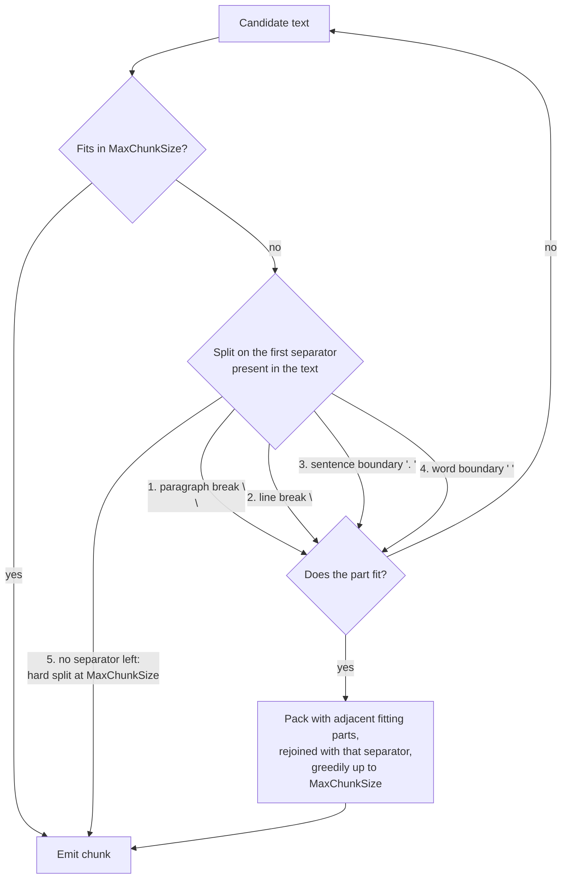

# Chunking

Embedding models have a finite token budget (typically 512–8192 tokens). If a document section exceeds that budget the model silently truncates or errors. Chunking divides each `DocumentSection` into `TextChunk` objects that fit within the budget while preserving enough context for retrieval to work. Choosing the wrong strategy or size is the most common cause of poor RAG quality.

## `ChunkingOptions`

The fixed-size, recursive, and token-aware strategies share the same options type:

```csharp
public sealed class ChunkingOptions
{
    public int MaxChunkSize { get; set; } = 512;  // characters (Fixed/Recursive) or tokens (TokenAware)
    public int Overlap      { get; set; } = 50;   // same unit as MaxChunkSize
}
```

Configure via the `RagBuilder`:

```csharp
services.AddRagNet(rag => rag
    .UseChunkingStrategy<RecursiveChunkingStrategy>(options =>
    {
        options.MaxChunkSize = 800;
        options.Overlap      = 80;
    })
    .UsePgVector(connectionString));
```

The default strategy when nothing is configured is `RecursiveChunkingStrategy` with `MaxChunkSize = 512, Overlap = 50`.

## Strategy comparison

| | `FixedSizeChunkingStrategy` | `RecursiveChunkingStrategy` | `TokenAwareChunkingStrategy` | `SemanticChunkingStrategy` | `HierarchicalMergerChunkingStrategy` | `CodeChunkingStrategy` | `PropositionChunkingStrategy` | `LateChunkingStrategy` |
|---|---|---|---|---|---|---|---|---|
| Unit | Characters | Characters | Tokens | Characters (min/max) | Heading subtrees (unbounded) | Characters | Propositions (LLM) | Tokens |
| Split logic | Hard cut at word boundary | Hierarchical separators | Tiktoken encode → slice → decode | Embedding cosine similarity breakpoints | Heading subtree merge | Language-specific (class/func/method) | LLM decomposes passages into atomic claims | Embed full text, then window token vectors |
| Overlap | Trailing characters prepended | Trailing characters prepended | Token-level sliding window | None | None | Optional | None (passages partition) | Token-level sliding window |
| Heading awareness | No | No | No | No (sentence-level) | Yes | No | No | No |
| Respects token limits | No | No | Yes | Approximate (min/max chars) | **No — `MaxChunkSize` is ignored** | No | Yes (passage budget) | Yes |
| Chunking overhead (50 KB) | ~14 µs | ~39 µs | ~853 µs | Embedding-latency-bound | not measured | not measured | LLM-latency-bound (1 call/passage) | Token-embedding-latency-bound |
| Best for | Homogeneous text, simple pipelines | General prose, markdown, mixed content | Code, URLs, dense technical text | Coherent meaning boundaries, QA systems | Structured documents with headings | Code files (Python, JS/TS, Go, Rust, C#, …) | Precise factoid retrieval | Context-aware chunk embeddings |

See [benchmarks](../reference/benchmarks.md) for full throughput numbers. Semantic chunking overhead is embedding-latency-bound (50–500 ms per batch), not CPU-bound — CPU processing is negligible.

## `FixedSizeChunkingStrategy`

Slices the section text at `MaxChunkSize` character positions, walking backward from each cut point to the nearest space to avoid splitting mid-word. Overlap is applied by advancing the position cursor by `(chunkLength - Overlap)` characters after each chunk.

```csharp
services.AddRagNet(rag => rag
    .UseChunkingStrategy<FixedSizeChunkingStrategy>(options =>
    {
        options.MaxChunkSize = 512;
        options.Overlap      = 50;
    }));
```

**Caveats:**
- Character count does not equal token count. A 512-character chunk can be anywhere from ~100 to ~600 tokens depending on the content. If your embedding model has a strict limit (e.g., 512 tokens), use `TokenAwareChunkingStrategy` instead.
- Breaks on whitespace only; it will split in the middle of a sentence when there is no space near the cut point.

## `RecursiveChunkingStrategy`

Splits on natural text boundaries using a priority list of separators tried in order, then packs the resulting parts back towards `MaxChunkSize`:



The fit check runs **before** any splitting: text that already fits within `MaxChunkSize` is emitted as a single chunk regardless of which separators it contains. Only oversized text is split, and each recursion moves one step down the separator list.

**Packing.** Parts that fit are not emitted one-by-one — consecutive parts are packed greedily towards `MaxChunkSize`, rejoined with the exact separator they were split on. At the default options, a section of 60 short lines totalling ~1,000 characters becomes 2 chunks of ~500 characters, not 60 chunks of ~31. Parts only ever pack with siblings from their own separator level: when a part is too large and recurses to a deeper separator, the deeper level's chunks are emitted as-is and never rejoined using the outer separator — joining them with a separator that did not sit between them would fabricate text that never appears in the document.

**Positions are exact.** Because packed parts are rejoined with the separator they were split on, every emitted chunk is an exact substring of the section text, and `StartPosition`/`EndPosition` point at that substring. If a chunk cannot be located in the source, the strategy throws `InvalidOperationException` rather than reporting a wrong position as a real one.

**Overlap and the size ceiling.** Overlap is prepended from the trailing characters of the previous chunk *after* packing, so an emitted chunk's `Text` can reach `MaxChunkSize + Overlap` — 562 characters at the default `512/50`. Size your embedding budget against that ceiling, not against `MaxChunkSize`. `StartPosition`/`EndPosition` describe the un-overlapped span; the prepended overlap is not included.

> **Tuning note:** packing changed what an `Overlap` value means in practice. Before packing, chunks were individual fragments (measured: ~108 characters on sentence-heavy text, ~31 on line-heavy), so `Overlap = 50` could be close to half of each chunk — 46% at ~108 characters. With packing, chunks approach `MaxChunkSize` and the same `Overlap = 50` is ~10% of a chunk. If you tuned `Overlap` against the old fragment sizes, you now get different behaviour without changing a line of your own code — revisit the value.

**Sentence punctuation is reduced-loss, not lossless.** Splitting on `". "` consumes the separator: `"A. B. C"` becomes `["A", "B", "C"]`, and every part but the last has lost its period. Rejoining during packing restores the `". "` *between* sentences inside a chunk, but each chunk's final sentence still ends without its terminal period at a pack boundary. The loss goes from one period per sentence to roughly one per chunk — about a tenfold reduction at the default options, not a fix.

> **Upgrading across the packing change (breaking):** chunk boundaries, sizes, and counts all change, so the text and embedding stored for a given document are different after the change. **Re-ingest every stored document** (`IngestionOptions.Overwrite = true` — see [Getting Started](../getting-started.md#re-ingesting-a-document)) so old chunks are deleted rather than left behind. Chunk ids derive from `(DocumentId, ChunkIndex)`, and packing produces far fewer chunks per document, so on stores addressed by those ids an ingest without `Overwrite` replaces the low indices but leaves the old higher-index fragments in place. Skipping re-ingestion leaves retrieval running against the old fragmented chunks — degraded quality with nothing to indicate why.

```csharp
services.AddRagNet(rag => rag
    .UseChunkingStrategy<RecursiveChunkingStrategy>(options =>
    {
        options.MaxChunkSize = 512;
        options.Overlap      = 50;
    }));
```

This is the **default strategy** and the right choice for most prose-based documents (PDFs, Word, Markdown, HTML).

## `TokenAwareChunkingStrategy`

The **sliding-window baseline**: fixed token windows with configurable overlap, O(n) time, no LLM and no regex. It uses the [Microsoft.ML.Tokenizers](https://learn.microsoft.com/dotnet/api/microsoft.ml.tokenizers) `TiktokenTokenizer` to encode the section text into token IDs, then slides a window of `WindowSizeTokens` tokens with a step of `WindowSizeTokens - OverlapTokens`. Because it counts tokens rather than characters, chunks never exceed embedding model token limits — and its simplicity makes it the natural performance and quality baseline to compare other strategies against.

The simplest registration takes a model name (window and overlap then come from `ChunkingOptions.MaxChunkSize` / `ChunkingOptions.Overlap`, interpreted as **token counts**):

```csharp
services.AddRagNet(rag => rag
    .UseTokenAwareChunking("gpt-4")   // selects cl100k_base encoding
    .UsePgVector(connectionString));
// ChunkingOptions.MaxChunkSize = 512, Overlap = 50 are applied as token counts
```

Or configure the window explicitly with `TokenAwareChunkingOptions`:

```csharp
services.AddRagNet(rag => rag
    .UseTokenAwareChunking(o =>
    {
        o.ModelName        = "gpt-4"; // tokenizer encoding
        o.WindowSizeTokens = 256;     // fixed window, overrides ChunkingOptions.MaxChunkSize
        o.OverlapTokens    = 32;      // overlap between windows, overrides ChunkingOptions.Overlap
    })
    .UsePgVector(connectionString));
```

`WindowSizeTokens` and `OverlapTokens` are optional; any value left `null` falls back to the corresponding `ChunkingOptions` property at chunk time.

> **Warning:** the fallback applies per property. If you set only `WindowSizeTokens` to a value at or below the default `ChunkingOptions.Overlap` (50), the fallback overlap is no longer smaller than the window and chunking throws at runtime — also set `OverlapTokens`:
>
> ```csharp
> // Throws at chunk time: effective overlap 50 (from ChunkingOptions.Overlap)
> // is not less than effective window 32 (from TokenAwareChunkingOptions.WindowSizeTokens).
> rag.UseTokenAwareChunking(o => o.WindowSizeTokens = 32);
>
> // Correct — override both:
> rag.UseTokenAwareChunking(o => { o.WindowSizeTokens = 32; o.OverlapTokens = 8; });
> ```

**Model names:** Any model name accepted by `TiktokenTokenizer.CreateForModel` works (e.g., `"gpt-4"`, `"gpt-3.5-turbo"`, `"text-embedding-ada-002"`). The default is `"gpt-4"` which uses the `cl100k_base` encoding, compatible with most modern OpenAI embedding models.

**Constraint:** the effective overlap must be strictly less than the effective window size; the strategy throws `ArgumentOutOfRangeException` otherwise (at construction when both are set via `TokenAwareChunkingOptions`, at chunk time when falling back to `ChunkingOptions`).

**Overhead:** Tiktoken encoding/decoding adds ~20–60× CPU overhead compared to character-based strategies on 50 KB input (~853 µs vs. ~14–39 µs, measured 2026-07-31). This is negligible relative to embedding API latency (typically 50–500 ms per batch).

## `SemanticChunkingStrategy`

Splits text at meaning boundaries using sentence embeddings and cosine similarity. Sentences in the same semantic group are merged; a new chunk starts where similarity drops below the configured percentile threshold.

```csharp
services.AddRagNet(rag => rag.UseSemanticChunking());
```

Or with custom options:

```csharp
services.AddRagNet(rag => rag.UseSemanticChunking(new SemanticChunkingOptions
{
    BreakpointPercentile = 0.25f,  // lower = more chunks; higher = fewer, larger chunks
    MinChunkSize = 100,            // characters; undersized groups merge with neighbors
    MaxChunkSize = 1500,           // characters; oversized groups split at sentence boundaries
    ChunkingEmbedder = myFastEmbedder,  // optional: override the embedder for chunking only
}));
```

`UseSemanticChunking` registers `SemanticChunkingStrategy` for all three interfaces — `IChunkingStrategy`, `IDocumentChunkingStrategy`, and `IChunkRefinementStrategy` — all pointing to the same singleton instance.

**Document-level path:** When `SemanticChunkingStrategy` is the active chunking strategy, `ParseBehavior` automatically uses the document-level path (`IDocumentChunkingStrategy`): all sections from a document are batch-embedded in one call, adjacent similar sections are merged into groups, and min/max size constraints are applied across groups. This is more coherent than processing each section independently.

**Overhead:** All processing is embedding-latency-bound. The local similarity computation and grouping add negligible overhead (< 1 ms for typical documents) relative to embedding API latency (50–500 ms per batch).

## `PropositionChunkingStrategy`

LLM-driven chunking that decomposes document text into **atomic, self-contained propositions** — each a single factual claim expressed as one complete sentence, with pronouns resolved so the sentence is understandable without its surrounding text. Each proposition becomes its own chunk, making it highly retrievable for specific questions ("one chunk, one fact"). The document is concatenated, split into token-bounded passages (cl100k_base, no overlap), and each passage is sent to the `IChatClient` in one call that returns a JSON array of proposition strings.

```csharp
services.AddRagNet(rag => rag.UsePropositionChunking());
```

Or with custom options:

```csharp
services.AddRagNet(rag => rag.UsePropositionChunking(o =>
{
    o.MaxPassageTokens          = 500;   // smaller passages, more LLM calls
    o.MaxPropositionsPerPassage = 30;    // safety cap per passage
    o.EmitParentPassages        = true;  // also emit each passage as its own chunk
    o.ChatClient                = myCheapModel; // optional dedicated client
}));
```

`UsePropositionChunking` registers `PropositionChunkingStrategy` for both `IChunkingStrategy` and `IDocumentChunkingStrategy`, pointing to the same singleton instance. It requires an `IChatClient` in DI (or `PropositionChunkingOptions.ChatClient`).

**Options (`PropositionChunkingOptions`):**

| Option | Default | Description |
|---|---|---|
| `MaxPassageTokens` | `1000` | Max tokens (cl100k_base) per passage sent to the LLM. One LLM call per passage. |
| `MaxPropositionsPerPassage` | `50` | Safety cap on propositions parsed per passage; excess entries are dropped. |
| `EmitParentPassages` | `false` | Also emit each source passage as its own chunk before its propositions (for dual-index setups). |
| `ChatClient` | `null` | Optional dedicated chat client; falls back to the DI-registered one. |

**Chunk metadata:** every chunk carries `Metadata["chunk.kind"]` (`"proposition"` or `"passage"`), plus `parent.start` / `parent.end` — the character span of the source passage in the concatenated document text.

**Parent Document Retrieval caveat:** each proposition chunk's `StartPosition` / `EndPosition` are set to its source passage's character span (the proposition text itself does not exist verbatim in the source), which is the position `ParentDocumentIngestionBehavior` uses to map child chunks to parents. Combining `UsePropositionChunking` with [Parent Document Retrieval](retrieval.md) is possible but has significant caveats, because the parent pass invokes the **same registered strategy**:

- The parent pass runs a **second LLM extraction pass** over the document at ingest time (doubling cost), and `ParentChunkSize` / `ParentOverlap` are ignored — passage boundaries come from `MaxPassageTokens`.
- With the default `EmitParentPassages = false`, the stored "parents" are themselves propositions, not passages. Set `EmitParentPassages = true` if you combine the two.
- Mapping is only reliable for **single-section documents**: parent boundaries are computed per section, while proposition spans are global to the concatenated document text.

For Parent Document Retrieval users the recommended setup is a **non-LLM parent chunker** (e.g. `RecursiveChunkingStrategy` or `TokenAwareChunkingStrategy`) as the registered strategy, with proposition chunks maintained as a separate index (dual-index setup via `EmitParentPassages`).

**Failure fallback:** if the LLM call fails, the response is not valid JSON, or no usable propositions survive filtering, the strategy logs a warning and emits the passage itself as a single chunk (`chunk.kind = "passage"`) — ingestion never loses content and never throws for one bad passage. Cancellation is always propagated, never swallowed.

**Cost:** one LLM call per `MaxPassageTokens`-sized passage at ingest time. Proposition chunking trades ingest cost and chunk count for maximum retrieval precision.

## `LateChunkingStrategy`

Late chunking inverts the usual order of operations: instead of splitting the text first and embedding each chunk in isolation, the **whole section is embedded first** in a single pass by an `ITokenEmbeddingGenerator` that returns one vector per token — so every token vector carries whole-document context (references, pronouns, cross-paragraph reasoning). Overlapping token windows are then cut over the token offsets, and each chunk's embedding is the **L2-normalized mean of its window's token vectors**. Chunks therefore arrive at the embedding stage with a precomputed, context-aware embedding already attached.

```csharp
services.AddRagNet(rag => rag
    .UseLateChunking(o =>
    {
        o.WindowSizeTokens = 256;
        o.OverlapTokens    = 32;
    })
    .UseOnnxTokenEmbeddings(o =>
    {
        o.ModelPath          = "models/jina-embeddings-v2-base-en.onnx";
        o.TokenizerVocabPath = "models/vocab.txt";
    })
    .UsePgVector(connectionString));
```

`UseLateChunking` registers `LateChunkingStrategy` for both `IChunkingStrategy` and `IDocumentChunkingStrategy` (same singleton). It requires an `ITokenEmbeddingGenerator` — either registered in DI (e.g. via `UseOnnxTokenEmbeddings` from `Rag.NET.Embeddings.Onnx`) or supplied directly through `LateChunkingOptions.Generator`.

**Options (`LateChunkingOptions`):**

| Option | Default | Description |
|---|---|---|
| `WindowSizeTokens` | `256` | Tokens per chunk window. Must be positive. |
| `OverlapTokens` | `32` | Token overlap between consecutive windows. Must be non-negative and smaller than `WindowSizeTokens`. |
| `Generator` | `null` | Optional dedicated `ITokenEmbeddingGenerator`; falls back to the DI-registered one. |

**ONNX generator (`Rag.NET.Embeddings.Onnx`):** `UseOnnxTokenEmbeddings` registers `OnnxTokenEmbeddingGenerator`, which runs a local ONNX embedding model that exposes token-level hidden states. You need a **jina-embeddings-v2-style ONNX export** — a model whose output is the last hidden state `[1, sequence, dimension]` — plus its **WordPiece `vocab.txt`** from the same model repository. A concrete, known-good starting point is [`jinaai/jina-embeddings-v2-base-en`](https://huggingface.co/jinaai/jina-embeddings-v2-base-en) on Hugging Face: download `onnx/model.onnx` as the `ModelPath` and `vocab.txt` as the `TokenizerVocabPath`.

Model I/O contract: the model must declare an **`input_ids`** input; **`attention_mask`** and **`token_type_ids`** are optional and fed only when the model declares them, so exports without them work. The token-level output is resolved by name — `OnnxTokenEmbeddingOptions.OutputName` (default `"last_hidden_state"`), falling back to the model's single output — and its shape is validated on every pass, so a pooled `[1, dimension]` export fails with a clear error instead of producing garbage embeddings.

Inputs longer than `OnnxTokenEmbeddingOptions.MaxTokens` (default 8192, including the two `[CLS]`/`[SEP]` positions per pass) are windowed internally with `WindowOverlapTokens` (default 64) overlap and stitched back together, so any input length is accepted. The integration smoke test picks up the model via the `RAGNET_ONNX_EMBED_MODEL` and `RAGNET_ONNX_EMBED_VOCAB` environment variables.

**Text the generator refuses (CJK and NFD).** `OnnxTokenEmbeddingGenerator` promises that its token offsets are spans into the text you passed in, but the BERT tokenizer reports offsets into its own *normalized* text. When normalization changes the length, those offsets cannot be mapped back, so the generator rejects the input rather than returning offsets that silently point at the wrong characters. Two kinds of text still change the length, and neither has a length-preserving rewrite:

- **CJK** — the normalizer inserts a space either side of every Chinese, Japanese and Korean ideograph, so the text **grows** (`"日本語 text"`: 8 characters in, 14 out). Applying an offset from that text to the original goes out of bounds.
- **NFD-decomposed text** — the normalizer strips combining marks, so the text **shrinks**, one character per mark (`"cafe" + U+0301 + " test"`: 10 characters in, 9 out). This is the form macOS filesystems produce, so it arrives without anyone choosing it. Unlike CJK it is fixable by the caller: `string.Normalize()` (NFC) before ingestion is accepted.

What is *not* refused, and used to be: `\n`, `\t` and `\r` are substituted with a single space before tokenizing, matching BERT's own reference implementation — the tokenizer's normalizer would otherwise **delete** them, which both breaks the offsets and merges the words either side into one the document never contained (`"alpha\n\nbeta gamma"` tokenized as `alphabet | ##a | gamma`). Rarer control characters are still deleted, so a document carrying e.g. a stray `U+0001` is refused as well. Late chunking is therefore fully supported for multi-line, multi-paragraph, tab-separated and NFC text of any script other than CJK.

A refusal is not an error you see: it takes the fallback below, so a CJK or NFD document is chunked and embedded normally and simply does not get late chunking's whole-document context. The generator's exception message names the direction the length moved and the cause it implies, and `LateChunkingStrategy` logs it at Warning.

**Fallback semantics:** if the token-embedding generator fails (or returns a matrix violating its contract), the section is still chunked into the same cl100k token windows — the chunks simply carry **no precomputed embedding** and are embedded normally downstream by the pipeline's regular embedder. Ingestion never loses content; cancellation is always propagated.

**Storage-dimension caveat:** a precomputed embedding whose dimension does not match the vector store's configured dimension fails at **storage time with a backend-side error** (e.g. a pgvector or Qdrant server rejection), not a Rag.NET-owned message. Make sure the ONNX model's hidden dimension matches the collection/table dimension you provisioned.

**Sanitiser caveat:** chunk sanitisers rewrite `Text` after chunking but preserve the precomputed embedding, so with late chunking a redaction sanitiser stores a vector that still encodes the *unsanitised* content. If you sanitise sensitive content, don't combine it with late chunking (or clear `Embedding` in your sanitiser so the redacted text is embedded normally downstream).

**Parent Document Retrieval caveat:** as with `PropositionChunkingStrategy`, enabling parent-document retrieval re-invokes the registered strategy for the parent pass — with late chunking that means a second full ONNX token-embedding pass over each document at ingest. Prefer a non-LLM/non-embedding parent chunker (`RecursiveChunkingStrategy`, `TokenAwareChunkingStrategy`) for the parent side.

## `HierarchicalMergerChunkingStrategy`

Merges document sections into heading-subtree chunks. Each chunk covers one heading and all body text beneath it down to a configurable depth. Best for documents with a clear heading hierarchy (Markdown, Word, HTML).

```csharp
services.AddRagNet(rag => rag.UseHierarchicalMerging());
```

See `HierarchicalMergerOptions` for depth and regex pattern configuration.

**`ChunkingOptions` is deliberately ignored — chunks are unbounded above.** A chunk here is one
heading subtree, a semantic unit whose size the document decides, so setting
`ChunkingOptions.MaxChunkSize` or `Overlap` alongside this strategy changes nothing; truncating a
subtree at a character count would defeat the strategy's purpose, and overlap has no meaning
between disjoint subtrees. The same holds for the domain templates that delegate to it —
`BookChunkingStrategy`, `LegalChunkingStrategy` and `AcademicPaperChunkingStrategy`
(`Rag.NET.Chunking.Templates`). A document whose top-level section runs long produces a chunk
exactly that long. To bound chunk size on top of the heading structure, add
`UseSemanticRefinement()` (below), which sub-splits oversized chunks after this strategy has
shaped them.

## Page attribution (`page` / `page_end` metadata)

Every strategy carries the source page through the chunking boundary: when a
`DocumentSection` has a `PageNumber` (PDF pages, PowerPoint slides), the chunks produced from
it get the reserved `page` and `page_end` metadata keys, written as **numbers**
(`MetadataValueKind.Number`), so retrieval results can be cited back to a page and filtered
numerically in every vector store.

- **Per-section strategies** (fixed-size, recursive, token-aware, code, C#, late chunking,
  and the per-section fallbacks) stamp both keys with the section's page: a chunk entirely
  on page 3 is `page: 3, page_end: 3`. The keys are always written together — never a lone
  `page` — so consumers render a range without probing for a missing half.
- **Merging strategies** (`HierarchicalMergerChunkingStrategy` and the templates delegating to
  it, `SemanticChunkingStrategy`'s document-level path, `PropositionChunkingStrategy`'s
  passages) report the min/max across the sections a chunk was merged from: a chunk spanning
  pages 3–4 is `page: 3, page_end: 4`. A run mixing paginated and unpaginated sections keeps
  the pages that are present rather than dropping the whole range.
- **Both keys are absent** (not null-valued) for non-paginated sources and where the origin
  page is genuinely unknowable: `ResumeChunkingStrategy`'s LLM-extracted field chunks
  (rewritten text with no source span; its full-text fallback does carry the document-wide
  range) and `VideoChunkingStrategy` (its sections' `PageNumber` is a scene timestamp,
  surfaced as `timestamp_seconds` metadata instead). Proposition chunks are also rewrites,
  but they carry their source passage's span, so they inherit that passage's page range.
- **Refinement** (`UseSemanticRefinement`) keeps the parent chunk's page range on every
  sub-chunk — the narrowest span the re-split can still vouch for.

The keys survive storage as numbers: all six vector stores persist and round-trip typed
metadata — see [Vector stores](vector-stores.md#typed-metadata).

## Chunk refinement (`IChunkRefinementStrategy`)

Chunk refinement is a post-processing pass that runs after chunking (both per-section and document-level paths). `SemanticChunkingStrategy` implements `IChunkRefinementStrategy` to sub-split oversized chunks at sentence boundaries.

Use `UseSemanticRefinement()` to add semantic sub-splitting on top of any base chunking strategy without replacing it:

```csharp
// Hierarchical structure first, semantic sub-splitting after
services.AddRagNet(rag => rag
    .UseHierarchicalMerging()
    .UseSemanticRefinement());

// Full semantic pipeline (document-level grouping + per-chunk refinement)
services.AddRagNet(rag => rag.UseSemanticChunking());
// IChunkRefinementStrategy is registered automatically — refinement runs for both paths
```

`UseSemanticRefinement` registers `SemanticChunkingStrategy` as **only** `IChunkRefinementStrategy`, leaving the primary `IChunkingStrategy` unchanged.

## Implementing a custom strategy

See [Extending](extending.md#implementing-ichunkingstrategy) for the full guide on implementing `IChunkingStrategy`.

To implement a document-level strategy (receives all sections at once), implement `IDocumentChunkingStrategy`. `ParseBehavior` automatically routes to it when the active `IChunkingStrategy` also implements `IDocumentChunkingStrategy`.

To implement a post-processing refinement step, implement `IChunkRefinementStrategy`. Register it in DI as a singleton; `ParseBehavior` resolves it optionally and applies it after chunking.

## Relationship to ingestion

The chunking strategy is invoked once per `DocumentSection` yielded by the parser (per-section path) or once per document (document-level path when `IDocumentChunkingStrategy` is active). Each section or document produces zero or more `TextChunk` objects. After chunking, the optional refinement pass runs, then the pipeline applies heading metadata and `DocumentMetadata.Tags` to every chunk's `Metadata` dictionary before embedding.

See [Ingestion](ingestion.md) for the full pipeline flow and [Retrieval](retrieval.md) for how chunk metadata is used at query time.

## `CodeChunkingStrategy`

Splits code files at language-appropriate boundaries using per-language separator hierarchies. Each language tries to split at the highest semantic boundary first (class → function → method) before falling back to paragraph and line breaks.

```csharp
services.AddRagNet(rag => rag
    .UseCodeChunking());             // auto-detect language from file extension
```

With explicit language override:

```csharp
services.AddRagNet(rag => rag
    .UseCodeChunking(new CodeChunkingOptions { Language = "python" }));
```

**Supported languages and extensions:**

| Language | Extensions |
|---|---|
| `python` | `.py` |
| `javascript` | `.js`, `.mjs`, `.cjs` |
| `typescript` | `.ts`, `.tsx` |
| `java` | `.java` |
| `go` | `.go` |
| `rust` | `.rs` |
| `ruby` | `.rb` |
| `csharp` | `.cs` |
| `cpp` | `.cpp`, `.cc`, `.cxx`, `.h`, `.hpp` |
| `php` | `.php` |
| `swift` | `.swift` |

Unknown extensions fall back to generic code separators (`\n\n` → `\n` → space).

**Caveats:**
- Uses heuristic string matching — it is not a parser. A `\ndef ` separator will split at any string starting with that pattern, including comments or strings containing `def `.
- Overlap is typically 0 for code. Set `ChunkingOptions.Overlap = 0` explicitly (default is 50 characters).
- For C# specifically, the Roslyn-based chunker (`Rag.NET.Chunking.CSharp`) produces semantically richer chunks with namespace, type, and member metadata.
