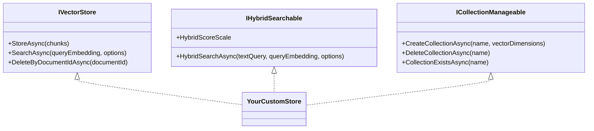

# Extending Rag.NET

Rag.NET is built around three extension points — `IDocumentParser`, `IVectorStore`, and `IChunkingStrategy` — that let you plug in custom implementations without touching pipeline code. Each interface is small and purposeful. This page walks through a concrete implementation of each.

## Implementing `IDocumentParser`

Use this when you need to ingest a file format not covered by the built-in parsers (Text, Markdown, CSV, JSON, PDF, HTML, Word, Excel, PowerPoint).

### Interface

```csharp
public interface IDocumentParser
{
    bool CanParse(string contentType);
    IAsyncEnumerable<DocumentSection> ParseAsync(
        Stream stream,
        DocumentMetadata metadata,
        CancellationToken cancellationToken = default);
}
```

`CanParse` is called for every registered parser in order. The first one returning `true` handles the document. `ParseAsync` yields `DocumentSection` objects — one per logical section of the document.

### `DocumentSection`

```csharp
public sealed record DocumentSection
{
    public required string Text        { get; init; }
    public required string DocumentId  { get; init; }
    public int? HeadingLevel           { get; init; }  // 1–6; null = no heading
    public string? Heading             { get; init; }  // heading text; null = no heading
    public int? PageNumber             { get; init; }  // null for non-paginated formats
    public int SectionIndex            { get; init; }
}
```

Set `HeadingLevel` and `Heading` if the format has structured headings. The pipeline will automatically build breadcrumb metadata (`heading`, `heading_level`, `heading_breadcrumb`) from these values and write them into every `TextChunk.Metadata` produced from the section. See [Ingestion — Heading-aware metadata](ingestion.md#heading-aware-metadata).

### Example: XML parser

```csharp
using System.Runtime.CompilerServices;
using System.Xml.Linq;
using Rag.NET.Abstractions;
using Rag.NET.Models;

public sealed class XmlDocumentParser : IDocumentParser
{
    public bool CanParse(string contentType)
        => string.Equals(contentType, "application/xml", StringComparison.OrdinalIgnoreCase)
        || string.Equals(contentType, "text/xml", StringComparison.OrdinalIgnoreCase);

    public async IAsyncEnumerable<DocumentSection> ParseAsync(
        Stream stream,
        DocumentMetadata metadata,
        [EnumeratorCancellation] CancellationToken cancellationToken = default)
    {
        var doc = await XDocument.LoadAsync(stream, LoadOptions.None, cancellationToken)
            .ConfigureAwait(false);

        int sectionIndex = 0;

        foreach (var element in doc.Descendants("section"))
        {
            cancellationToken.ThrowIfCancellationRequested();

            var text = element.Value.Trim();
            if (string.IsNullOrEmpty(text))
                continue;

            var title = element.Attribute("title")?.Value;

            yield return new DocumentSection
            {
                Text         = text,
                DocumentId   = metadata.DocumentId,
                Heading      = title,
                HeadingLevel = title is not null ? 1 : null,
                SectionIndex = sectionIndex++,
            };
        }
    }
}
```

### Registration

```csharp
services.AddRagNet(rag => rag
    .AddParser<XmlDocumentParser>()
    .UsePgVector(connectionString));
```

Or, if your parser requires constructor arguments that DI cannot resolve automatically:

```csharp
services.AddRagNet(rag =>
{
    rag.Services.AddSingleton<IDocumentParser>(new XmlDocumentParser(myOption));
    rag.UsePgVector(connectionString);
});
```

Parsers are tried in registration order. Built-in parsers (Text, Markdown) are registered before your custom ones and both declare a `ParserClaim` for the content type they accept, so a custom parser that also declares a claim for `text/plain` or `text/markdown` — see [Ingestion — content-type ownership and the claim model](ingestion.md#content-type-ownership-and-the-claim-model) — is a startup error naming both parsers, not a silent loss to the built-in. The supported way to win that content type deliberately is `AddParser<XmlDocumentParser>(replaces: typeof(TextDocumentParser))`, which removes the built-in's registration and claim outright rather than merely racing it for priority. Registering directly against `services` before calling `AddRagNet` still changes selection order for a parser that declares no claim at all — the pipeline still tries parsers in registration order — but it is no substitute for `replaces:` against a parser that does declare one, since the claim guard fires regardless of registration order.

---

## Implementing `IVectorStore`

Use this to support a vector store backend not covered by the built-in packages (pgvector, Qdrant, Azure AI Search), or to write a test double.



### Interface

```csharp
public interface IVectorStore
{
    Task StoreAsync(IReadOnlyList<EmbeddedChunk> chunks, CancellationToken cancellationToken = default);

    Task<IReadOnlyList<SearchResult>> SearchAsync(
        ReadOnlyMemory<float> queryEmbedding,
        SearchOptions options,
        CancellationToken cancellationToken = default);

    Task DeleteByDocumentIdAsync(string documentId, CancellationToken cancellationToken = default);
}
```

`SearchOptions`:

```csharp
public sealed class SearchOptions
{
    public int TopK                                            { get; set; } = 5;
    public double MinScore                                     { get; set; } = 0.0;
    public IDictionary<string, MetadataValue>? MetadataFilter  { get; set; }
}
```

Your `SearchAsync` should apply `TopK`, `MinScore`, and `MetadataFilter`. Hybrid routing never reaches it — the pipeline resolves the hybrid path via `IHybridSearchable` before calling `SearchAsync`.

### Optional: `IHybridSearchable`

If your backend natively supports combined BM25+vector search, implement this interface alongside `IVectorStore`:

```csharp
public interface IHybridSearchable
{
    ScoreScale HybridScoreScale => ScoreScale.OpaqueRanking;

    Task<IReadOnlyList<SearchResult>> HybridSearchAsync(
        string textQuery,
        ReadOnlyMemory<float> queryEmbedding,
        SearchOptions options,
        CancellationToken cancellationToken = default);
}
```

The pipeline prefers `HybridSearchAsync` over the in-memory BM25 fallback when both interfaces are implemented **and** the call configures nothing native fusion cannot express: no sparse (SPLADE) arm would run, no `EnsembleOptions` is supplied, and `MinScore` is `0.0`. Otherwise client-side RRF fusion runs so the configured weights and threshold semantics apply — see [Retrieval — How the hybrid path is selected](retrieval.md#how-the-hybrid-path-is-selected).

Your `HybridSearchAsync` must **not** apply `MinScore`, unlike `SearchAsync` above: the default `HybridScoreScale` of `ScoreScale.OpaqueRanking` declares that the fused score it returns has no similarity meaning, so a similarity-shaped threshold would filter it arbitrarily — and the pipeline already keeps `MinScore` requests off this path for exactly that reason. Override `HybridScoreScale` only if your backend's hybrid query genuinely returns a comparable similarity, and say why in the override.

If you also implement `IBm25Index` (the in-memory-BM25-fallback side of that client-side path, not this interface), its `Search` method takes a `metadataFilter` you must apply — see [Retrieval — `MetadataFilter` and the BM25 arm](retrieval.md#metadatafilter-and-the-bm25-arm).

### Optional: `IChunkLookup`

Implement if your backend can return chunks by identity rather than by similarity:

```csharp
public interface IChunkLookup
{
    bool SupportsChunkLookup => true;

    Task<IReadOnlyList<TextChunk>> GetChunksAsync(
        IReadOnlyList<ChunkKey> keys,
        CancellationToken cancellationToken = default);
}
```

GraphRAG's local search needs this. It puts the source chunks that produced its selected entities
in front of the model, chosen by graph provenance and never by score — there is no query vector
that returns exactly those chunks, and a metadata filter cannot express "any of these twenty
`(document, index)` pairs" on most backends. A store without this capability leaves local search's
Sources section empty, which is half of its token budget.

Keys with no stored chunk are absent from the result rather than an error: a document deleted since
extraction leaves the graph naming chunks that no longer exist, and that is not a reason to fail a
query. The result order is unspecified — callers that need an order re-associate by `ChunkKey`.

`SupportsChunkLookup` exists because decorators implement the interface unconditionally in order to
forward it, so an `is IChunkLookup` test alone would report the capability for every decorated
store. Leave the default `true` in your own store; `ResilientVectorStore` overrides it to report
what its inner store can do, and `FederatedVectorStore` reports whether *any* member can.

**Currently implemented by:** `InMemoryVectorStore`, `PgVectorStore`, `QdrantVectorStore`,
`RedisVectorStore`, `WeaviateVectorStore`, `PineconeVectorStore`, `ChromaVectorStore`
and `AzureAISearchVectorStore` — that is every store — and forwarded by
`ResilientVectorStore` and `FederatedVectorStore` (#318).

**How the keys are matched differs per backend, and the difference is not cosmetic.** PgVector zips
the pairs in SQL with `unnest` over two arrays. Qdrant cannot use point ids at all — they are random
GUIDs, unrelated to the chunk's identity — so it filters on the `document_id` and `chunk_index`
payload fields, one nested `must` per key inside a single `should`. Redis is the inverse again: the
key *is* the identity, so it reads hashes directly and never queries the index at all. Weaviate is a
GraphQL `where` of Or-composed And pairs, built as its own query because a keyed read has no vector,
no hybrid argument and no `_additional` to select.

Pinecone and Chroma are like Redis: their record ids are derived (`documentId:chunkIndex`), so the
lookup is a fetch by id with no query and no filter. Chroma needed a `/get` endpoint added to its
client first — a derived id is no use if the API cannot ask for one, and its `/get` returns *flat*
arrays where `/query` returns one row per query embedding.

Azure AI Search needed its **document key** changed before a lookup was expressible at all. The key
was a random GUID, so identity lived only in fields — and filtering on `chunk_index` is impossible
because that field is not `IsFilterable`. The key is now
`Base64Url(documentId + "
" + chunkIndex)`: Base64Url because Azure permits only letters, digits,
`_`, `-` and `=` in a key, so raw concatenation fails outright on an id containing a slash, a space
or non-ASCII text. The same change made writes upsert rather than duplicate (#517).

**If the backend's query is built by string concatenation, escape the document id.** Weaviate's
lookup does; removing that escaping passed every test until one was added using an id containing a
quote. A malformed query is the good outcome there.

**Construct ids; do not parse them.** Where the id is derived from the identity, building one is
exact — a chunk index cannot contain the separator — but recovering the identity back out of an id
is not, because a document id can. Pinecone's store refuses to parse for that reason and reads the
identity from metadata instead.

Whatever the mechanism, **the pairs must be matched as pairs**: conditions on the two fields
independently return another document's chunk at the same index. And **a negative `chunk_index` has
to work** — `GraphEntityExtractionBehavior` assigns `-(i + 1)` to synthetic entity and relationship
chunks, so those are exactly the rows this capability is asked for. On three backends so far, an
implementation assuming unsigned indices passed every test except that one.

PgVector matches the pairs in the database rather than expanding them into the SQL: `unnest` over
two arrays yields one row per position, so a single statement with two parameters serves any key
count. Building an `IN ((..),(..))` list instead produces different query text for every key count,
which defeats the plan cache. Whatever a backend's equivalent is, **the pairs have to be matched as
pairs** — matching `chunk_index` alone returns another document's chunk at that index.

### Optional: `ICollectionManageable`

Implement if your store supports programmatic index lifecycle:

```csharp
public interface ICollectionManageable
{
    Task CreateCollectionAsync(string name, int vectorDimensions, CancellationToken cancellationToken = default);
    Task DeleteCollectionAsync(string name, CancellationToken cancellationToken = default);
    Task<bool> CollectionExistsAsync(string name, CancellationToken cancellationToken = default);
}
```

### Example: in-memory test double

> Rag.NET ships a ready-made `Rag.NET.Storage.InMemoryVectorStore` (thread-safe, with sparse
> SPLADE support via `ISparseSearchable`) — register it with
> `rag.Services.AddSingleton<IVectorStore>(new InMemoryVectorStore())` if you just need an
> in-process store. The simplified implementation below illustrates the contract.

```csharp
using Rag.NET.Abstractions;
using Rag.NET.Models;
using Rag.NET.Models.Options;

public sealed class InMemoryVectorStore : IVectorStore
{
    private readonly List<(EmbeddedChunk Chunk, float[] Embedding)> _store = [];

    public Task StoreAsync(IReadOnlyList<EmbeddedChunk> chunks, CancellationToken cancellationToken = default)
    {
        foreach (var chunk in chunks)
            _store.Add((chunk, chunk.Embedding.ToArray()));
        return Task.CompletedTask;
    }

    public Task<IReadOnlyList<SearchResult>> SearchAsync(
        ReadOnlyMemory<float> queryEmbedding,
        SearchOptions options,
        CancellationToken cancellationToken = default)
    {
        var query = queryEmbedding.Span;

        var results = _store
            .Select(item =>
            {
                double dot = 0, normA = 0, normB = 0;
                var v = item.Embedding.AsSpan();
                for (int i = 0; i < query.Length; i++)
                {
                    dot  += query[i] * v[i];
                    normA += query[i] * query[i];
                    normB += v[i] * v[i];
                }
                double denom = Math.Sqrt(normA) * Math.Sqrt(normB);
                double score = denom == 0 ? 0 : dot / denom;
                return (item.Chunk, Score: score);
            })
            .Where(r => r.Score >= options.MinScore)
            .OrderByDescending(r => r.Score)
            .Take(options.TopK)
            .Select(r => new SearchResult { Chunk = r.Chunk.Chunk, Score = r.Score })
            .ToList();

        return Task.FromResult<IReadOnlyList<SearchResult>>(results);
    }

    public Task DeleteByDocumentIdAsync(string documentId, CancellationToken cancellationToken = default)
    {
        _store.RemoveAll(item => item.Chunk.Chunk.DocumentId == documentId);
        return Task.CompletedTask;
    }
}
```

### Registration

```csharp
services.AddRagNet(rag =>
{
    rag.Services.AddSingleton<IVectorStore, InMemoryVectorStore>();
    // If also implementing IHybridSearchable:
    // rag.Services.AddSingleton<IHybridSearchable>(sp =>
    //     (IHybridSearchable)sp.GetRequiredService<IVectorStore>());
});
```

---

## Implementing `IChunkingStrategy`

Use this to apply domain-specific splitting logic — for example, splitting code files by function boundary, or splitting legal documents by clause number.

### Interface

```csharp
public interface IChunkingStrategy
{
    IAsyncEnumerable<TextChunk> ChunkAsync(
        DocumentSection section,
        ChunkingOptions options,
        CancellationToken cancellationToken = default);
}
```

`ChunkAsync` is called once per `DocumentSection`. It yields `TextChunk` objects. The pipeline applies metadata (heading breadcrumbs, document tags) after chunking — you do not need to populate `Metadata` in your implementation.

### `TextChunk`

```csharp
public sealed record TextChunk
{
    public required string Text            { get; init; }
    public required DocumentId DocumentId  { get; init; }
    public required int ChunkIndex         { get; init; }
    public int StartPosition               { get; init; }
    public int EndPosition                 { get; init; }
    public IDictionary<string, MetadataValue> Metadata { get; init; }
        = new Dictionary<string, MetadataValue>(StringComparer.Ordinal);
}
```

`ChunkIndex` should be monotonically increasing within a document (not just within a section). Maintain a counter across sections if your strategy is stateful.

### Example: sentence-boundary chunker

```csharp
using System.Runtime.CompilerServices;
using Rag.NET.Abstractions;
using Rag.NET.Models;
using Rag.NET.Models.Options;

public sealed class SentenceChunkingStrategy : IChunkingStrategy
{
    public async IAsyncEnumerable<TextChunk> ChunkAsync(
        DocumentSection section,
        ChunkingOptions options,
        [EnumeratorCancellation] CancellationToken cancellationToken = default)
    {
        if (string.IsNullOrWhiteSpace(section.Text))
            yield break;

        // Split on sentence-ending punctuation followed by whitespace
        var sentences = section.Text
            .Split([". ", "! ", "? "], StringSplitOptions.RemoveEmptyEntries);

        var buffer    = new System.Text.StringBuilder();
        int chunkIndex = 0;
        int position   = 0;

        foreach (var sentence in sentences)
        {
            cancellationToken.ThrowIfCancellationRequested();

            if (buffer.Length > 0 && buffer.Length + sentence.Length > options.MaxChunkSize)
            {
                var text = buffer.ToString().Trim();
                if (text.Length > 0)
                {
                    yield return new TextChunk
                    {
                        Text         = text,
                        DocumentId   = section.DocumentId,
                        ChunkIndex   = chunkIndex++,
                        StartPosition = position - text.Length,
                        EndPosition  = position,
                    };
                }
                buffer.Clear();
            }

            buffer.Append(sentence).Append(". ");
            position += sentence.Length + 2;
        }

        if (buffer.Length > 0)
        {
            var text = buffer.ToString().Trim();
            if (text.Length > 0)
            {
                yield return new TextChunk
                {
                    Text         = text,
                    DocumentId   = section.DocumentId,
                    ChunkIndex   = chunkIndex,
                    StartPosition = position - text.Length,
                    EndPosition  = position,
                };
            }
        }

        await Task.CompletedTask.ConfigureAwait(false);
    }
}
```

### Registration

```csharp
services.AddRagNet(rag => rag
    .UseChunkingStrategy<SentenceChunkingStrategy>(options =>
    {
        options.MaxChunkSize = 600;   // approximate character budget per chunk
        options.Overlap      = 0;
    })
    .UsePgVector(connectionString));
```

`UseChunkingStrategy<T>` registers `T` as `IChunkingStrategy` (singleton) and optionally configures `ChunkingOptions`. Any previous `IChunkingStrategy` registration is replaced.

---

## Writing a GraphQL connector (data providers)

REST connectors are built on `[ZeroAllocRestClient]` interfaces; a GraphQL API needs no new
client dependency — model it as a single POST with a typed body. The Linear connector
(`src/Rag.NET.DataProviders.Linear`) is the reference implementation; the conventions:

1. **Envelope record** — one `[Post("/graphql")]` method taking a
   `record GraphQlRequest(string Query, TVariables Variables)` body; the shared
   `SystemTextJsonSerializer` (camelCase) serializes records cleanly — pin every property
   name with `[JsonPropertyName]` as the Linear DTOs do, rather than relying on the casing policy.
2. **Typed variables, omitted nulls** — model variables/filters as records with
   `[JsonIgnore(Condition = JsonIgnoreCondition.WhenWritingNull)]` on optional members:
   an *omitted* GraphQL filter field means "no constraint", an explicit `null` does not.
3. **Const query document** — keep the query a `const string` with `$variables`; never
   string-interpolate user input into the document.
4. **Errors array** — GraphQL errors arrive with HTTP 200; treat a non-empty top-level
   `errors` array as a `Result` failure naming the messages (and a response with neither
   `data` nor `errors` as malformed).
5. **Auth** — some GraphQL APIs (Linear included) expect a bare `Authorization: <key>`
   header without a `Bearer` prefix; pin the verified format in a comment at registration.

See the [data providers guide](data-providers.md#linear) for the connector-facing
behaviour (pagination, watermark, filters).

---

## Answer engines: `CreateFromServices` pattern

All built-in `IAnswerEngine` implementations (`ChatAnswerEngine`, `MapReduceAnswerEngine`, `RefineAnswerEngine`, `FlareAnswerEngine`) expose a static `CreateFromServices(IServiceProvider)` factory that centralizes dependency resolution. When adding a new engine, follow the same pattern:

1. Expose a `public static MyEngine CreateFromServices(IServiceProvider sp) => new(sp.GetRequiredService<...>(), sp.GetService<...>(), ...);`.
2. Wire the factory at every registration site (`ServiceCollectionExtensions`, `UsePromptHardening`'s `ChatAnswerEngine` fallback, `UseDispatchingAnswerEngine`).

Rationale: optional dependencies (like `IContextualCompressor`) are then threaded through by updating ONE method instead of every construction site.

---

## Using `RagBuilder.Services` for advanced cases

`RagBuilder.Services` exposes the underlying `IServiceCollection` for registrations that do not have a dedicated fluent method:

```csharp
services.AddRagNet(rag =>
{
    // Replace the default RecursiveChunkingStrategy with a custom one
    // that needs a factory-resolved dependency
    rag.Services.AddSingleton<IChunkingStrategy>(sp =>
    {
        var config = sp.GetRequiredService<IConfiguration>();
        return new MyCustomChunkingStrategy(config["ChunkDelimiter"]!);
    });

    rag.UsePgVector(connectionString);
});
```
