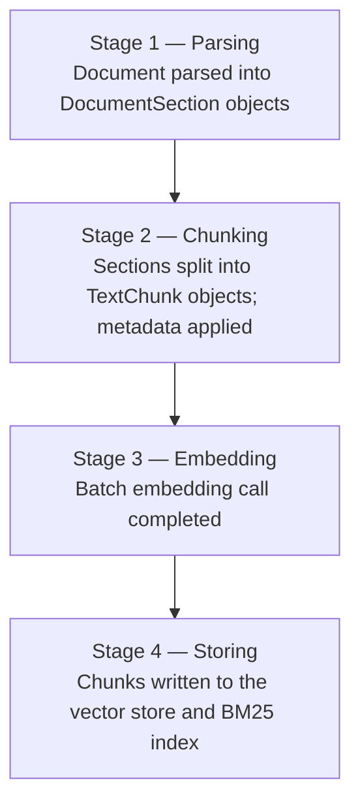

# Ingestion

Ingestion is the process of taking a raw document, converting it to searchable text, splitting it into chunks, generating embeddings, and writing everything to the vector store. Understanding each sub-stage helps you choose the right parser, configure metadata correctly, and track progress in production.

## The four stages

`IngestAsync` progresses through four sequential stages. If you pass an `IProgress<IngestionProgress>`, a callback fires at the end of each stage:



| Stage | `IngestionProgressStage` value | What happened |
|-------|-------------------------------|---------------|
| 1 | `Parsing` | Document parsed into `DocumentSection` objects |
| 2 | `Chunking` | Sections split into `TextChunk` objects; metadata applied |
| 3 | `Embedding` | Batch embedding call completed |
| 4 | `Storing` | Chunks written to the vector store and BM25 index |

## `DocumentMetadata`

Every ingestion call requires a `DocumentMetadata` record:

```csharp
public sealed record DocumentMetadata
{
    public required string DocumentId { get; init; }
    public required string FileName   { get; init; }
    public string? ContentType        { get; init; }
    public IDictionary<string, MetadataValue> Tags { get; init; }
        = new Dictionary<string, MetadataValue>(StringComparer.Ordinal);
}
```

| Property | Purpose |
|----------|---------|
| `DocumentId` | Stable identifier for the document. Used to delete or overwrite all its chunks. Must be unique per document across your corpus. |
| `FileName` | Human-readable file name. Written into every chunk's `Metadata["file_name"]`. |
| `ContentType` | MIME type used for parser selection (e.g., `"application/pdf"`). Defaults to `"text/plain"` when `null`. |
| `Tags` | Arbitrary key-value pairs propagated into every chunk's `Metadata`. Use these for [metadata filtering](retrieval.md#metadata-filtering) at query time. |

```csharp
var metadata = new DocumentMetadata
{
    DocumentId  = "policy-hr-001",
    FileName    = "hr-policy.docx",
    ContentType = "application/vnd.openxmlformats-officedocument.wordprocessingml.document",
    Tags = new Dictionary<string, MetadataValue>
    {
        ["category"] = "hr",
        ["version"]  = "2024-01",
    },
};
```

After ingestion, every `TextChunk.Metadata` for this document will contain:
- `"document_id"` → `"policy-hr-001"`
- `"file_name"` → `"hr-policy.docx"`
- `"category"` → `"hr"`
- `"version"` → `"2024-01"`
- Plus any heading metadata injected by the parser (see below)

### Typed metadata values

Metadata values are `MetadataValue`, a small discriminated value carrying one of four kinds — **string**, **number** (a `double`; `int`/`long` convert exactly up to 2^53), **boolean**, or **date** (`DateTimeOffset`, compared and stored by UTC instant). Implicit conversions exist *from* each carried type, so plain-string write sites keep their shape, and a number written as a number stays a number all the way into the vector store — filterable numerically, not as the text `"3"`:

```csharp
Tags = new Dictionary<string, MetadataValue>
{
    ["category"]    = "hr",              // string
    ["page_count"]  = 42,                // number
    ["confidential"] = true,             // boolean
    ["approved_at"] = DateTimeOffset.UtcNow, // date
},
```

There is deliberately **no** implicit conversion back to `string` — that would silently stringify numbers at read sites, which is exactly the bug the typed value removes. Read through `Kind` and the kind-checked accessors (`StringValue`, `NumberValue`, `BooleanValue`, `DateTimeOffsetValue`), or `ToString()` for a lossless textual form of any kind.

The typing runs the whole chain: a data-provider connector's `FileEntry.Metadata`, `DocumentMetadata.Tags`, `TextChunk.Metadata`, `SearchOptions.MetadataFilter`, and each store's persisted representation (see [Vector stores](vector-stores.md#typed-metadata)). Values stored before metadata carried types read back losslessly as string-kind values.

Chunk-level values win: `MetadataBehavior` applies document tags to chunks with `TryAdd`, so a key a chunking strategy already set is never clobbered by a document tag.

## `IngestionOptions`

```csharp
public sealed class IngestionOptions
{
    public bool Overwrite { get; set; }

    /// <summary>
    /// Maximum number of documents to ingest concurrently
    /// when using IngestFromProviderAsync. Default is 1 (sequential).
    /// </summary>
    public int MaxDegreeOfParallelism { get; init; } = 1;

    /// <summary>Chunks per embedding batch within a single document. Default 100.</summary>
    public int EmbedBatchSize { get; init; } = 100;

    /// <summary>Maximum embedding batches in flight concurrently per document. Default 2.</summary>
    public int MaxConcurrentEmbeddingBatches { get; init; } = 2;
}
```

When `Overwrite = true`, the pipeline calls `IVectorStore.DeleteByDocumentIdAsync` before the document is parsed, purging the previous version's vectors outright. That vector-store delete is now **the only thing `Overwrite` exclusively buys**:

```csharp
await pipeline.IngestAsync(stream, metadata,
    options: new IngestionOptions { Overwrite = true });
```

Removal from the **BM25 index and the data manager is unconditional** — it happens on every ingest, whether or not `Overwrite` is set, immediately before the new postings are written. (`Overwrite` still removes from those two as well, but up front, before parsing, so its extra guarantee is narrow: a re-ingest whose new content fails to parse or yields no chunks leaves nothing of the old one behind.)

So the old advice — *"without `Overwrite`, re-ingesting the same `DocumentId` accumulates duplicate chunks"* — needs correcting in both directions:

| Store | Re-ingest **without** `Overwrite` | Re-ingest **with** `Overwrite` |
|---|---|---|
| BM25 index | Clean replace | Clean replace (purged earlier, before parsing) |
| `IRagDataManager` | Clean replace | Clean replace (purged earlier, before parsing) |
| Vector store | **Partial** — upserted on `(documentId, chunkIndex)`, so a *shorter* replacement strands the tail | Clean replace |
| Parent chunk store | **Partial** — upserted on `(documentId, parentChunkIndex)` | **Partial** — `Overwrite` does not purge parent chunks either; only `IIngestor.DeleteAsync` does |

A 9-chunk document re-ingested as 5 chunks therefore leaves chunks 5–8 in the vector store and retrievable unless `Overwrite` is set. **Set `Overwrite` on refresh operations where the document may have shrunk.** You no longer need it to avoid duplicate BM25 postings.

> BM25 scores changed with this correction. A corpus that had been re-ingested carried inflated term statistics from the duplicated postings; they are gone, so keyword and hybrid scores move. Re-baseline any score thresholds tuned against the old behaviour. See [Re-ingest semantics](data-providers.md#re-ingest-semantics).

`MaxDegreeOfParallelism` controls how many documents `IngestFromProviderAsync` processes concurrently. The default `1` preserves the previous sequential behaviour. Increase it when your vector store and embedding service can handle concurrent requests:

```csharp
var result = await pipeline.IngestFromProviderAsync(provider, "my-corpus",
    options: new IngestionOptions { MaxDegreeOfParallelism = 4 },
    hashStore: hashStore);
```

A value of `4` is a reasonable starting point for most cloud embedding APIs. The optimal value depends on your embedding service's rate limits and your vector store's connection pool size.

### Chunk-batch embedding

Within a single document, chunks that need embedding are sliced into batches of `EmbedBatchSize` (default 100) and the batches are embedded concurrently, bounded by `MaxConcurrentEmbeddingBatches` (default 2). A document with at most `EmbedBatchSize` pending chunks is embedded in one generator call, exactly as before — batching only kicks in for larger documents. Chunk order and precomputed embeddings are always preserved; results are reassembled by original chunk index. Tune `EmbedBatchSize` to your embedding API's maximum inputs per request, and raise `MaxConcurrentEmbeddingBatches` when the service tolerates more parallel requests. Both values must be greater than zero. Note that `MaxDegreeOfParallelism` (documents) and `MaxConcurrentEmbeddingBatches` (batches per document) multiply: with `4 × 2` you can have up to eight embedding requests in flight. This changed the default behaviour for documents with more than 100 pending chunks: previously they were embedded in a single request, now in up to 2 concurrent requests of at most 100 chunks each — operators with strict embedding-API rate limits can set `MaxConcurrentEmbeddingBatches = 1` to keep requests sequential.

> Concurrent ingestion of the same `DocumentId` is not supported. The BM25 index update and vector store write are not transactional, and **there is no per-`DocumentId` lock anywhere in the pipeline** — the unconditional remove-then-re-add above takes the index's write lock once per call, but nothing holds it across the pair, so two concurrent ingests of one document can interleave as `A.Remove → B.Remove → A.Add → B.Add` and reproduce the duplicate postings the replace exists to prevent. Serialise ingestion per document at the application layer. The Service Bus trigger can do this for you: [sessions](data-providers.md#sessions-ordering-and-the-single-writer-caveat) give per-document FIFO.

## Parsers

Parsers implement `IDocumentParser`. The pipeline selects the first registered parser whose `CanParse(contentType)` returns `true`.

### Built-in parsers (always available in `Rag.NET` core)

| Content type | Parser | Notes |
|-------------|--------|-------|
| `text/plain` | `TextDocumentParser` | Produces a single `DocumentSection` |
| `text/markdown` | `MarkdownDocumentParser` | Heading-aware: extracts `HeadingLevel` and `Heading` per section |

### Optional parsers (separate packages)

| Content type | Package | Notes |
|-------------|---------|-------|
| `application/pdf` | `Rag.NET.Parsers.Pdf` | Table extraction (default on) + OCR for scanned pages via Tesseract or Azure Document Intelligence — see [below](#pdf-table-extraction-and-ocr) |
| `text/html` | `Rag.NET.Parsers.Html` | Heading-aware (AngleSharp) |
| `application/vnd.openxmlformats-officedocument.wordprocessingml.document` | `Rag.NET.Parsers.Word` | OpenXml |
| `application/vnd.openxmlformats-officedocument.spreadsheetml.sheet` | `Rag.NET.Parsers.Excel` | OpenXml |
| `application/vnd.openxmlformats-officedocument.presentationml.presentation` | `Rag.NET.Parsers.PowerPoint` | OpenXml |
| `text/csv` | (core) `CsvDocumentParser` | |
| `application/json` | (core) `JsonDocumentParser` | |

Register additional parsers via `AddParser<T>()` or by calling the package-specific extension method:

```csharp
services.AddRagNet(rag => rag
    .AddPdfParser()
    .AddHtmlParser()
    .AddWordParser()
    .AddExcelParser()
    .AddPowerPointParser());
```

Some parsers take options. `AddHtmlParser` accepts a callback for how links are handled — by
default a link's URL is appended to its text, which for site-internal paths is noise in the
embedding:

```csharp
services.AddRagNet(rag => rag
    .AddHtmlParser(o => o.HrefHandling = HtmlHrefHandling.MakeAbsolute));
```

`Remove` drops the URL and keeps the link text; `MakeAbsolute` resolves it against the page's
`<base href>`, failing that the document's `url` tag — which every web data provider here sets —
and failing that `HtmlParserOptions.BaseUri`. With no base available the URL is left as it is
rather than resolved against a guess.

To register your own parser implementation directly:

```csharp
services.AddRagNet(rag => rag
    .AddParser<MyXmlParser>());
```

### Content-type ownership and the claim model

Two parsers can end up claiming the same content type — a package you added and a built-in, or two
packages you added deliberately. `AddRagNet` detects that **before anything is resolved**: a
registration that declares a `ParserClaim` for a content type another declared claimant already
holds is an `InvalidOperationException` at startup, naming both parsers, both registration calls,
and (when one exists) a way out — never silent content loss at ingestion time.

**Not every parser declares a claim, and that is by design, not a gap.** `CanParse` is a predicate,
not an enumeration — nothing can discover what an arbitrary parser accepts without probing it
against a guessed list of content types, which is worse than an undetected collision. A parser can
opt in to being seen by implementing `IDeclaresContentTypes` alongside `IDocumentParser`:

```csharp
public sealed class MyXmlParser : IDocumentParser, IDeclaresContentTypes
{
    public static IReadOnlyCollection<string> ContentTypes { get; } =
        ["application/xml", "text/xml"];

    public bool CanParse(string contentType) =>
        ContentTypes.Contains(contentType, StringComparer.OrdinalIgnoreCase);

    // ParseAsync(...) as usual
}
```

When `TParser` implements `IDeclaresContentTypes`, `AddParser<TParser>()` declares one
`ParserClaim` per reported type automatically. A parser that implements only `IDocumentParser` —
most of the parsers this library ships, and any custom parser that does not opt in — declares
nothing and stays invisible to the guard, exactly as before this interface existed; nothing about
it needs to change to keep working.

**A deliberate override is expressed with `AddParser<TParser>(replaces:, replacesTypeNames:)`,**
which is different from silencing the conflict — it **removes** the replaced parser's
`IDocumentParser` registration and its claim together:

```csharp
services.AddRagNet(rag => rag
    .AddParser<MyCsvParser>(replaces: typeof(CsvDocumentParser)));
```

Removal, not just silencing, is load-bearing: parser selection takes the *first* registered parser
whose `CanParse` matches, and built-in parsers register before your `configure` delegate runs. An
override that only suppressed the conflict check would still lose selection to the parser it was
supposed to replace. `replaces` matches by full type name, so replacing a parser you cannot
reference at compile time — one from an optional package that may not even be installed — use
`replacesTypeNames` instead:

```csharp
services.AddRagNet(rag => rag
    .AddParser<MyExcelParser>(replacesTypeNames: ["Rag.NET.Parsers.Excel.ExcelDocumentParser"]));
```

A name (or type) that matches nothing currently registered removes nothing and is **not** an
error — replacing a parser from a package you never installed is a no-op, which is exactly what an
optional dependency needs. `Rag.NET.Chunking.Templates`'s `UseQAPairsChunking()` uses this to
declare `QAPairsDocumentParser` as a deliberate override of core's `CsvDocumentParser` and, when
`Rag.NET.Parsers.Office` is installed, its `ExcelDocumentParser` — see [Domain-Specific Chunking
Templates](../reference/features.md#domain-specific-chunking-templates) for the resulting
behaviour change.

**One current limit, worth knowing before you reach for it:** `replaces`/`replacesTypeNames` can
only remove a parser registered by concrete type (`AddParser<T>()`, or a `[Singleton]`-attributed
built-in). A parser registered through a factory lambda —
`services.AddSingleton<IDocumentParser>(sp => new MyParser(...))`, the pattern
`Rag.NET.Parsers.Vision`, `.Email` and `.Archive` all use — cannot be named this way; naming one is
a silent no-op indistinguishable from naming a package that was never installed.

### PDF: table extraction and OCR

The PDF parser accepts `PdfParserOptions` via a configuring overload:

```csharp
services.AddRagNet(rag => rag
    .AddPdfParser(options =>
    {
        options.ExtractTables = true;    // default
        options.MinTableRows = 3;        // default
        options.MinTableColumns = 2;     // default
        options.OcrMinCharacters = 50;   // default; the OCR trigger, shared by both engines
        options.MaxOcrPages = 200;       // default; document-level (paid) OCR engines only
        options.UseOcrFallback = false;  // default; the Tesseract switch, requires <EnableOcr>true</EnableOcr>
        options.TessDataPath = "./tessdata"; // default; Tesseract only
        options.OcrLanguage = "eng";     // default; Tesseract only
    }));
```

#### Table extraction

Table extraction is **on by default**. A pure-geometry heuristic clusters each page's words
into rows by baseline Y-bands and detects column gutters — word-free X-intervals that persist
across at least `MinTableRows` vertically adjacent rows. Each detected table is emitted as a
pipe-delimited Markdown table in its own `DocumentSection` with `Heading = "table"` and
`PageNumber` set; the page's remaining prose is emitted as separate sections interleaved in
document order (above → table → below).

Two behavioral notes versus the pre-table parser:

- **Reading order:** on pages *with* a detected table, prose text is reassembled from word
  geometry (sorted top-down, then left-to-right) rather than taken verbatim from
  `page.Text`, so whitespace can differ slightly. Pages without tables keep the exact
  legacy `page.Text` output.
- **Header assumption:** the first detected row is rendered as the Markdown header row.

Known limitations (the guards deliberately prefer a conservative false negative — the page
parses as prose, exactly the old behavior — over a false-positive table):

- Extraction is per page: a table spanning a page break is emitted as two tables.
- Column gutters narrower than 1.5x the median word height are not detected, so very tight
  tables degrade to prose.
- Tables whose cells average more than 4 words degrade to prose (e.g. long description
  columns).
- A 2-3-column run of 8 or more rows spanning more than half the page's rows is treated as a
  multi-column page layout (academic two-column, newsletter three-column) and stays prose,
  **unless** its cells average 2 words or fewer — dense Key/Value content is extracted even
  when it fills the page. Whole-page 2/3-column tables whose cells run longer than that are
  still missed by design.
- Any extractor failure logs a warning and the page parses as plain text (degraded, never
  broken).

#### OCR for scanned PDFs

Scanned pages are full-page images with no text layer, so PdfPig extracts little or nothing
from them. The parser can route those pages through an OCR engine, and there are **two**, with
different shapes, costs and limitations:

| | Tesseract | Azure Document Intelligence |
|---|---|---|
| Package | `Rag.NET.Parsers.Pdf` | `Rag.NET.Parsers.Pdf.AzureDocumentIntelligence` |
| Unit of work | One embedded image at a time | The whole PDF — one call per document |
| Runs | In process, local native library | Azure cloud service |
| Compile gate | `-p:EnableOcr=true`, **source builds of this repository only** — the published package compiles the engine out | **None** |
| Opt-in | `UseOcrFallback = true` | Registering the engine |
| Cost | Free | Paid, **per page of the submitted document** |
| Concurrency | Serialized (Tesseract is not thread-safe) | Unserialized — it is a network client |

Configuring **both** is a registration-time error rather than a silent precedence rule:
`UseOcrFallback = true` combined with a document-level engine throws an
`InvalidOperationException` from whichever registration call comes second.

The trigger and the output shape are the same either way. When a page's extracted text is
shorter than `OcrMinCharacters` (default 50), recognized text replaces it and is emitted as a
`DocumentSection` with `Heading = "ocr"` and `PageNumber` set; pages PdfPig read successfully
keep PdfPig's text, which is exact. Every degraded case is **lossless**: no recognized text, an
engine failure, or a skipped call logs a warning and leaves the page exactly as it would be
with no engine configured — short-but-real extracted text is never lost by enabling OCR, and
genuinely empty pages still emit nothing.

#### Tesseract: the per-image fallback

When `UseOcrFallback` is enabled and a page falls below `OcrMinCharacters`, the parser extracts
that page's embedded images (largest display area first) and runs Tesseract over each until one
yields text.

Tesseract is **off by default**, compile-gated (the same pattern as `Rag.NET.Parsers.Vision`) —
and the gate is a property of **this repository's build, not yours**. The published
`Rag.NET.Parsers.Pdf` package is compiled without the Tesseract engine, deliberately, so
consumers do not carry its native payload; setting `EnableOcr` in a consuming project has no
effect on the already-compiled package assembly. To get the per-image Tesseract path you must
build `Rag.NET.Parsers.Pdf` **from source**:

1. Build this repository (or your vendored copy of it) with `dotnet build -p:EnableOcr=true` —
   this defines `ENABLE_OCR` and pulls in the `Tesseract` package for `Rag.NET.Parsers.Pdf`,
   and reference that build instead of the NuGet package.
2. Provide a tessdata directory (e.g. download `eng.traineddata` from
   [tessdata](https://github.com/tesseract-ocr/tessdata)) and point `TessDataPath` at it.
3. Set `OcrLanguage` to the language code matching your traineddata (default `eng`).
4. Set `UseOcrFallback = true`.

Enabling `UseOcrFallback` against a build without the gate — which includes the published
package, always — throws an instructive `InvalidOperationException` at parser construction that
points at Azure Document Intelligence below: misconfiguration fails fast, not at the first
scanned page. If you consume Rag.NET as packages and need OCR, Azure Document Intelligence is
the supported engine.

#### Azure Document Intelligence: the whole-document engine

```bash
dotnet add package Rag.NET.Parsers.Pdf.AzureDocumentIntelligence
```

```csharp
using Azure;
using Rag.NET.Parsers.Pdf.AzureDocumentIntelligence;

services.AddRagNet(rag => rag
    .AddPdfParser()
    .UseAzureDocumentIntelligenceOcr(
        new Uri("https://my-resource.cognitiveservices.azure.com/"),
        new AzureKeyCredential(key),
        o =>
        {
            o.ModelId = "prebuilt-read";                 // default
            o.PricePerPage = 0.0015m;                    // default — indicative only, see below
            o.PollingInterval = TimeSpan.FromSeconds(1); // default
            o.Locale = null;                             // default: let the service detect
        }));
```

The endpoint is a `Uri`; the credential is either an `AzureKeyCredential` or a
`TokenCredential` (managed identity / OAuth) — there is an overload for each.

**No `<EnableOcr>` compile gate applies**, and `UseOcrFallback` stays `false`. That gate exists
for Tesseract's native binaries and out-of-band traineddata; a managed REST client has neither,
and reusing it would force an Azure-only consumer to pull Tesseract's native payload.
Registering the engine *is* the opt-in — the parser routes sub-threshold pages through it
without any options change.

The service is called **at most once per document**, the moment the first sub-threshold page
appears — never once per page, and never at all for a PDF PdfPig reads in full. It receives the
PDF itself, rasterizes server-side, and returns every page from a single long-running
operation. `PollingInterval` governs how often that operation is polled when the service sends
no `Retry-After`. When it does send one, the longer of the two applies — so raising
`PollingInterval` throttles polling, while lowering it below what the service asks for does not
speed anything up.

Configuration is validated at **registration** (`ModelId` non-empty, `PricePerPage` and
`PollingInterval` non-negative), so a bad value throws from the `UseAzureDocumentIntelligenceOcr`
call rather than out of a DI factory during the first parse.

Service failures are not fatal: the parser logs a warning and falls back to PdfPig's own
extraction. Cancellation is not a failure and propagates.

#### What Azure OCR costs

- **Every page of the submitted document is billed, not just the pages that needed OCR.** A
  500-page PDF containing one scanned page costs 500 pages — that document is above the default
  cap, so out of the box it would be skipped and billed nothing; raise `MaxOcrPages` past 500 and
  this is what you buy. Extracting only the pages that need it would mean *writing* PDFs, a
  dependency this repo does not have.
- **`MaxOcrPages` (default 200) is what bounds that exposure.** A document with more pages than
  the cap skips OCR entirely: the parser logs a warning naming both numbers and emits PdfPig's
  text exactly as it would with no engine configured — lossless, not silent. The default is a
  tenth of Azure Document Intelligence's verified 2,000-page per-document service limit, and
  generous enough that the documents people actually ingest (reports, papers, contracts, slide
  exports) are never quietly downgraded. Raise it deliberately, with the per-page price in
  view. It has no effect on the Tesseract path, which runs locally and free.
- **`PricePerPage` defaults to `0.0015`** — the widely published pay-as-you-go rate for the
  `prebuilt-read` model (USD 1.50 per 1,000 pages) at the time of writing. **That default is
  indicative, not authoritative.** Azure pricing varies by tier, region, model and commitment,
  and changes without this library changing; set it from your own price sheet. It is used only
  to compute what is written to the cost ledger — the service bills whatever it bills.
- `prebuilt-read` is the default model because the parser wants page text; the richer prebuilt
  models cost more per page for structure this package deliberately discards.

#### Memory: budget for roughly twice the document

Two costs that compound, both specific to the document-level path:

- **Registering a document engine turns the parser from streaming into whole-file-resident.**
  PdfPig consumes its stream lazily throughout `GetPages()`, so the PDF is buffered in full up
  front to give PdfPig and the engine each their own view of it. This happens for **every** PDF
  on that path, not only the ones that turn out to need OCR — you cannot know which those are
  before parsing. Large files land on the large object heap, multiplied by however many
  documents ingest in parallel.
- **During an OCR call the PDF is buffered a second time**, because the SDK's
  `AnalyzeDocumentOptions` accepts `BinaryData` rather than a `Stream`. Peak resident bytes are
  therefore roughly **2× the document size** per concurrent OCR call. That is forced by the
  SDK's surface, not a defect here.

Size the host accordingly, or keep the engine off the parser that handles your largest inputs.

#### OCR spend, the cost ledger and your budget

When an `ICostLedger` is registered, the Azure engine records each OCR call to it as a
`CostKind.Ocr` entry carrying `Pages` and **zero tokens** — no token count is fabricated for an
API that never reports one. `Cost` is billed pages × `PricePerPage`, computed by the engine
because the ledger prices nothing itself. With no ledger registered, recording is a silent
no-op rather than an error, and a ledger *write* failure is logged and swallowed: the OCR result
was already paid for.

Two consequences to know before enabling it:

- **OCR spend counts toward the same budget window `UseCostBudgeting` enforces for chat and
  embedding calls**, so enabling OCR can cause *those* gates to trip. See
  [cost budgeting](resilience.md#cost-budgeting).
- **OCR emits no `ragnet.llm.cost` / `ragnet.llm.tokens` telemetry.** The type that publishes
  those meters (`CostAccounting`) is internal to `Rag.NET` and unreachable from the Azure
  package. Dashboards built on those meters therefore **under-report total spend by exactly the
  OCR portion** — query the ledger for the complete picture. This is a known limitation, not an
  oversight.

#### OCR limitations, by engine

**Tesseract only** — none of these applies to the Azure path:

- Only **embedded images** are OCR-ed. Vector-only scanned pages (no embedded images) cannot be
  OCR-ed without a PDF rasterizer and degrade to the plain-text path with a warning. Azure
  rasterizes server-side, so vector-only pages are recognized normally.
- CCITT G4 / JBIG2-compressed scans (common in real scanned PDFs) may not decode via PdfPig's
  PNG re-encoding, and their raw streams are not loadable by Leptonica — such pages also
  degrade to the plain-text path. Azure receives the PDF itself, so its own decoders apply.
- Tesseract engines are not thread-safe: the parser serializes OCR calls, so scanned-page
  throughput does not scale with parallel document ingestion. The document path takes no such
  lock.

**Azure Document Intelligence only:**

- It is a **paid** API reached from an automatic fallback, billed per submitted page — see
  [what Azure OCR costs](#what-azure-ocr-costs) and `MaxOcrPages`.
- Whole-file buffering, twice over during a call — see
  [memory](#memory-budget-for-roughly-twice-the-document).
- Recorded spend reaches the budget window but not the `ragnet.llm.*` meters — see
  [OCR spend](#ocr-spend-the-cost-ledger-and-your-budget).
- Only **text** is used. Tables, key/value pairs and selection marks the service returns are
  discarded; the PDF parser has its own table extractor, and merging two table sources is a
  separate question.

**Both engines:**

- OCR replaces only pages below `OcrMinCharacters`; a page whose extracted text clears the
  threshold keeps PdfPig's text, which is exact. On the Azure path that page is still submitted
  and still billed — the whole document goes in one call — but its recognized text is discarded.

## `DocumentSection`

Parsers produce a stream of `DocumentSection` records:

```csharp
public sealed record DocumentSection
{
    public required string Text        { get; init; }
    public required string DocumentId  { get; init; }
    public int? HeadingLevel           { get; init; }  // 1–6 (H1–H6), null if no heading
    public string? Heading             { get; init; }  // heading text, null if no heading
    public int? PageNumber             { get; init; }  // null for non-paginated formats
    public int SectionIndex            { get; init; }
}
```

### Heading-aware metadata

When `HeadingLevel` and `Heading` are set (by the Markdown or HTML parser), the pipeline automatically builds a breadcrumb trail and writes three entries into every `TextChunk.Metadata` produced from that section:

| Key | Example value |
|-----|--------------|
| `heading` | `"Section 2"` |
| `heading_level` | `"2"` |
| `heading_breadcrumb` | `"Chapter 1 > Section 2"` |

The breadcrumb is built by concatenating all ancestor headings in order, separated by ` > `. A new heading at level N resets all headings at levels N+1 through 6.

These metadata keys can be used for [metadata filtering](retrieval.md#metadata-filtering).

### Page attribution

When `PageNumber` is set (the PDF parser reads it from PdfPig's page number on every path —
plain text, per-page OCR fallback, and document-level OCR — and the PowerPoint parser sets it
to the slide number), every chunking strategy copies it onto the chunks it produces as the
reserved `page` / `page_end` metadata pair, written as **numbers**, so a retrieved chunk can be
cited back to its source page and filtered numerically:

- A chunk that sits entirely on page 3 has `page: 3, page_end: 3` — the keys are always
  written together, so consumers can render a range without probing for a missing half.
- A chunk merged from sections spanning pages 3–4 (hierarchical merging, semantic
  document-level grouping, proposition passages) has `page: 3, page_end: 4` — the min/max of
  the contributing sections' page numbers.
- A merged run that mixes paginated and unpaginated sections keeps the pages that are present:
  a chunk touching page 3 and an unpaginated section is still findable on page 3.
- Both keys are **absent** (not null-valued) for non-paginated formats (Markdown, HTML, plain
  text, …) and for chunks whose origin page is unknowable (LLM-rewritten resume fields; video
  "pages" are scene timestamps and stay in `timestamp_seconds`).

`page` and `page_end` are [reserved metadata keys](data-providers.md#the-convention): the
framework writes them, and a connector emitting either from entry metadata is rejected with
`ReservedMetadataKeyException`. Chunks stored before the keys existed read back without them
until re-ingested.

## Progress reporting

Pass any `IProgress<IngestionProgress>` to receive stage-completion callbacks:

```csharp
public sealed record IngestionProgress
{
    public required IngestionProgressStage Stage { get; init; }
    public required string DocumentId            { get; init; }
    public int? Current                          { get; init; }
    public int? Total                            { get; init; }
    public required string Message               { get; init; }
}
```

```csharp
var progress = new Progress<IngestionProgress>(p =>
    Console.WriteLine($"[{p.Stage}] {p.Message} ({p.Current}/{p.Total})"));

using var stream = File.OpenRead("report.pdf");
var result = await pipeline.IngestAsync(stream, metadata, progress: progress);
```

Example output:

```
[Parsing] Parsing complete (/)
[Chunking] Chunked into 42 chunks (42/42)
[Embedding] Generated 42 embeddings (42/42)
[Storing] Stored 42 chunks (42/42)
```

`Current` and `Total` are `null` for the `Parsing` stage because the total section count is not known until parsing completes.

## Ingestion return value

```csharp
public sealed record IngestionResult
{
    public required string DocumentId  { get; init; }
    public required int ChunksStored   { get; init; }
}
```

`ChunksStored` can be 0 if the document parsed to no content (empty file or all-whitespace input). The pipeline short-circuits before the embedding call in that case.

## Performance notes

See [benchmarks](../reference/benchmarks.md) for detailed measurements. Key takeaways:

- Parsing and chunking of a 50 KB document completes in under 400 µs (mocked embedder).
- Real ingestion time is dominated by the embedding API call, typically 50–500 ms per batch.
- Use `Overwrite = true` and a stable `DocumentId` for incremental refreshes to avoid accumulating stale chunks.

## Data providers

For batch ingestion from a directory, website, or GitHub repository, use `IngestFromProviderAsync` instead of calling `IngestAsync` in a loop. It handles ETag/hash deduplication, optional cleanup, and — via `IngestionOptions.MaxDegreeOfParallelism` — parallel processing of multiple documents.

### `LocalFilesDataProvider`

```csharp
var provider = new LocalFilesDataProvider("/data/docs", new LocalFilesOptions
{
    Extensions   = [".pdf", ".docx", ".md"],
    SearchOption = SearchOption.AllDirectories,
    Filter       = path => !path.Contains(".git"),
});

var result = await pipeline.IngestFromProviderAsync(provider, "my-corpus",
    hashStore: sp.GetRequiredService<IContentHashStore>(),
    cleanupMode: CleanupMode.Full);

Console.WriteLine($"Ingested: {result.IngestedCount}, Skipped: {result.SkippedCount}, Failed: {result.FailedCount}, Deleted: {result.DeletedCount}");

// The counts are derived from lists, so you can name the files rather than just tally them:
foreach (var entry in result.Failed)
    Console.WriteLine($"  failed: {entry.FileName} ({entry.Id.Value})");
```

### `SitemapDataProvider`

```csharp
var provider = new SitemapDataProvider("https://docs.example.com/sitemap.xml", httpClient);
await pipeline.IngestFromProviderAsync(provider, "docs-site", hashStore: hashStore);
```

### `RssDataProvider`

```csharp
var provider = new RssDataProvider("https://example.com/feed.rss", httpClient);
await pipeline.IngestFromProviderAsync(provider, "blog-feed", hashStore: hashStore);
```

Supports RSS 2.0 and Atom feeds. `Id` is the `<guid>` or `<link>` element; `ETag` is `<pubDate>` / `<updated>` — so unchanged posts are automatically skipped on subsequent runs.

### `WebCrawlerDataProvider`

```csharp
var provider = new WebCrawlerDataProvider("https://docs.example.com", httpClient, new WebCrawlerOptions
{
    MaxDepth = 3,
    MaxPages = 500,
    SameDomain = true,
    RespectRobotsTxt = true,
});
await pipeline.IngestFromProviderAsync(provider, "docs-site", hashStore: hashStore);
```

### `GitHubDataProvider`

```csharp
var provider = new GitHubDataProvider("my-org", "my-repo", githubClient, new GitHubDataProviderOptions
{
    Branch                = "main",
    Extensions            = [".md", ".cs"],
    Filter                = path => !path.StartsWith("docs/plans/"),
    LastIngestedCommitSha = settings.LastIngestedCommitSha, // null on first run
});
await pipeline.IngestFromProviderAsync(provider, "github-repo", hashStore: hashStore);
// Save result to settings for next run: settings.LastIngestedCommitSha = latestCommitSha;
```

### Registration

```csharp
services.AddRagNet(b => b
    .UsePgVector(connectionString, vectorDimensions: 1536)
    .UseContentHashRecordManager("ragnet-hashes.db"));
```

## Event-driven ingestion

Ingestion can also be push-based. Three triggers ship:

- an HMAC-verified **webhook** endpoint (`Rag.NET.Api`), which enqueues onto the bounded in-memory job queue drained by the `UseEventDrivenIngestion` `BackgroundService` processor;
- a background **polling** trigger (`UsePollingIngestion`), which re-runs `IngestFromProviderAsync` on an interval;
- an **Azure Service Bus** trigger (`UseServiceBusIngestion`, `Rag.NET.Ingestion.AzureServiceBus`), which ingests each message end to end and settles it on the outcome — complete, abandon for redelivery, or dead-letter with a reason. It does **not** use the job queue; that is what makes it durable, and it is the only ingestion path with a dead-letter queue.

See [Event-driven ingestion in the data providers guide](data-providers.md#event-driven-ingestion) for setup, the shared payload contract, signature examples, and the [settlement table](data-providers.md#settlement).

## Embedding versioning & re-indexing

Switching embedding models invalidates every stored vector — dense similarity scores are only meaningful within one model's embedding space. `UseEmbeddingVersioning` tracks which model produced each document's vectors so you can re-embed only what is stale instead of wiping and re-ingesting the corpus.

### Model migration walkthrough

**1. Register versioning before (or at) your first ingest:**

```csharp
services.AddRagNet(b => b
    .UseEmbeddingVersioning(o => o.DatabasePath = "ragnet-versions.db"));

// Stores chunk text — enables real re-indexing (otherwise ReindexStaleAsync is report-only):
services.AddSingleton<IRagDataManager>(new SqliteDocumentStore("ragnet-data.db"));
```

After every successful store, the pipeline stamps the document with the resolved model identity and the vector dimension. The identity comes from the generator's `EmbeddingGeneratorMetadata` (`"{ProviderName}/{DefaultModelId}"`); for adapters that expose no metadata, set `o.ModelId` explicitly — without either source, stamping is disabled with a one-time warning (the identity is never guessed). `DeleteAsync` removes the stamp along with the document.

**2. Switch the embedding model** (new registration, new deployment — nothing else changes). Newly ingested documents are stamped with the new identity; existing documents keep their old stamp.

**3. Re-index the stale documents:**

```csharp
var result = await pipeline.ReindexStaleAsync(serviceProvider, cancellationToken: cancellationToken);
// Optionally pass IngestionOptions to tune the re-embedding batch size:
// await pipeline.ReindexStaleAsync(serviceProvider, new IngestionOptions { EmbedBatchSize = 50 }, cancellationToken);
// result.Reindexed     — re-embedded, re-stored, re-stamped
// result.ReportedStale — stale but not re-indexable (no data manager registered)
// result.Failed        — (documentId, error) pairs; the loop continued past them
```

A document is stale when its stamped model identity differs from the current one, or when its stamped dimension differs from the current model's output dimension (learned by embedding one constant probe text — a single extra embedding call per run, only made when at least one stamp matches the current model id). Stale documents are re-embedded from the chunk text stored by the `IRagDataManager`, their old vectors are deleted (so surplus stale chunks under higher chunk indices cannot survive), the new vectors are stored, and the stamp is updated. Re-embedding honours `IngestionOptions.EmbedBatchSize`. When a sparse encoder (`ISparseEmbeddingGenerator`) and a sparse-capable store are both registered, sparse vectors are regenerated from the same text; a sparse failure is logged and the dense re-index still succeeds. BM25 needs no re-index (the text is unchanged).

An overload taking explicit dependencies (`versionStore`, `embedder`, `vectorStore`, `dataManager`, options) is available for non-DI composition, mirroring `IngestFromProviderAsync`.

### Limitations

- **Chunks are reused verbatim.** Re-indexing re-embeds the stored chunk text; it does not re-parse or re-chunk the source document. If you also changed chunking settings, re-ingest instead.
- **Report-only without a data manager.** Without an `IRagDataManager` (which stores the chunk text), stale documents land in `ReportedStale` for caller-driven re-ingest from the original source.
- **Fixed-dimension backends need the collection recreated first.** On Qdrant and pgvector the collection/column dimension is fixed at creation. For a dimension-changing migration, recreate the collection (or column) for the new dimension *before* calling `ReindexStaleAsync` — otherwise every stale document lands in `Failed` with a backend error. Only the in-memory store tolerates mixed dimensions.
- **Quiesce ingestion while re-indexing.** Concurrent ingestion converges (both paths replace by `(DocumentId, ChunkIndex)` and re-stamp), but search results can transiently mix old- and new-model vectors — prefer running `ReindexStaleAsync` while ingestion is paused.
- **Only stamped documents are seen.** Documents ingested before `UseEmbeddingVersioning` was registered have no stamp and are invisible to `ReindexStaleAsync` — re-ingest them once to get them stamped. The same applies when stamping itself failed: a stamp failure is logged as a warning (ingestion still succeeds), but until the document is successfully re-ingested it will be missed — or, after a model switch, mis-reported — by re-indexing.
- The `ragnet reindex --stale` CLI command ships with the CLI tool (Milestone 3).
