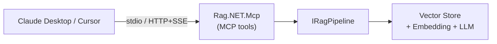

import Tabs from '@theme/Tabs';
import TabItem from '@theme/TabItem';

# MCP Server

Rag.NET can be exposed as a [Model Context Protocol](https://modelcontextprotocol.io/) (MCP) server, making it consumable by any MCP-compatible host — Claude Desktop, Cursor, LM Studio, and others — without custom integration code.



## Packages

| Package | Purpose |
|---|---|
| `Rag.NET.Mcp` | MCP tools (`rag_retrieve`, `rag_ask`, `rag_ingest`) — resolves `IRagPipeline` from DI |
| `Rag.NET.Api` | ASP.NET Core REST API exposing `IRagPipeline` as HTTP endpoints |
| `Rag.NET.Api.Client` | `IRagPipeline` implementation that calls `Rag.NET.Api` over HTTP |
| `Rag.NET.Api.Grpc` | gRPC service exposing `IRagPipeline` |
| `Rag.NET.Api.Grpc.Client` | `IRagPipeline` implementation that calls `Rag.NET.Api.Grpc` over gRPC |
| `Rag.NET.Mcp.Tool` | `ragnet-mcp` dotnet global tool — self-contained, no code required |
| `Rag.NET.Hosting` | Configuration-driven pipeline wiring (`AddRagNetPipelineFromConfiguration`) shared by `Rag.NET.Mcp.Tool` and the `ragnet` CLI — not published, referenced internally |

---

## Deployment patterns

### Pattern A — In-process (recommended)

The MCP server and the RAG pipeline run in the same process. `Rag.NET.Mcp` resolves `IRagPipeline` directly from DI — no extra HTTP hop, no auth between MCP and the pipeline.

```bash
dotnet add package Rag.NET.Mcp
dotnet add package ModelContextProtocol.AspNetCore
```

```csharp
var builder = WebApplication.CreateBuilder(args);

// 1. Register AI services (embedding + chat)
builder.Services.AddEmbeddingGenerator(...);
builder.Services.AddChatClient(...);

// 2. Configure Rag.NET pipeline
builder.Services.AddRagNet(rag => rag
    .UsePgVector("Host=localhost;Database=ragdb;Username=postgres;Password=secret",
                 vectorDimensions: 1536));

// 3. Add MCP server on top — resolves IRagPipeline from the same DI container.
// Rag.NET.Mcp does not reference ModelContextProtocol.AspNetCore (that would force an ASP.NET
// Core dependency on every stdio-only consumer), so HTTP transport is configured through the
// SDK's own builder, exposed as McpServerBuilder.Server:
var mcp = builder.Services.AddRagNetMcpServer();
mcp.Server.WithHttpTransport();  // for multi-client HTTP/SSE
// mcp.WithStdioTransport();     // use this instead for Claude Desktop (subprocess)

var app = builder.Build();

// API-key auth for HTTP is your own middleware — Rag.NET.Mcp only wires the transport.
app.Use(async (context, next) =>
{
    if (context.Request.Headers["X-Api-Key"] != "your-secret")
    {
        context.Response.StatusCode = StatusCodes.Status401Unauthorized;
        return;
    }

    await next(context);
});

app.MapMcp("/mcp");
await app.RunAsync();
```

### Pattern B — Shared backend (REST)

Run one Rag.NET REST backend and point multiple MCP server instances at it. Useful when you want a single, centrally-managed knowledge base.

```
Claude Desktop ──┐
Cursor           ├──→ MCP Server (Rag.NET.Mcp + Rag.NET.Api.Client)
LM Studio ───────┘            ↓  X-Api-Key
                     Backend (Rag.NET + Rag.NET.Api)
```

**Backend app:**

```bash
dotnet add package Rag.NET
dotnet add package Rag.NET.Api
```

```csharp
builder.Services.AddRagNet(...);
builder.Services.AddRagNetApi(o => o.ApiKeys = ["key-for-mcp-1", "key-for-mcp-2"]);
app.UseRagNetApiAuthentication();
app.MapRagNetApi();
```

**MCP proxy app:**

```bash
dotnet add package Rag.NET.Mcp
dotnet add package Rag.NET.Api.Client
```

```csharp
builder.Services.AddRagNetApiClient(o =>
{
    o.BaseUrl = "https://rag-backend.internal";
    o.ApiKey  = "key-for-mcp-1";
});
builder.Services
    .AddRagNetMcpServer()
    .WithStdioTransport();
```

### Pattern C — Shared backend (gRPC)

Same as Pattern B but using gRPC for the MCP server → backend hop. Preferred for internal service-to-service communication: strongly typed, lower overhead, and native server-streaming.

```bash
# Backend
dotnet add package Rag.NET.Api.Grpc

# MCP proxy
dotnet add package Rag.NET.Mcp
dotnet add package Rag.NET.Api.Grpc.Client
```

```csharp
// Backend
builder.Services.AddRagNetGrpcApi(o => o.ApiKeys = ["key-for-mcp-1"]);
app.MapRagNetGrpcApi();

// MCP proxy
builder.Services.AddRagNetGrpcClient(o =>
{
    o.BaseUrl = "https://rag-backend.internal:5001";
    o.ApiKey  = "key-for-mcp-1";
});
builder.Services.AddRagNetMcpServer().WithStdioTransport();
```

### Pattern D — dotnet global tool (no code required)

Install and run without writing any code. You supply an `appsettings.json` with your pipeline configuration (embedding provider, vector store, chat client) and the tool starts the MCP server.

```bash
dotnet tool install -g Rag.NET.Mcp.Tool

# stdio (Claude Desktop subprocess)
ragnet-mcp

# HTTP/SSE on port 5050
ragnet-mcp --transport http --port 5050 --api-key your-secret
```

The tool wires its pipeline — chat client, embedding generator, vector store — from an `appsettings.json` next to its working directory, or from environment variables (`__` as the section separator, e.g. `RagNet__ChatClient__ApiKey`). A sample `appsettings.sample.json`, showing every supported `VectorStore:Kind`, ships alongside the installed binaries; copy it to `appsettings.json` and fill in real values.

```json
{
  "RagNet": {
    "ChatClient":  { "Endpoint": "https://api.openai.com/v1", "ApiKey": "…", "Model": "gpt-4o-mini" },
    "Embeddings":  { "Endpoint": "https://api.openai.com/v1", "ApiKey": "…", "Model": "text-embedding-3-small", "VectorDimensions": 1536 },
    "VectorStore": {
      "Kind": "InMemory | Qdrant | PgVector",
      "Qdrant":   { "Host": "…", "Port": 6334, "CollectionName": "…" },
      "PgVector": { "ConnectionString": "…" }
    }
  }
}
```

`VectorDimensions` lives under `Embeddings`, not under the store, because it is a property of the embedding model — every store merely has to agree with it. The chat client and embedding generator both go through one OpenAI-compatible endpoint, which covers OpenAI, Azure OpenAI, OpenRouter, Ollama, and LM Studio. The vector store is one of three kinds: `InMemory` (the default, zero setup, but **every ingested document is lost when the process exits** — a warning is logged at startup), `Qdrant`, or `PgVector`.

:::note
A misconfigured setting — an unrecognised `Kind`, a missing `Endpoint`/`Model`, an absent or non-positive `VectorDimensions` — fails at startup with a message naming both the setting and the `RagNet:…` configuration key that fixes it, rather than failing the first time an MCP client calls a tool.

Need a provider outside that bounded set — Weaviate, Pinecone, Chroma, Azure AI Search, ONNX embeddings, a bespoke `IChatClient`? Host `Rag.NET.Mcp` directly in your own application (Pattern A above) and register whatever you like; this tool covers the bounded, OpenAI-compatible set above and nothing wider.
:::

---

## MCP tools

Three tools are exposed to the LLM host:

### `rag_retrieve`

Search the knowledge base and return ranked chunks.

| Parameter | Type | Default | Description |
|---|---|---|---|
| `query` | string | — | The natural-language query |
| `topK` | int | 5 | Maximum number of results |
| `useHybrid` | bool | true | BM25 + vector hybrid search |

Returns a JSON array of `SearchResult` objects with `Chunk.Text`, `Chunk.DocumentId`, `Chunk.ChunkIndex`, `Score`, and `Chunk.Metadata`.

### `rag_ask`

Retrieve relevant chunks and generate a grounded answer.

| Parameter | Type | Default | Description |
|---|---|---|---|
| `query` | string | — | The question |
| `topK` | int | 5 | Chunks to retrieve |
| `useHybrid` | bool | true | Hybrid search |

Returns a JSON object with `Answer` (string) and `Sources` (array of `SearchResult`).

### `rag_ingest`

Add a document to the knowledge base at runtime.

| Parameter | Type | Default | Description |
|---|---|---|---|
| `content` | string | — | Document text (inline) |
| `documentId` | string? | auto | Stable ID for updates/deletes |
| `fileName` | string? | `{id}.txt` | Used to infer content type |
| `contentType` | string? | — | MIME type override |
| `tags` | string[]? | — | Metadata as `key=value` pairs, e.g. `["author=Alice", "year=2024"]` |

Returns `{ "DocumentId": "...", "ChunksStored": N }`.

---

## Claude Desktop configuration

Add Rag.NET as an MCP server in Claude Desktop's config file.

**macOS:** `~/Library/Application Support/Claude/claude_desktop_config.json`
**Windows:** `%APPDATA%\Claude\claude_desktop_config.json`

<Tabs>
  <TabItem value="in-process" label="In-process (stdio)" default>
    ```json
    {
      "mcpServers": {
        "rag-net": {
          "command": "dotnet",
          "args": ["run", "--project", "/path/to/your/RagMcpHost"],
          "env": {}
        }
      }
    }
    ```
  </TabItem>
  <TabItem value="global-tool" label="dotnet global tool (stdio)">
    ```json
    {
      "mcpServers": {
        "rag-net": {
          "command": "ragnet-mcp",
          "args": [],
          "env": {
            "RAGNET_MCP_API_KEY": "your-secret"
          }
        }
      }
    }
    ```
  </TabItem>
  <TabItem value="http" label="HTTP backend">
    ```json
    {
      "mcpServers": {
        "rag-net": {
          "url": "http://localhost:5050/mcp",
          "headers": {
            "X-Api-Key": "your-secret"
          }
        }
      }
    }
    ```
  </TabItem>
</Tabs>

---

## Authentication

| Transport | Mechanism |
|---|---|
| stdio | None — process boundary is the security boundary |
| HTTP/SSE | `X-Api-Key` header; configure `ApiKeys` array for rotation and per-client revocation |
| MCP over HTTP (`ragnet-mcp --transport http`) | `X-Api-Key` header; `--api-key` or `RAGNET_MCP_API_KEY`, or `--allow-anonymous` to opt out deliberately |
| gRPC | `x-api-key` metadata header; validated by a server-side interceptor |

Both `AddRagNetApi` and `AddRagNetGrpcApi` require an explicit authentication decision at registration: configure at least one key, or opt out deliberately with `AllowAnonymous = true` (e.g. behind a trusted gateway). Registering with an empty `ApiKeys` and no opt-out throws at startup, and setting both at once is rejected as a contradiction. At request time the middleware/interceptor fail closed — no keys and no opt-out means the request is refused, never silently served.

`ragnet-mcp --transport http` follows the same rule and **refuses to start** without one of the
two: it exposes ingest, retrieve and ask, and binds every interface rather than loopback. Building
your own MCP server on `Rag.NET.Mcp` instead? `McpApiKeyAuthorization.IsAuthorized` is the same
decision the tool uses — the middleware is yours to write, because it is ASP.NET Core and that
package deliberately does not reference a web framework, but the comparison is not something to
reimplement.

Multiple keys are supported for rotation without downtime:

```csharp
services.AddRagNetApi(o => o.ApiKeys = ["key-a", "key-b"]);
// Rotate: add "key-c", redeploy, then remove "key-a"
```

---

## REST API endpoints

When using `Rag.NET.Api`, the following endpoints are available:

| Method | Path | Maps to |
|---|---|---|
| `POST` | `/rag/ingest` | `IngestAsync` |
| `POST` | `/rag/retrieve` | `RetrieveAsync` |
| `POST` | `/rag/ask` | `AskAsync` |
| `GET` | `/rag/ask/stream?query=...` | `AskStreamingAsync` (SSE) |
| `DELETE` | `/rag/documents/{id}` | `DeleteAsync` |

The route prefix `/rag` is configurable via `RagApiOptions.RoutePrefix`.
