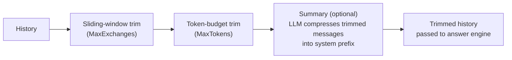
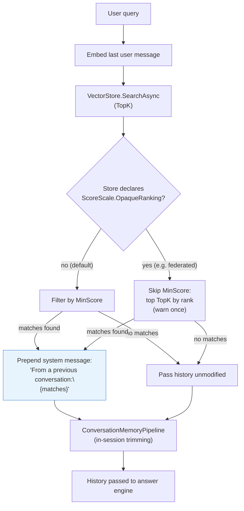

# Conversational Memory

Multi-turn RAG requires managing conversation history so that older exchanges do not overflow the context window while still giving the LLM enough context to respond coherently. Rag.NET provides two composable layers:

1. **`ConversationMemoryPipeline`** — in-session history trimming (sliding window, token budget, optional summary).
2. **`PersistentConversationMemory`** — cross-session recall: embeds each exchange and stores it in the vector store; injects relevant past exchanges as a system prefix on future turns.

Both implement `IConversationMemory` and are registered as a singleton via `UseConversationMemory`.

---

## In-Session Memory (`ConversationMemoryPipeline`)

### Enabling

```csharp
services.AddRagNet(rag => rag
    .UseConversationMemory(new ConversationMemoryOptions
    {
        MaxExchanges = 20,
    }));
```

### `ConversationMemoryOptions`

| Option | Default | Description |
|--------|---------|-------------|
| `MaxExchanges` | `null` | Maximum user/assistant exchange pairs to keep; oldest removed first; system messages always preserved. Applied first. |
| `MaxTokens` | `null` | Maximum token budget (cl100k_base); oldest non-system messages trimmed until within budget. Applied second. |
| `UseSummary` | `false` | When `true`, trimmed messages are LLM-summarized into a system prefix instead of discarded. Requires `IChatClient`. Applied last. |
| `SummaryPromptTemplate` | `null` | Custom prompt for the summary call. `null` uses the built-in default. |

### Trimming order

When both `MaxExchanges` and `MaxTokens` are set, window trimming runs first, then token trimming runs on the result. Summary (when enabled) replaces trimmed messages with an LLM-generated summary prefix.



### How `AskAsync` uses it

When `IConversationMemory` is registered, the answer engines (`ChatAnswerEngine`, `MapReduceAnswerEngine`, `RefineAnswerEngine`) call `ProcessAsync` on the memory before every LLM call. The caller is still responsible for maintaining the `ConversationHistory` list and passing it via `RagOptions`:

```csharp
var history = new List<ChatMessage>();

// First turn
var response = await pipeline.AskAsync("What is RAG?", new RagOptions
{
    ConversationHistory = history,
});
history.Add(new(ChatRole.User,      "What is RAG?"));
history.Add(new(ChatRole.Assistant, response.Answer));

// Second turn — memory trims history before the LLM call
var response2 = await pipeline.AskAsync("Can you give an example?", new RagOptions
{
    ConversationHistory = history,
});
```

`ProcessAsync` is called internally by the pipeline — callers do not need to invoke it directly.

---

## Persistent Memory (`PersistentConversationMemory`)

Persistent memory adds cross-session recall on top of `ConversationMemoryPipeline`. Each exchange is embedded and stored in the vector store keyed by a `sessionId`. On subsequent calls, the current query is embedded and used to search for similar past exchanges; relevant ones are injected as a system prefix before the in-session trimming runs.

### Enabling

Nest `UsePersistentMemory()` inside `UseConversationMemory`:

```csharp
services.AddRagNet(rag => rag
    .UseConversationMemory(
        options: new ConversationMemoryOptions { MaxExchanges = 20 },
        configure: mem => mem.UsePersistentMemory()));
```

With custom options:

```csharp
services.AddRagNet(rag => rag
    .UseConversationMemory(
        options: new ConversationMemoryOptions { MaxExchanges = 20 },
        configure: mem => mem.UsePersistentMemory(new PersistentMemoryOptions
        {
            TopK     = 5,
            MinScore = 0.75,
        })));
```

Requires `IVectorStore` and `IEmbeddingGenerator` to be registered in DI.

### `PersistentMemoryOptions`

| Option | Default | Description |
|--------|---------|-------------|
| `TopK` | `3` | Maximum number of past exchanges to inject per turn |
| `MinScore` | `0.7` | Minimum cosine similarity for an exchange to be injected — **only on a similarity-scaled store** (see below) |

**Score scale.** `MinScore` is a threshold on the similarity scale, and every store is assumed to be on that scale unless it says otherwise by implementing `IScoreScaleAware`. A store declaring `ScoreScale.OpaqueRanking` — currently `FederatedVectorStore`, whose scores are Reciprocal Rank Fusion sums peaking near `0.033` for two stores — has no thresholdable scale, so recall **ignores `MinScore`** there: it injects the store's top `TopK` matches in rank order and logs one warning per memory instance naming the store type and the ignored option. Recall works against such a store, but a minimum relevance cannot be enforced: every turn with a user message injects up to `TopK` past exchanges, however weakly related. Lower `TopK` if that is too much context, or back persistent memory with a dedicated similarity-scaled store when the threshold matters. See [vector stores](vector-stores.md#score-scale-iscorescaleaware).

### Storing exchanges

Call `StoreAsync` after each turn to persist the exchange for future sessions:

```csharp
var response = await pipeline.AskAsync("Explain the refund policy", new RagOptions
{
    ConversationHistory = history,
});

// Persist this exchange under a stable session identifier
var memory = serviceProvider.GetRequiredService<IConversationMemory>();
await memory.StoreAsync(
    userMessage:      "Explain the refund policy",
    assistantMessage: response.Answer,
    sessionId:        "user-42-session-1");
```

`sessionId` is used as the `DocumentId` in the vector store. Use a stable, user-scoped identifier (e.g., user ID, conversation ID) so past exchanges from the same user are grouped together.

### How it works



Each stored exchange is a single `TextChunk`:
- `Text = "User: {userMessage}\nAssistant: {assistantMessage}"`
- `DocumentId = sessionId`
- `ChunkIndex` = sequential index within the session (process-scoped counter; resets on restart)

### Error handling

| Condition | Behaviour |
|-----------|-----------|
| Vector store search fails | Logged as warning; history unchanged; inner pipeline called normally |
| `StoreAsync` embedding fails | Logged as warning; exchange not persisted (non-fatal) |
| `StoreAsync` store write fails | Logged as warning; exchange not persisted (non-fatal) |
| All results below `MinScore` (similarity-scaled store) | No prefix injected; inner pipeline called normally |
| Store declares `ScoreScale.OpaqueRanking` | `MinScore` is not applied; the top `TopK` matches are injected in rank order, with one warning logged per memory instance |
| Store returns no matches at all | No prefix injected; inner pipeline called normally |

---

## `IConversationMemory` interface

```csharp
public interface IConversationMemory
{
    /// <summary>
    /// Trims or augments history before an LLM call.
    /// Called automatically by answer engines when registered.
    /// </summary>
    Task<IReadOnlyList<ChatMessage>> ProcessAsync(
        IReadOnlyList<ChatMessage> history,
        CancellationToken cancellationToken = default);

    /// <summary>
    /// Persists a completed exchange for cross-session recall.
    /// No-op on <see cref="ConversationMemoryPipeline"/>; stores in the vector store on
    /// <see cref="PersistentConversationMemory"/>.
    /// </summary>
    Task StoreAsync(
        string userMessage,
        string assistantMessage,
        SessionId sessionId,
        CancellationToken cancellationToken = default);
}
```

`StoreAsync` is always safe to call regardless of which implementation is registered — it is a no-op on `ConversationMemoryPipeline`.
