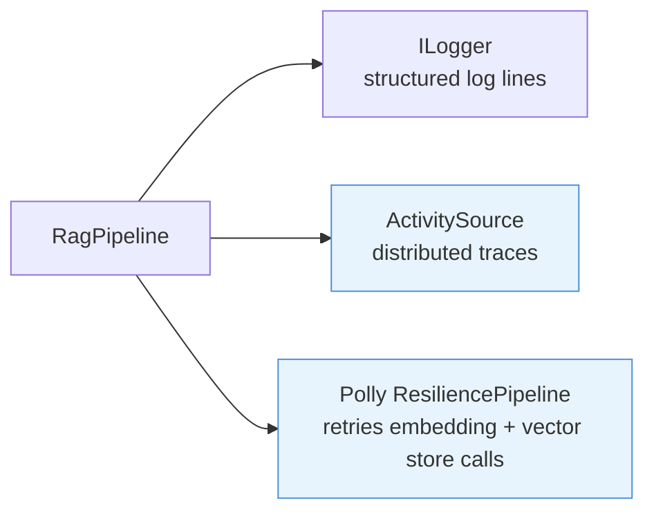

# Observability

Production RAG pipelines need structured logging, distributed traces, and resilience against transient failures in external APIs. Rag.NET integrates with the standard .NET observability stack — `Microsoft.Extensions.Logging`, OpenTelemetry `ActivitySource`, and Polly — so you can wire up your existing infrastructure without additional adapters.

## `ILogger` integration

Logging is distributed across the behavior pipeline. Each behavior accepts an optional `ILogger` via its constructor and emits structured log messages for its operations. All messages use high-performance source-generated `[LoggerMessage]` methods.

### Log messages

| Component | Level | Method | Message template |
|-----------|-------|--------|-----------------|
| `PipelineIngestor` | `Information` | `IngestStarted` | `Ingesting document {DocumentId} ({ContentType})` |
| `PipelineIngestor` | `Information` | `IngestCompleted` | `Ingested document {DocumentId}: {ChunksStored} chunk(s) stored` |
| `PipelineIngestor` | `Error` | `IngestFailed` | `Failed to ingest document {DocumentId}` (includes exception) |
| `VectorStoreBehavior` | `Debug` | `RetrieveStarted` | `Retrieving chunks (TopK={TopK})` |
| `VectorStoreBehavior` | `Debug` | `RetrieveCompleted` | `Retrieved {ResultCount} chunk(s)` |
| `MultiQueryBehavior` | `Warning` | `QueryExpansionFailed` | `Query expansion failed for '{Query}'` |
| `RerankingBehavior` | `Warning` | — | `Reranking failed, returning unranked results` |
| `HydeBehavior` | `Warning` | `HydeGenerationFailed` | `HyDE generation failed for query '{Query}', falling back to original query embedding` |
| `RedundancyFilterBehavior` | `Warning` | — | `Redundancy filtering failed, returning unfiltered results` |
| `EmbeddingCacheBehavior` | `Debug` | `EmbeddingCacheHit` | `Embedding cache hit for query '{Query}'` |
| `ResultCacheBehavior` | `Debug` | `ResultCacheHit` | `Result cache hit for query '{Query}'` |
| `EmbeddingCacheBehavior` | `Warning` | `EmbeddingCacheFailed` | `Embedding cache operation failed for query '{Query}'` |
| `ResultCacheBehavior` | `Warning` | `ResultCacheFailed` | `Result cache operation failed for query '{Query}'` |
| `ParentDocumentRetrievalBehavior` | `Debug` | `ParentDocumentRetrieved` | `Parent document retrieved for query '{Query}': {ChildCount} children -> {ParentCount} parents` |
| `ParentDocumentRetrievalBehavior` | `Warning` | `ParentDocumentFailed` | `Parent document lookup failed for query '{Query}', returning child chunks` |

### Setup

Register any `ILogger` provider. The decorators pick it up automatically:

```csharp
services.AddLogging(logging =>
{
    logging.AddConsole();
    logging.SetMinimumLevel(LogLevel.Debug);
});

services.AddRagNet(rag => rag.UsePgVector(connectionString));
```

With `Microsoft.Extensions.Logging.Console`, a retrieval call produces output similar to:

```
dbug: Rag.NET.Retrieval.VectorStoreRetriever[0]
      Retrieving chunks (TopK=5)
dbug: Rag.NET.Retrieval.VectorStoreRetriever[0]
      Retrieved 5 chunk(s)
```

No additional configuration is required. If no `ILogger` is provided, each component silently uses `NullLogger.Instance`.

## OpenTelemetry `ActivitySource`

The pipeline creates `Activity` spans for the three pipeline operations using an `ActivitySource` named `"Rag.NET"`. The source version is taken from the assembly version at startup.

### Activity names

Every span name is prefixed `ragnet.`. The names are string literals in the pipeline rather than public constants — the source name and the span names are the public identity, and the `ActivitySource` itself is internal.

| Span | Opened by |
|------|-----------|
| `ragnet.query` | `AskAsync` / `AskStreamingAsync` / `RetrieveAsync`, enclosing everything the call does |
| `ragnet.retrieve` | `PipelineRetriever`, around the retrieval behavior pipeline |
| `ragnet.ask` | `ChatAnswerEngine`, on both the streamed and non-streamed paths |
| `ragnet.ingest` | `PipelineIngestor`, enclosing the four ingestion stages |
| `ragnet.parse` | `ParseBehavior` |
| `ragnet.chunk` | `ChunkingBehavior` |
| `ragnet.embed` | `EmbeddingBehavior` |
| `ragnet.store` | `StorageBehavior` |

`RetrieveAsync` opens `ragnet.query` too, even though it usually encloses a single `ragnet.retrieve`. It reads like redundancy and is not: a fan-out retriever such as `DeepResearchRetriever` calls the inner retriever once per sub-question, so one `RetrieveAsync` can open several sibling `ragnet.retrieve` spans with nothing above them. The enclosing span is what keeps those one operation rather than several.

### Setup with OpenTelemetry SDK

```bash
dotnet add package OpenTelemetry.Extensions.Hosting
dotnet add package OpenTelemetry.Exporter.Console   # or your preferred exporter
```

```csharp
using OpenTelemetry;
using OpenTelemetry.Trace;

services.AddOpenTelemetry()
    .WithTracing(tracing => tracing
        .AddSource("Rag.NET")           // subscribe to Rag.NET activities
        .AddConsoleExporter());         // or AddOtlpExporter(), AddZipkinExporter(), etc.
```

With this configuration every `IngestAsync`, `RetrieveAsync`, and `AskAsync` call produces a span that appears in your trace backend. Nest these calls inside your own application spans to get full request traces.

These are the same spans the [pipeline debugger](diagnostics.md) reads for its latency breakdown. Note that registering it subscribes its own `ActivityListener` with `AllData` sampling, so the `ragnet.*` spans start being created even in a process with no exporter configured — see [what it costs to have on](diagnostics.md#enabling-diagnostics-changes-the-pipelines-cost-profile).

### Setup with Application Insights

```csharp
services.AddApplicationInsightsTelemetry();
// Application Insights auto-collects all ActivitySource spans registered in the process.
// No additional AddSource("Rag.NET") call is required with the Azure Monitor distro.
```

## Polly resilience pipeline

Embedding API calls and vector store calls are remote operations subject to transient failures (rate limits, timeouts, network blips). `RagBuilder.ConfigureResilience` registers a named [Polly](https://github.com/App-vNext/Polly) `ResiliencePipeline` (`"rag-net"`) and decorates the registered `IEmbeddingGenerator<string, Embedding<float>>` and `IVectorStore` so every call runs through it.

**Ordering matters.** Only the surfaces registered at the time of the call are decorated — the same rule as `UseRateLimiting`/`UseCostBudgeting`. Register the store and embedding generator first; calling `ConfigureResilience` with neither registered throws with an actionable message rather than silently doing nothing.

### Default policy

When called without arguments, a retry policy with exponential back-off and jitter is applied:

- Maximum 3 retry attempts
- Base delay: 1 second
- Back-off type: exponential
- Jitter: enabled

```csharp
services.AddRagNet(rag => rag
    .UsePgVector(connectionString)
    .ConfigureResilience());   // uses default exponential back-off retry
```

### Custom policy

Supply a delegate to configure the `ResiliencePipelineBuilder` yourself:

```csharp
using Polly;
using Polly.CircuitBreaker;
using Polly.Retry;

services.AddRagNet(rag => rag
    .UsePgVector(connectionString)
    .ConfigureResilience(builder => builder
        .AddRetry(new RetryStrategyOptions
        {
            MaxRetryAttempts = 5,
            Delay            = TimeSpan.FromMilliseconds(500),
            BackoffType      = DelayBackoffType.Exponential,
            UseJitter        = true,
        })
        .AddCircuitBreaker(new CircuitBreakerStrategyOptions
        {
            FailureRatio          = 0.5,
            SamplingDuration      = TimeSpan.FromSeconds(30),
            MinimumThroughput     = 10,
            BreakDuration         = TimeSpan.FromSeconds(15),
        })));
```

### What is and is not covered

- **Covered:** `IEmbeddingGenerator.GenerateAsync`, and `IVectorStore.StoreAsync`/`SearchAsync`/`DeleteByDocumentIdAsync`. Retries assume these are idempotent — `StoreAsync` is an upsert keyed by `(DocumentId, ChunkIndex)` and delete-of-missing is a no-op across the shipped stores, so a re-sent write does not duplicate.
- **Capability surfaces:** decorating a sparse-capable store keeps the `store is ISparseSearchable` probe honest (the sparse operations are wrapped too). `IScoreScaleAware` is delegated: a decorated `FederatedVectorStore` still reports `ScoreScale.OpaqueRanking`, and a store that declares no scale still reads as `Similarity` — so score-scale-sensitive consumers such as persistent memory behave identically with and without `ConfigureResilience`. `IHybridSearchable` is forwarded by a variant, `ResilientHybridVectorStore`, chosen by `ResilientVectorStore.Create` the same way the sparse variant is — so `store is IHybridSearchable` stays true after decoration and the native hybrid query **is** retried, like any other read. That was not so before [#544](https://github.com/MarcelRoozekrans/Rag.NET/issues/544): the decorator did not implement the interface, and because the retrieval pipeline probes the *registered* `IVectorStore`, native hybrid dispatch was not merely un-retried but **unreachable**. A store implementing both `ISparseSearchable` and `IHybridSearchable` is refused at registration, since no variant preserves that pair. `ICollectionManageable` is still **not** forwarded and that costs nothing, which is the difference: nothing probes it on a resolved `IVectorStore` — it is registered as its own DI singleton by each store's `Use*` extension and only ever resolved directly. Collection management is therefore not retried, by choice.
- **Not covered:** `IChatClient`. Use `UseFallbackChain` for chat-side resilience (see the [resilience guide](resilience.md)).
- **Cancellation is never retried.** The caller's `CancellationToken` flows into every attempt, and the default retry predicate excludes `OperationCanceledException` — so a cancelled call (and, deliberately, an `HttpClient` timeout surfacing as `TaskCanceledException`) fails on the first attempt. A custom `configure` delegate owns its own predicates and should exclude it too.

> **Warning — double retry with Weaviate and Chroma:** those two stores hand-build a **retry-only** `ResilienceHandler` on their own `HttpClient` — a bare `AddRetry(new HttpRetryStrategyOptions())` pipeline, *not* `AddStandardResilienceHandler`, so there is no transport-level timeout, circuit breaker or concurrency limiter. This decorator therefore stacks **on top of** transport-level retries and the attempt counts multiply. Both layers default to `MaxRetryAttempts = 3`, and Polly counts *retries*, not attempts: 1 initial call + 3 retries = 4 attempts per layer, so the worst case is 4 × 4 = **up to 16 requests**, each with its own back-off. Configure one layer or the other: either skip `ConfigureResilience` for those stores and tune the HTTP handler, or keep `ConfigureResilience` and accept the multiplication knowingly. Qdrant (gRPC), Pinecone (SDK) and PgVector (Npgsql) are not HTTP-typed clients and have no transport-level retry, so for them the decorator is the only layer.

## Combining all three



A production-ready observability setup:

```csharp
services.AddLogging(logging => logging
    .AddConsole()
    .SetMinimumLevel(LogLevel.Information));

services.AddOpenTelemetry()
    .WithTracing(tracing => tracing
        .AddSource("Rag.NET")
        .AddOtlpExporter());

services.AddRagNet(rag => rag
    .UsePgVector(connectionString)
    .AddPdfParser()
    .ConfigureResilience());
```

This gives you:
- Structured log lines for every ingestion and retrieval operation
- Distributed traces for `ingest`, `retrieve`, and `ask` spans, exportable to any OTLP-compatible backend (Jaeger, Grafana Tempo, Azure Monitor, etc.)
- Automatic retry with exponential back-off for transient API failures
