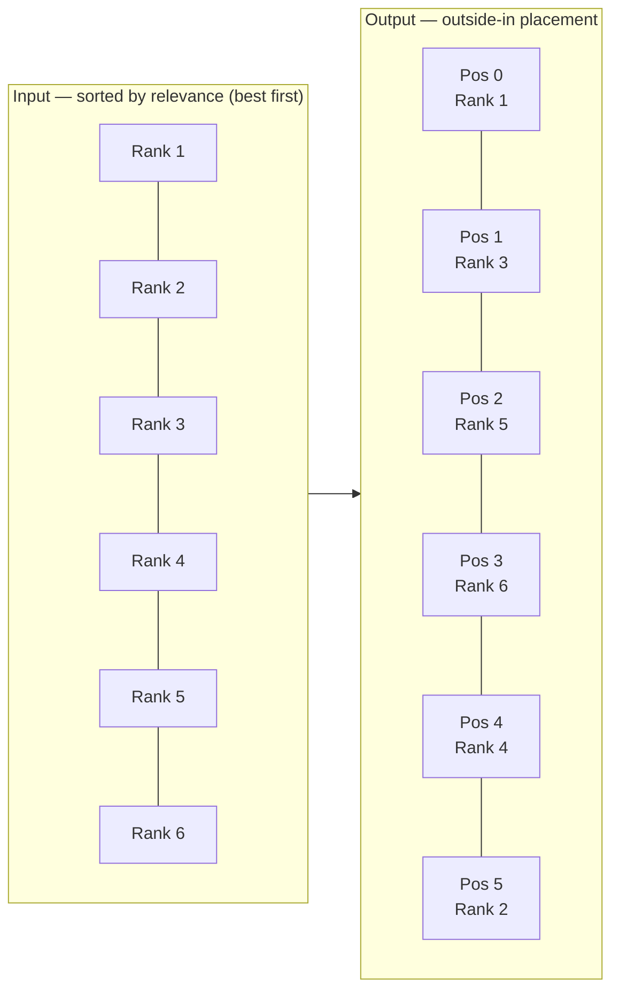
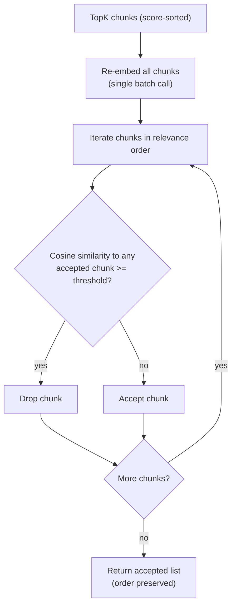
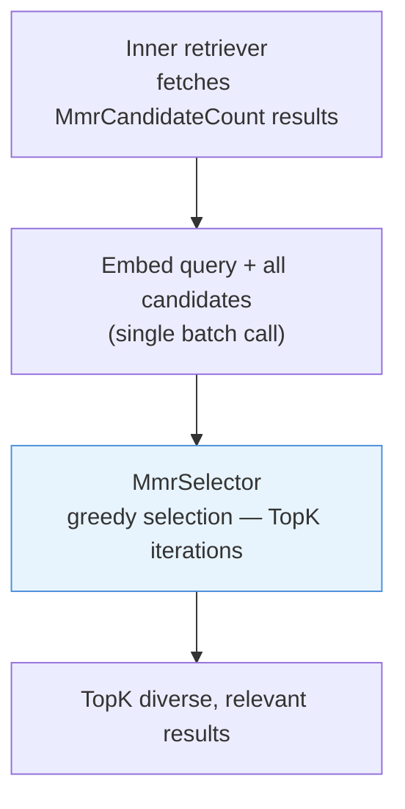
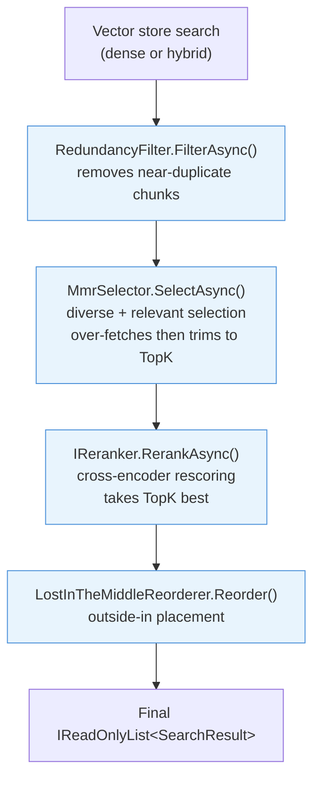

# Post-Retrieval

After the vector store returns a ranked list of chunks, three optional post-processors can improve the quality of what the LLM receives. All are controlled per-call via flags on `RetrievalOptions`. They run in a fixed order: redundancy filtering first, then cross-encoder reranking, then Lost-in-the-Middle reordering.

## Lost-in-the-Middle reordering

LLMs attend unevenly to their context window. Research by Liu et al. (2023, ["Lost in the Middle"](https://arxiv.org/abs/2307.03172)) found that models consistently perform better when the most relevant information appears at the beginning or end of the context, not in the middle. When `UseLostInTheMiddleReordering = true`, Rag.NET reorders the retrieved chunks so that the highest-scoring ones are placed at the extremes of the list.

### How it works

The reorderer expects a list sorted by descending relevance (best first — which is the default output of `RetrieveAsync`). It interleaves chunks from the sorted list into a new order using an outside-in pattern:

```
Input (rank 1 = best):  [1, 2, 3, 4, 5, 6]
Output (positions):      [1, 3, 5, 6, 4, 2]
```



Even-indexed input items (0, 2, 4, ...) fill from the left; odd-indexed items (1, 3, 5, ...) fill from the right. The result places rank-1 at position 0, rank-3 at position 1, rank-5 at position 2, rank-6 at position 3, rank-4 at position 4, rank-2 at position 5.

The `Score` values on the returned `SearchResult` objects are unchanged. Only the list ordering is modified.

### Usage

```csharp
// On RetrieveAsync
var results = await pipeline.RetrieveAsync("query", new RetrievalOptions
{
    TopK                         = 10,
    UseLostInTheMiddleReordering = true,
});

// On AskAsync / AskStreamingAsync
var response = await pipeline.AskAsync("question", new RagOptions
{
    TopK                         = 10,
    UseLostInTheMiddleReordering = true,
});
```

### When to use it

Enable it when `TopK >= 5` and the LLM is receiving a long context window of retrieved passages. For very small `TopK` values (2–3), the benefit is minimal. It has no computational cost beyond an array allocation — there is no additional API call.

### API reference

```csharp
public static class LostInTheMiddleReorderer
{
    public static IReadOnlyList<SearchResult> Reorder(IReadOnlyList<SearchResult> results);
}
```

Input must be sorted in descending relevance order. Unsorted input produces meaningless output with no error.

## Redundancy filter

Redundant retrieved chunks waste context window space. When multiple chunks contain near-identical content (e.g., the same paragraph duplicated across documents, or overlapping chunks from the same source), sending all of them to the LLM dilutes the effective context. The redundancy filter removes near-duplicates before the context is assembled.

### How it works



1. All `TopK` retrieved chunk texts are re-embedded in a single batch call to `IEmbeddingGenerator`.
2. The filter iterates through the chunks in order (by relevance score, descending). Each chunk is accepted if its cosine similarity to every previously accepted chunk is below `RedundancyThreshold`.
3. The accepted list is returned. Order is preserved.

This is a greedy maximal independent set algorithm: earlier (higher-scoring) chunks take priority. A chunk is dropped only if it is similar to an already-accepted chunk, not if it is similar to another dropped chunk.

### Usage

```csharp
var results = await pipeline.RetrieveAsync("query", new RetrievalOptions
{
    TopK                = 10,
    UseRedundancyFilter = true,
    RedundancyThreshold = 0.95f,   // default — drop chunks with >95% cosine similarity
});

// Also on AskAsync / AskStreamingAsync
var response = await pipeline.AskAsync("question", new RagOptions
{
    TopK                = 10,
    UseRedundancyFilter = true,
    RedundancyThreshold = 0.90f,   // lower = more aggressive deduplication
});
```

### Threshold guidance

| Threshold | Effect |
|-----------|--------|
| `0.99` | Only removes near-exact copies |
| `0.95` (default) | Removes chunks with virtually identical content; safe for most corpora |
| `0.90` | Removes substantially similar chunks; useful for corpora with heavy reformatting or paraphrasing |
| `0.85` | Aggressive; can drop genuinely different chunks that discuss the same concept |

### Cost

The re-embedding call dominates the cost. For a batch of 10 chunks, expect 10–50 ms depending on your embedding provider. The cosine similarity loop is O(accepted × candidates) — quadratic in `TopK` — but is CPU-only and typically under 1 ms for `TopK <= 20`.

See [benchmarks](../reference/benchmarks.md#redundancy-filter) for measured values.

### API reference

```csharp
public static class RedundancyFilter
{
    public static async Task<IReadOnlyList<SearchResult>> FilterAsync(
        IReadOnlyList<SearchResult> results,
        IEmbeddingGenerator<string, Embedding<float>> embedder,
        float threshold,
        CancellationToken cancellationToken = default);
}
```

`FilterAsync` is called internally by `RagPipeline.RetrieveAsync`. You can call it directly if you are composing your own retrieval pipeline outside of `IRagPipeline`.

## Maximal Marginal Relevance (MMR)

MMR selects results that are both relevant to the query and maximally different from each other. Where the redundancy filter simply drops near-duplicates, MMR actively re-ranks candidates using a combined score that balances relevance against inter-result diversity, and is query-aware.

### Enabling

Register `UseMmr()` on the builder. An `IEmbeddingGenerator` must already be registered — no `IChatClient` required.

```csharp
services.AddRagNet(b => b
    .UseMmr());
```

### How it works

MMR over-fetches candidates (default `MmrCandidateCount = TopK × 3`), then greedily selects `TopK` results using:

```
score(d) = λ · sim(d, query) – (1–λ) · max_{s∈S} sim(d, s)
```

Where:
- `sim(d, query)` — cosine similarity between chunk `d` and the query
- `max_{s∈S} sim(d, s)` — maximum cosine similarity between `d` and any already-selected chunk
- `λ` (`MmrLambda`) — controls the relevance/diversity trade-off; `1.0` = pure relevance, `0.0` = pure diversity



If embedding fails, the pipeline logs a warning and returns candidates in their original score order.

### Usage

```csharp
var results = await pipeline.RetrieveAsync("query", new RetrievalOptions
{
    TopK              = 5,
    UseMmr            = true,
    MmrLambda         = 0.5f,   // default — balanced relevance and diversity
    MmrCandidateCount = 20,     // default: TopK * 3
});
```

### Lambda guidance

| `MmrLambda` | Effect |
|-------------|--------|
| `1.0` | Pure relevance — equivalent to returning the top-scoring candidates |
| `0.7` | Slightly diversified — good for homogeneous corpora |
| `0.5` | (default) — balanced trade-off, works well for most use cases |
| `0.3` | Diversity-heavy — maximises variety at the cost of some relevance |
| `0.0` | Pure diversity — may return less relevant but maximally distinct results |

> **Note:** `MmrLambda` must be between `0.0` and `1.0` inclusive. Values outside this range throw `ArgumentOutOfRangeException`.

### MMR vs Redundancy Filter

|  | Redundancy Filter | MMR |
|--|-------------------|-----|
| **Goal** | Remove near-duplicates | Select diverse, relevant results |
| **Scoring** | Binary (keep / drop) | Continuous MMR score |
| **Query-aware** | No | Yes — relevance to query is part of the score |
| **Cost** | One batch embed | Two embed calls (query + chunks) |

They can be used together. The redundancy filter runs before MMR in the decorator chain — MMR then selects the diverse subset from the already-deduplicated candidates.

### Disabling per call

`UseMmr` is opt-in — the decorator is active only when the call explicitly sets `UseMmr = true`. This differs from other registered features (HyDE, reranking, multi-query) which default to `true` and require explicit opt-out.

### API reference

```csharp
public static class MmrSelector
{
    public static async Task<IReadOnlyList<SearchResult>> SelectAsync(
        string query,
        IReadOnlyList<SearchResult> candidates,
        IEmbeddingGenerator<string, Embedding<float>> embedder,
        int topK,
        float lambda = 0.5f,
        CancellationToken cancellationToken = default);
}
```

`SelectAsync` is called internally by `MmrRetriever`. You can call it directly if you are composing your own retrieval pipeline outside of `IRagPipeline`.

## Execution order

When multiple post-retrieval options are enabled on the same call, the order is:



1. **Redundancy filter** — removes near-duplicate chunks (cheap, cosine similarity on existing embeddings)
2. **MMR** — selects `TopK` diverse, query-relevant results from the de-duplicated candidate pool. Opt-in (`UseMmr = true` required).
3. **Cross-encoder reranking** — rescores each (query, passage) pair with a cross-encoder model (expensive, per-pair inference). Trims to `TopK` after scoring. Only active when an `IReranker` is registered via `UseReranking<T>()` or `UseOnnxReranking()`.
4. **Lost-in-the-Middle reordering** — places highest-scoring chunks at context extremes for better LLM attention (presentation concern, zero cost)

The redundancy filter runs first to reduce the candidate pool before MMR's embedding calls. MMR runs before reranking so the cross-encoder operates on the already-diversified set.
