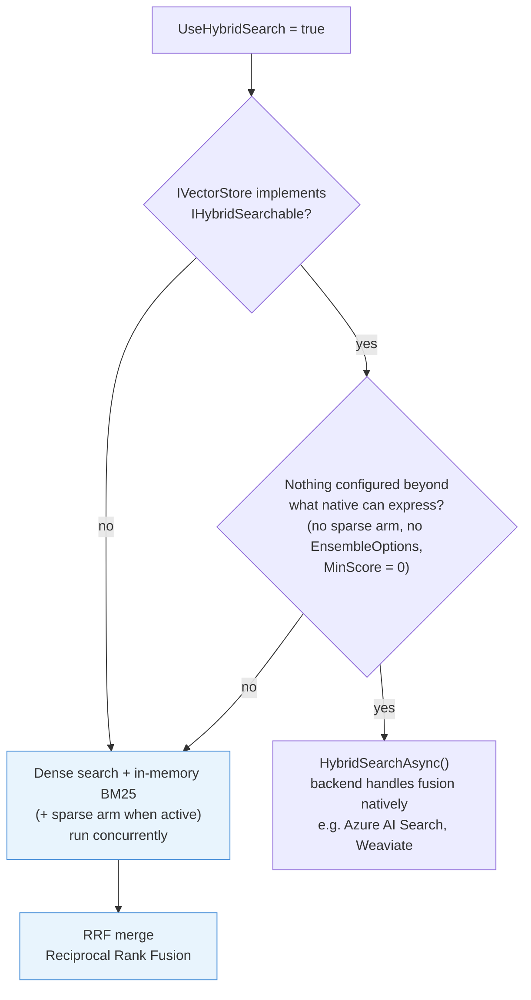
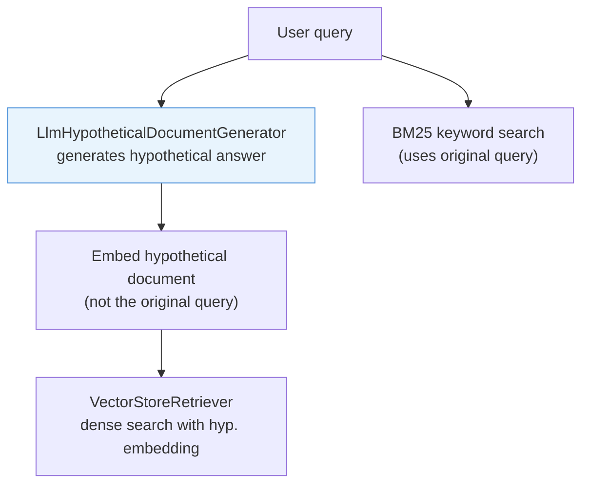
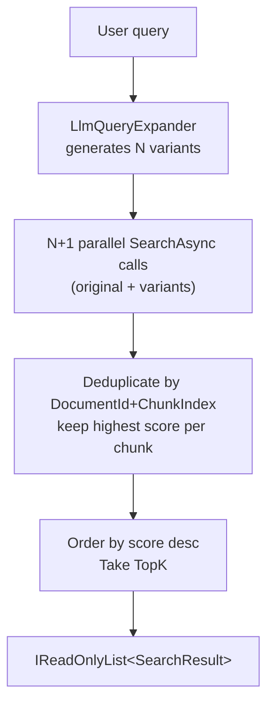
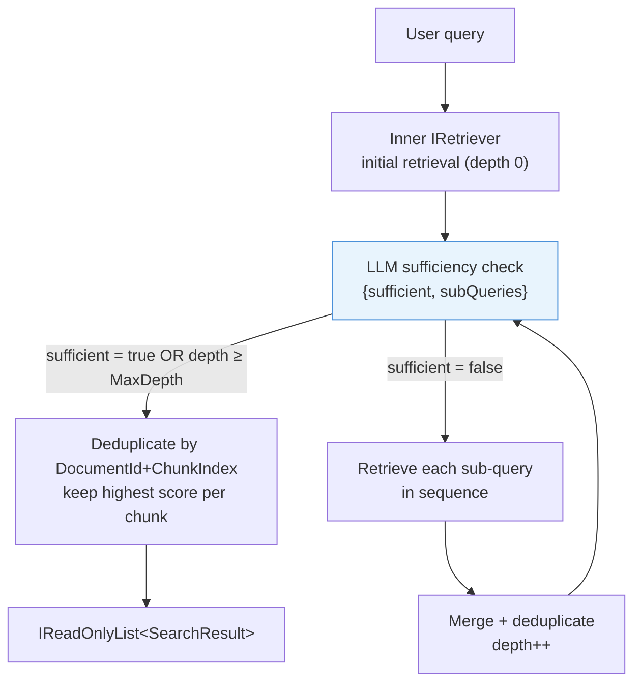
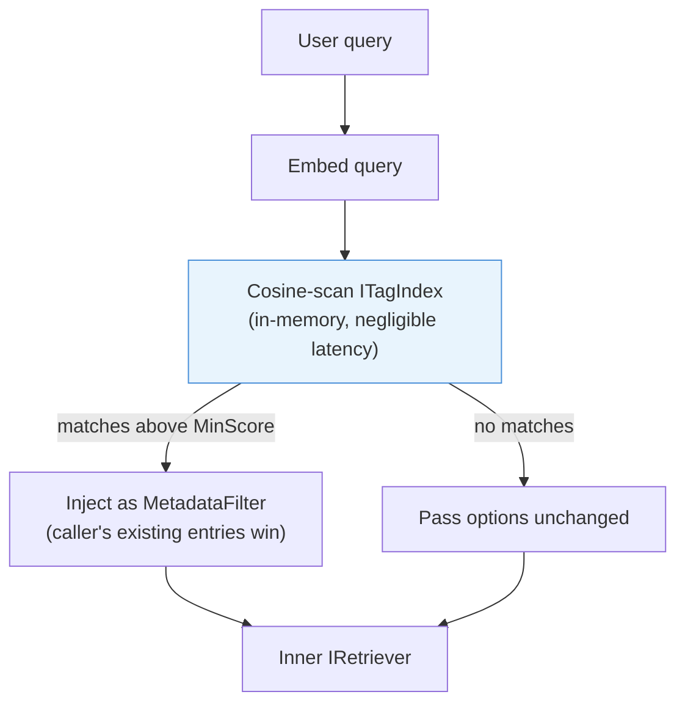
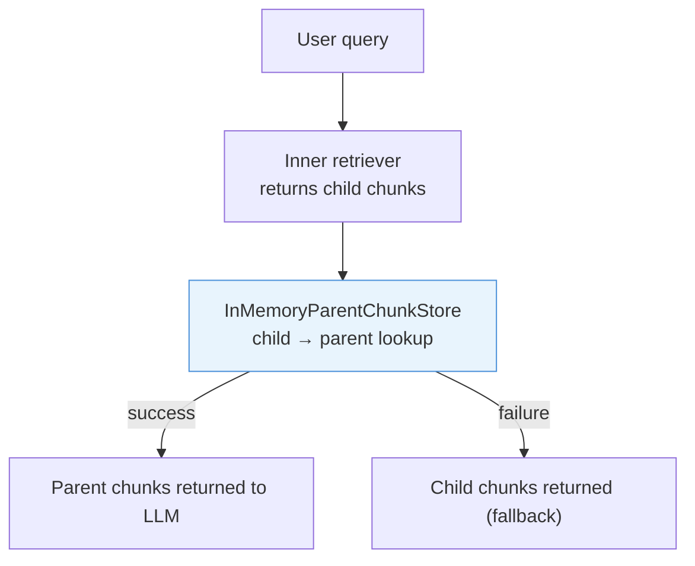
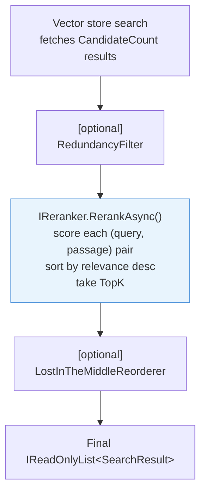

# Retrieval

Retrieval is the step that determines answer quality more than any other. A well-configured retrieval layer surfaces the right chunks for a given query; a poorly configured one buries them. This page covers `RetrievalOptions`, semantic search, hybrid BM25+vector search, multi-query retrieval, metadata filtering, and the `RagOptions` properties that mirror these settings for `AskAsync`.

## `RetrievalOptions`

```csharp
public sealed record RetrievalOptions
{
    public int TopK                          { get; init; } = 5;
    public double MinScore                   { get; init; } = 0.0;
    public IDictionary<string, MetadataValue>? MetadataFilter { get; init; }
    public ISpecification<SearchResult>? Filter { get; init; }
    public bool UseHybridSearch              { get; init; }
    public bool UseLostInTheMiddleReordering { get; init; }
    public bool UseRedundancyFilter          { get; init; }
    public float RedundancyThreshold         { get; init; } = 0.95f;
    public bool UseMmr                       { get; init; } = false;  // opt-in
    public float MmrLambda                   { get; init; } = 0.5f;
    public int? MmrCandidateCount            { get; init; }
    public bool UseHyde                      { get; init; } = true;
    public bool UseMultiQuery                { get; init; } = true;
    public bool UseParentDocument            { get; init; } = true;
    public bool UseReranking                 { get; init; } = true;
    public bool UseCacheEmbedding            { get; init; } = true;
    public bool UseCacheResult               { get; init; } = true;
    public int? CandidateCount               { get; init; }
    public bool UseAdaptiveRetrieval         { get; init; } = false;
    public bool UseCrag                      { get; init; } = false;
    public float CragScoreThreshold          { get; init; } = 0.5f;
    public CragFallbackMode CragFallbackMode { get; init; } = CragFallbackMode.Replace;
}
```

All properties are optional. Call `RetrieveAsync` with no options to get five results using pure semantic search with no score floor.

```csharp
// Minimal — pure semantic, top 5
var results = await pipeline.RetrieveAsync("What are the Q4 targets?");

// Full options
var results = await pipeline.RetrieveAsync("What are the Q4 targets?", new RetrievalOptions
{
    TopK                          = 10,
    MinScore                      = 0.6,
    UseHybridSearch               = true,
    UseLostInTheMiddleReordering  = true,
    UseRedundancyFilter           = true,
    RedundancyThreshold           = 0.92f,
    UseMmr                        = true,
    MmrLambda                     = 0.5f,
    MmrCandidateCount             = 30,
    UseHyde                       = true,
    UseMultiQuery                 = true,
    UseReranking                  = true,
    CandidateCount                = 20,
    MetadataFilter = new Dictionary<string, MetadataValue>
    {
        ["department"] = "finance",
    },
});
```

## `SearchResult`

`RetrieveAsync` returns `Result<IReadOnlyList<SearchResult>, RagError>`. Unwrap with `.IsSuccess` / `.Value` / `.Error` before iterating:

```csharp
var result = await pipeline.RetrieveAsync("query");
if (result.IsSuccess)
    foreach (var r in result.Value)
        Console.WriteLine($"[{r.Score:F2}] {r.Chunk.Text}");
```

Results are ordered by relevance (descending) unless Lost-in-the-Middle reordering is enabled.

```csharp
public sealed record SearchResult
{
    public required TextChunk Chunk { get; init; }
    public required double Score    { get; init; }
}
```

`Score` semantics depend on the search mode:
- **Semantic (pure dense):** cosine similarity in `[0, 1]` (pgvector: `1 - cosine_distance`).
- **Hybrid via `IHybridSearchable`:** the score comes from the backend (Azure AI Search returns [RRF values](https://learn.microsoft.com/azure/search/hybrid-search-ranking), about `1/60` per fused query; Weaviate returns a relative-score-fusion value in `[0, 1]`).
- **Hybrid via in-memory BM25 fallback:** Reciprocal Rank Fusion score, typically in `(0, 0.05]`.

## Semantic search

The default mode. The query is embedded using `IEmbeddingGenerator`, and the resulting vector is passed to `IVectorStore.SearchAsync`. The store performs ANN (Approximate Nearest Neighbor) search and returns the `TopK` closest chunks whose cosine similarity is at least `MinScore`.

```csharp
var results = await pipeline.RetrieveAsync("explain the refund policy", new RetrievalOptions
{
    TopK     = 8,
    MinScore = 0.65,
});
```

`MinScore = 0.0` (the default) returns all results up to `TopK` regardless of score. Raise it to filter out weakly relevant chunks. Values around `0.6–0.75` work well for typical prose with OpenAI embeddings.

## Hybrid search (BM25 + vector)

Set `UseHybridSearch = true` to combine keyword relevance (BM25) with semantic similarity. This improves recall for queries containing rare proper nouns, model numbers, or other terms that have low semantic signal in the embedding space.

```csharp
var results = await pipeline.RetrieveAsync("ISO 27001 compliance checklist", new RetrievalOptions
{
    TopK            = 10,
    UseHybridSearch = true,
});
```

### How the hybrid path is selected

The pipeline inspects the registered `IVectorStore` at retrieval time and dispatches to the store's native server-side hybrid query **only when the call configures nothing native fusion cannot express** — a native backend call cannot apply `EnsembleOptions` weights, cannot run a sparse (SPLADE) arm, and would apply `MinScore` to its own fusion-score scale instead of the dense arm's similarity scale:



| Condition | Behaviour |
|-----------|-----------|
| Store implements `IHybridSearchable`, **and** no sparse arm would run, **and** `EnsembleOptions` is not supplied, **and** `MinScore` is `0.0` | Calls `HybridSearchAsync` — the backend handles fusion natively in a single call; scores are on the backend's fusion scale |
| Store implements `IHybridSearchable`, but the call supplies `EnsembleOptions` (even default-valued), a non-zero `MinScore`, or a sparse arm would run | Client-side fusion, so the configured weights, threshold semantics, and sparse arm all apply |
| Store does not implement `IHybridSearchable` | Dense search and in-memory BM25 (and, when active, sparse) run concurrently; results merged via Reciprocal Rank Fusion |

Azure AI Search and Weaviate implement `IHybridSearchable` and perform server-side BM25+vector fusion. pgvector and Qdrant do not; they fall back to the in-memory BM25 index maintained by `RagPipeline`. The probe is on the registered `IVectorStore` instance itself — a decorator that does not forward `IHybridSearchable` (e.g. `ResilientVectorStore`, `FederatedVectorStore`) keeps the client-side path.

Which path served a query is observable without a debugger: the `ragnet.retrieve` activity carries a `retrieval.hybrid.path` tag (`native` or `client`), and the native path logs a debug event `ensemble_native_hybrid` naming the store. The two paths return scores on different scales (the backend's fusion scale vs. client-side RRF values around `0.016`), so telling them apart matters when reading scores.

### In-memory BM25 index

`RagPipeline` maintains a thread-safe `InMemoryBm25Index` using BM25 parameters k1=1.5, b=0.75 (Lucene defaults). Every chunk stored via `IngestAsync` is indexed automatically. The index is process-local by default — it is rebuilt each time the application starts. To persist the index across restarts without re-ingestion, see [SQLite Persistence](#sqlite-persistence) below. For stores that need persistent keyword search without native hybrid support, use Azure AI Search or Weaviate.

### Reciprocal Rank Fusion (RRF)

When using the BM25 fallback, results from the dense and BM25 retrievers are merged with RRF:

```
score(d) = Σ  1 / (k + rank_i)    where k = 60
```

Each document's RRF score is the sum of its reciprocal ranks across both result lists. Documents appearing in both lists score higher than documents appearing in only one. The top `TopK` results by RRF score are returned.

RRF scores are not cosine similarities. `MinScore` filtering is applied by each arm before merging — the dense arm against cosine similarity and the sparse arm against SPLADE dot-product scores, which are on a different scale — and the final RRF scores are not filtered by `MinScore`.

A store whose own `IVectorStore.SearchAsync` scores are on a non-similarity scale says so by implementing `IScoreScaleAware` and returning `ScoreScale.OpaqueRanking`; `FederatedVectorStore`, whose merged scores are RRF sums, is the one store that does. Consumers that would otherwise apply a fixed cut-off to those scores skip the threshold and take results in rank order instead — today that is persistent conversation memory's `PersistentMemoryOptions.MinScore`. Every other store is treated as similarity-scaled, so nothing on the retrieval path above changes. See [vector stores](vector-stores.md#score-scale-iscorescaleaware).

See [benchmarks](../reference/benchmarks.md#hybrid-search-bm25-fallback) for throughput data on the BM25+RRF path.

## Sparse retrieval (SPLADE)

Learned sparse retrieval adds a third arm to hybrid search: a SPLADE model expands the query and each chunk into weighted vocabulary terms (a `SparseVector`), scoring by dot product over an inverted index. Unlike BM25 it matches on learned term expansions, so it handles synonyms and out-of-vocabulary phrasing while staying as cheap to search as keyword retrieval. Like BM25, the sparse arm always encodes the **raw query text** — even when HyDE is active and the dense arm searches with a hypothesis embedding — because lexical and learned-sparse matching want the user's actual terms.

### Setup

Three pieces: a SPLADE encoder, a sparse-capable vector store, and hybrid search enabled.

```csharp
services.AddRagNet(rag =>
{
    rag.UseSpladeEncoder(o =>
    {
        o.ModelPath = "models/splade/model.onnx";      // ONNX export with MLM logits [1, seq, vocab]
        o.TokenizerVocabPath = "models/splade/vocab.txt";
        // o.MaxTokens = 512; o.TopTerms = 256; o.OutputName = "logits";
    });

    // Qdrant: named sparse vector "splade" next to the dense vector on the same points.
    rag.UseQdrant("localhost", 6334, "docs", vectorDimensions: 1536, enableSparseVectors: true);

    // Or PgVector: a sparsevec column on the same rag_chunks rows (pgvector 0.7.0+):
    // rag.UsePgVector("Host=localhost;Database=ragdb;Username=postgres;Password=secret",
    //                 vectorDimensions: 1536, enableSparseVectors: true);

    // Or Pinecone: sparse values on the same records (dotproduct serverless index):
    // rag.UsePinecone("api-key", "docs", 1536, o => o.EnableSparseVectors = true);

    // Or in-process (tests / small corpora):
    // rag.Services.AddSingleton<IVectorStore>(new InMemoryVectorStore());
});
```

**Model:** export a SPLADE checkpoint such as [`naver/splade-cocondenser-ensembledistil`](https://huggingface.co/naver/splade-cocondenser-ensembledistil) to ONNX (e.g. `optimum-cli export onnx --model naver/splade-cocondenser-ensembledistil --task fill-mask <out>`); the encoder needs the model's MLM logits output plus its WordPiece `vocab.txt`.

With those registered, ingestion computes a sparse vector per chunk automatically (`SparseEmbeddingBehavior`) and stores it alongside the dense embedding. Retrieval with `UseHybridSearch = true` then fuses **dense + BM25 + sparse** with weighted RRF:

```csharp
var results = await pipeline.RetrieveAsync("ISO 27001 compliance checklist", new RetrievalOptions
{
    TopK            = 10,
    UseHybridSearch = true,
    // UseSparseSearch = null (default): the sparse arm follows UseHybridSearch.
    // Set false to exclude it for this call.
    EnsembleOptions = new EnsembleOptions { DenseWeight = 0.4f, Bm25Weight = 0.3f, SparseWeight = 0.3f },
});
```

### Behaviour and degradation

- `RetrievalOptions.UseSparseSearch` — `null` (default) follows `UseHybridSearch`; `false` disables the sparse arm per call. `true` without `UseHybridSearch` has no effect: sparse search only participates in the ensemble.
- The sparse arm runs only when an `ISparseEmbeddingGenerator` is registered **and** the store implements `ISparseSearchable` (Qdrant with `enableSparseVectors: true`, PgVector with `enableSparseVectors: true`, Pinecone with `EnableSparseVectors = true`, or `InMemoryVectorStore`). Otherwise hybrid search behaves exactly as the two-arm dense+BM25 fusion above.
- Degraded, never broken: sparse encoding or search failures are logged and the remaining arms serve the request; sparse ingestion failures fall back to dense-only storage.
- Qdrant sparse mode uses deterministic point ids derived from `(DocumentId, ChunkIndex)`, making chunk upserts idempotent. Collections created without sparse support must be recreated to enable it.
- PgVector sparse mode stores SPLADE weights in a `sparsevec` column on the same `rag_chunks` rows and searches them server-side; it needs **pgvector 0.7.0+**, caps `OnnxSpladeOptions.TopTerms` at 1000 while its sparse HNSW index exists, and — unlike Pinecone — has no dense/sparse write-ordering contract. The `sparsevec` column's dimension is fixed at first initialize, so changing to an encoder with a different vocabulary means dropping the column and re-ingesting. See [Vector stores — PgVector](vector-stores.md#sparse-vectors-splade).
- Qdrant is the most exercised path; Pinecone's sparse *write* path is covered by construction only (Pinecone Local rejects sparse writes, so it is untested against a live serverless index — see [Vector stores — Pinecone](vector-stores.md#sparse-vectors-splade-2)).

## Hypothetical Document Embeddings (HyDE)

HyDE improves retrieval for queries that are phrased very differently from the documents they should match. Instead of embedding the raw query, the pipeline asks an LLM to generate a hypothetical answer document and embeds that instead. The original query string is still used for BM25/keyword search, so hybrid search remains effective.

### Enabling

Register `UseHyde()` on the builder. An `IChatClient` must already be registered — it is used to generate the hypothetical document.

```csharp
services.AddRagNet(b => b
    .UseHyde());
```

Configure the prompt template:

```csharp
services.AddRagNet(b => b
    .UseHyde(o =>
    {
        o.PromptTemplate =
            "Write a short passage that answers the following question.\n\n" +
            "Question: {query}";
    }));
```

`{query}` is a required placeholder in the template.

### Multi-hypothesis averaging (HyDE v2)

By default HyDE generates **three** hypothetical documents per query (`HypothesisCount`, minimum 1) at a relatively high sampling temperature (`HypothesisTemperature`, default 0.8, for diversity), embeds them in a single batch call, and searches with the **L2-normalized mean** of their embeddings. Averaging smooths out the variance a single badly-angled hypothesis would introduce.

```csharp
services.AddRagNet(b => b
    .UseHyde(o =>
    {
        o.HypothesisCount = 5;        // 1 disables averaging (classic single-doc HyDE)
        o.HypothesisTemperature = 0.9f;
    }));
```

Notes:

- **Cost:** each retrieval spends `n` LLM calls (bounded at 4 in parallel) plus `n` embedding inputs in one batch call, where `n = HypothesisCount`. Set `HypothesisCount = 1` to restore the single-LLM-call cost.
- Individual hypothesis generations may fail; as long as one survives, retrieval proceeds with the survivors (logged at Debug, plus an Information entry when averaging has to be skipped). If all fail, the pipeline logs a warning and falls back to embedding the original query.
- The averaged vector flows to dense search via an internal `RetrievalOptions.EmbeddingOverride`; the embedding cache is bypassed in this mode (there is no stable text key to cache under).
- Averaging requires an `IEmbeddingGenerator` in DI (always present in a standard pipeline); without one, HyDE falls back to the single-document text path.

> **Upgrading from single-hypothesis HyDE:**
>
> - `UseHyde()` now defaults to **3 hypotheses per query** — 3 LLM calls plus 1 embedding batch where it used to be a single LLM call. Set `HypothesisCount = 1` to restore the previous call volume.
> - Hypothesis generation now always requests an explicit sampling temperature (`HypothesisTemperature`, default 0.8) — **including at `HypothesisCount = 1`**, where previously the provider's default temperature applied.
> - Combining MultiQuery with HyDE multiplies costs: each of the `VariantCount + 1` query branches runs its own HyDE generation, i.e. `(VariantCount + 1) x HypothesisCount` LLM calls — **12 per query with both defaults**.

### How it works



The original query is preserved for BM25/keyword matching via an internal `EmbeddingTextOverride` property on `RetrievalOptions`. If the LLM call fails (network error, timeout), the pipeline logs a warning and falls back to embedding the original query.

### Disabling per call

When a HyDE generator is registered, it is active by default. Opt out for a specific call:

```csharp
var results = await pipeline.RetrieveAsync("exact phrase lookup", new RetrievalOptions
{
    UseHyde = false,
});
```

## Search Result Caching

Caching reduces embedding API and vector store costs on repeated queries. Rag.NET supports two cache levels backed by `HybridCache` — in-process memory (L1) with optional distributed cache (L2, e.g., Redis).

### Enabling

```csharp
services.AddRagNet(b => b
    .UseCaching());
```

Configure TTLs:

```csharp
services.AddRagNet(b => b
    .UseCaching(o =>
    {
        o.EmbeddingTtl = TimeSpan.FromHours(1);
        o.ResultTtl = TimeSpan.FromMinutes(10);
    }));
```

### Cache levels

| Level | Behavior | What it caches | Default TTL |
|-------|----------|---------------|-------------|
| Embedding | `EmbeddingCacheBehavior` | Retrieval results keyed by embedding text | 30 minutes |
| Result | `ResultCacheBehavior` | Complete post-processed result list | 5 minutes |

The embedding cache sits just above `VectorStoreBehavior` — on cache hit, it skips embedding generation and vector store search. The result cache wraps the entire chain — on cache hit, it skips everything (reranking, redundancy filter, reordering included).

### Disabling per call

```csharp
var results = await pipeline.RetrieveAsync("query", new RetrievalOptions
{
    UseCacheEmbedding = false,  // skip embedding cache
    UseCacheResult = false,     // skip result cache
});
```

### Cache invalidation

Caches expire via TTL. No automatic invalidation on ingest/delete. After bulk ingestion, reduce `ResultTtl` or opt out of caching for the next retrieval call.

### Distributed cache

Register any `IDistributedCache` in DI and `HybridCache` uses it as L2 automatically:

```csharp
services.AddStackExchangeRedisCache(o => o.Configuration = "localhost:6379");
services.AddRagNet(b => b.UseCaching());
```

## Multi-query retrieval

Multi-query retrieval expands a single query into several alternative phrasings, runs all of them in parallel against the vector store, then deduplicates and merges the results. It is particularly effective when the user's phrasing differs from how information is expressed in the documents.

### Enabling

Register `UseMultiQueryRetrieval()` on the builder. An `IChatClient` must already be registered — it is used to generate the variants.

```csharp
services.AddRagNet(b => b
    .UseMultiQueryRetrieval());
```

Configure the number of variants and the prompt template:

```csharp
services.AddRagNet(b => b
    .UseMultiQueryRetrieval(o =>
    {
        o.VariantCount = 5;
        o.PromptTemplate =
            "Generate {count} different phrasings of the following question.\n" +
            "Return only the rephrased questions, one per line, with no numbering.\n\n" +
            "Question: {query}";
    }));
```

`{count}` and `{query}` are required placeholders in the template.

### How it works



The original query is always included in the fan-out. If the expander fails (network error, timeout), the pipeline logs a warning and falls back to single-query retrieval automatically.

### Disabling per call

When an expander is registered, multi-query is active by default. Opt out for a specific call:

```csharp
var results = await pipeline.RetrieveAsync("exact phrase lookup", new RetrievalOptions
{
    UseMultiQuery = false,
});
```

## Deep Research Loop

Deep Research iteratively refines retrieval by asking an LLM whether the current context is sufficient to answer the query. If not, the LLM produces focused sub-queries that are retrieved and merged into the result set. This repeats up to `MaxDepth` times.

### Enabling

Register `UseDeepResearch()` on the builder. An `IChatClient` must already be registered.

```csharp
services.AddRagNet(b => b
    .UseDeepResearch());
```

Configure depth and sub-query count:

```csharp
services.AddRagNet(b => b
    .UseDeepResearch(new DeepResearchOptions
    {
        MaxDepth       = 2,
        SubQueryCount  = 3,
    }));
```

| Option | Default | Constraint | Description |
|--------|---------|------------|-------------|
| `MaxDepth` | `3` | Must be greater than 0 | Maximum number of sufficiency-check iterations. Zero or negative would skip the loop entirely — plain retrieval at decorator prices. |
| `SubQueryCount` | `3` | Must be greater than 0 | Maximum sub-queries generated per iteration. Zero would burn one LLM call per iteration retrieving nothing; negative would throw mid-retrieval. |
| `SufficiencyPrompt` | `null` | — | Custom prompt; `null` uses the built-in default |

`UseDeepResearch` validates these at registration and throws `ArgumentException` from the configuring line — a bad value never reaches retrieval.

### How it works



The LLM responds with a small JSON payload:

```json
{ "sufficient": false, "subQueries": ["sub-query 1", "sub-query 2"] }
```

If the LLM returns malformed JSON or fails entirely (network error, timeout), the loop stops and the current accumulated results are returned — no data is lost.

### Error handling

| Condition | Behaviour |
|-----------|-----------|
| LLM returns malformed JSON | Treated as `sufficient = true`; loop stops, current results returned |
| LLM call fails (network error) | Treated as `sufficient = true`; current results returned |
| Sub-query retrieval fails | Sub-query logged as warning and skipped; other sub-queries continue |
| Inner retriever fails on first call | Failure propagated immediately; no LLM call made |

---

## Tag-Based Retrieval

Tag-based retrieval automatically narrows the search space by injecting `MetadataFilter` entries derived from semantic tag matching. At ingest time, `TagIngestionBehavior` embeds each unique tag value from `DocumentMetadata.Tags` and stores it in an in-memory index. At query time, `TagRetriever` embeds the query, cosine-scans the tag index, and merges the best-matching tags into the `MetadataFilter` before the vector search runs.

**Why it differs from `MetadataFilter`:** `MetadataFilter` requires the caller to know which tag to filter on. Tag-based retrieval discovers it automatically — a query about "budget targets" can automatically resolve to `department=finance` without the caller knowing about that tag value.

### Enabling

```csharp
services.AddRagNet(b => b
    .UseTagRetrieval());
```

With custom options:

```csharp
services.AddRagNet(b => b
    .UseTagRetrieval(new TagRetrievalOptions
    {
        TopK     = 2,     // inject up to 2 tag keys
        MinScore = 0.85,  // stricter similarity threshold
    }));
```

| Option | Default | Constraint | Description |
|--------|---------|------------|-------------|
| `TopK` | `1` | Must be greater than 0 | Maximum number of distinct tag keys to inject. Zero would scan the index and then inject nothing — tag retrieval silently failing open. |
| `MinScore` | `0.82` | Must be between −1.0 and 1.0, and finite | Minimum cosine similarity for a tag to be injected. Above 1 no similarity can ever qualify — the same silent fail-open. |

`UseTagRetrieval` validates these at registration and throws `ArgumentException` from the configuring line.

### How it works

Tags are populated at ingest time — pass tags on `DocumentMetadata`:

```csharp
await pipeline.IngestAsync(stream, new DocumentMetadata
{
    DocumentId = new DocumentId("report-q4"),
    FileName   = "report-q4.pdf",
    Tags       = new Dictionary<string, MetadataValue>
    {
        ["department"] = "finance",
        ["year"]       = "2024",
    },
});
```

`TagIngestionBehavior` embeds each unique `(key, value)` pair once. The same tag value appearing in 1000 documents is embedded only once.

At query time:



At most one tag value is injected per key — the highest-scoring match wins. When `TagRetriever` and `DeepResearchRetriever` are both registered, the stacking order is `TagRetriever → DeepResearchRetriever → PipelineRetriever`.

### Disabling per call

```csharp
var results = await pipeline.RetrieveAsync("query", new RetrievalOptions
{
    UseTagRetrieval = false,
});
```

---

## Time-Weighted Retrieval

Rag.NET can automatically discount older documents by multiplying each result's similarity score by an exponential decay factor. Fresher documents retain their original score; documents older than a few days decay toward zero.

### Enabling

```csharp
services.AddRagNet(rag => rag.UseTimeWeighting());
```

With custom decay rate:

```csharp
services.AddRagNet(rag => rag.UseTimeWeighting(new TimeWeightedOptions
{
    DecayRate            = 0.005,                          // slower decay — ~6 days to halve
    FallbackMetadataKeys = ["published_at", "event_date"], // external timestamp fields
}));
```

### `TimeWeightedOptions`

| Option | Default | Constraint | Description |
|--------|---------|------------|-------------|
| `DecayRate` | `0.01` | Must be zero or positive, and finite | λ in `score × e^(−λ × age_hours)`. Default halves relevance at ~69 hours (~3 days). Zero means no decay; a negative rate would *boost* the oldest content exponentially — recency inverted. |
| `FallbackMetadataKeys` | `["updated_at", "published_at", "lastmod", "received_at"]` | — | Connector-specific metadata keys to try, in order, after both reserved timestamp keys have been checked and missed. First parseable ISO 8601 value wins. |

`UseTimeWeighting` validates `DecayRate` at registration and throws `ArgumentException` from the configuring line.

### Resolution order

`TimeWeightedRetriever` resolves a chunk's timestamp in this order, taking the first key that is present and parses:

1. **`updated_at`** — the reserved chunk tag `MetadataBehavior` writes from `DocumentMetadata.UpdatedAt`.
2. **`created_at`** — the reserved chunk tag `MetadataBehavior` writes from `DocumentMetadata.CreatedAt`.
3. **`TimeWeightedOptions.FallbackMetadataKeys`**, in list order — connector-specific tags that carry a timestamp under a different key.
4. **Absent** — decay factor `1.0`, neutral.

Freshness is a **last-changed** question, not a first-created one: a page written five years ago and edited yesterday is current information, and a page written yesterday and never touched since is exactly as current as its creation date says. That is why a modified timestamp outranks a creation timestamp whenever both are present — `updated_at` is checked before `created_at`, not the other way around — and why a connector-specific fallback key is only consulted once neither reserved key resolved anything.

`FallbackMetadataKeys`' default list still opens with `"updated_at"` for backward compatibility with callers who set `TimeWeightedOptions` explicitly and drop the reserved keys — but for chunks produced by this repository's own connectors, that entry never actually fires: any chunk carrying `updated_at` was already caught at step 1, and one that is not carrying it will not find it again at step 3 either.

### How timestamps are set

`DocumentMetadata.CreatedAt` and `DocumentMetadata.UpdatedAt` are both `DateTime?` with **no default**. A document you ingest directly has neither unless you set one:

```csharp
await pipeline.IngestAsync(stream, new DocumentMetadata
{
    DocumentId = new DocumentId("release-notes-v3"),
    FileName   = "release-notes-v3.md",
    CreatedAt  = new DateTime(2024, 9, 1, 0, 0, 0, DateTimeKind.Utc),
    UpdatedAt  = new DateTime(2024, 11, 15, 0, 0, 0, DateTimeKind.Utc),
});
```

`MetadataBehavior` serialises each into its chunk's metadata — `CreatedAt` as `"created_at"`, `UpdatedAt` as `"updated_at"` — **only when it is set**. `TimeWeightedRetriever` reads both keys at query time, per the resolution order above.

### Provider-ingested documents: a typed channel, connector by connector

Documents ingested through `IngestFromProviderAsync` (see [Data Providers](data-providers.md)) get `CreatedAt`/`UpdatedAt` from `FileHandle.CreatedAt`/`UpdatedAt` (or `FileEntry.CreatedAt`/`UpdatedAt` for the three connectors that build entries directly) — a typed channel each connector populates for itself from whatever creation/modification timestamp the vendor API actually returns, distinct from any string tag the same connector also writes. **Not every connector has both concepts to offer**, and none fabricates the one it lacks: a connector that only knows a modification time sets `UpdatedAt` and leaves `CreatedAt` unset, and vice versa. See [Data Providers — Timestamps](data-providers.md#timestamps-createdat-and-updatedat) for the full per-connector table of which of the two, if either, each connector supplies.

For connectors with neither concept available on the objects they fetch — GitHub, GitLab, WebCrawler, and (after investigation) Bitbucket — `TimeWeightedRetriever` returns a decay factor of `1.0`: **neutral**, not fabricated. A 2019 GitHub file ingested today is left unranked by recency rather than scored as if it were created this morning, which is what happened before Phase 4.9 fixed the underlying defect. Neutral-but-honest is better than confident-but-wrong, and it remains a real gap for those connectors specifically — there is no vendor timestamp to wire up, so nothing short of a different API surface would close it.

**`"date"` stays deliberately excluded from `FallbackMetadataKeys`'s default.** Gmail, Slack and Microsoft Teams all write a `date` tag, but not the same thing: Gmail's is a full ISO-8601 timestamp (redundant with its typed `CreatedAt` now), while Slack's and Teams' is day-granularity only (`yyyy-MM-dd`, the day a per-day rollup document covers) — mixing the two under one fallback key would apply decay computed from inconsistent precision depending on which connector produced the chunk. `date` is also generic enough that a caller's own document metadata may already use it for something time-weighting should not touch (an invoice date, a due date), so treating it as a timestamp source by default risks decaying by the wrong clock. Slack and Teams both populate their typed `CreatedAt`/`UpdatedAt` at full precision from the same underlying data the day-bucketed `date` tag summarises — so `date`'s day-granularity is no longer the only signal available for those two, even though the tag itself was left as-is; normalising it directly was out of this phase's scope. Opt in with one line if you accept the risk of using `date` for your own data anyway:

```csharp
services.AddRagNet(rag => rag.UseTimeWeighting(new TimeWeightedOptions
{
    FallbackMetadataKeys = ["updated_at", "published_at", "lastmod", "received_at", "date"],
}));
```

### Per-call opt-out

```csharp
var results = await pipeline.RetrieveAsync("query", new RetrievalOptions
{
    UseTimeWeighting = false,
});
```

### Decorator stacking

When combined with other decorators, the call order is:

```
TagRetriever → TimeWeightedRetriever → DeepResearchRetriever → PipelineRetriever
```

Tag filtering narrows candidates first; time-weighted re-scoring is applied to the final result set.

---

## Parent-Document Retrieval

Parent-document retrieval indexes small child chunks for precise embedding matching but returns their larger parent documents to the LLM. This resolves a fundamental tension: embedding precision favors small chunks (sharp semantic signal), while answer quality favors large context (rich surrounding text). Child chunks are matched at retrieval time; the pipeline then swaps each child for its pre-stored parent before returning results.

### Enabling

Register `UseParentDocumentRetrieval()` on the builder. No `IChatClient` is required.

```csharp
services.AddRagNet(b => b
    .UseParentDocumentRetrieval());
```

Configure parent chunk size and overlap:

```csharp
services.AddRagNet(b => b
    .UseParentDocumentRetrieval(o =>
    {
        o.ParentChunkSize = 4096;
        o.ParentOverlap   = 200;
    }));
```

| Option | Default | Description |
|--------|---------|-------------|
| `ParentChunkSize` | `2048` | Character size of parent chunks stored in the parent store |
| `ParentOverlap` | `100` | Overlap in characters between adjacent parent chunks |

### How it works

**Ingestion:** When `UseParentDocumentRetrieval()` is registered, `ParentDocumentIngestionBehavior` performs a dual chunking pass. The document is chunked at the normal (small) granularity for embedding and vector store storage. In parallel, the same document is chunked at `ParentChunkSize` / `ParentOverlap` and the resulting parent chunks are stored in `InMemoryParentChunkStore`, keyed by `DocumentId` and chunk index. **The stream passed to `IngestAsync` must be seekable** (e.g., `MemoryStream`) — the second pass resets the stream position to zero. Wrap non-seekable streams (HTTP response bodies, compressed streams) in a `MemoryStream` before calling `IngestAsync` when this feature is active.

**Retrieval:** `ParentDocumentRetrievalBehavior` calls the next behavior in the chain to obtain child `SearchResult` objects, then maps each child chunk to its parent via the store. If every child lookup succeeds, the parent chunks replace the children in the returned list. If a lookup fails (e.g., the store was not yet populated after a restart), the behavior logs a warning and returns the original child chunks unmodified.



### In-memory store trade-off

`InMemoryParentChunkStore` is a process-scoped singleton — the same lifecycle as `InMemoryBm25Index`. Parent chunks are not persisted and must be rebuilt by re-running ingestion after each application restart. To persist parent chunks across restarts, see [SQLite Persistence](#sqlite-persistence) below.

### Disabling per call

When parent-document retrieval is registered, it is active by default. Opt out for a specific call:

```csharp
var results = await pipeline.RetrieveAsync("exact phrase lookup", new RetrievalOptions
{
    UseParentDocument = false,
});
```

## Cross-encoder reranking

Cross-encoder reranking rescores search results by running each (query, passage) pair through a cross-encoder model. Unlike bi-encoders (used for embedding), cross-encoders jointly attend to both inputs, producing significantly more accurate relevance scores at the cost of per-pair inference.

### Enabling

Register a reranker on the builder. The core package provides `UseReranking<T>()` for custom implementations. The `Rag.NET.Reranking.Onnx` package provides a local ONNX model implementation:

```csharp
// Option 1: ONNX cross-encoder (local model)
services.AddRagNet(b => b
    .UseOnnxReranking(o =>
    {
        o.ModelPath = "models/ms-marco-MiniLM-L-6-v2.onnx";
        o.MaxLength = 512;
    }));

// Option 2: A custom IReranker implementation — Rag.NET.Reranking.Cohere's CohereReranker
// shown here; write your own IReranker for other providers (e.g. Jina)
services.AddRagNet(b => b
    .UseReranking<CohereReranker>());
```

### How it works

When a reranker is registered, the pipeline over-fetches candidates from the vector store (`CandidateCount`, defaulting to `TopK × 3`), then the reranker rescores and trims to `TopK`:



If the reranker fails (network error, model issue), the pipeline logs a warning and returns results in their original vector-search order.

### Disabling per call

When a reranker is registered, it is active by default. Opt out for a specific call:

```csharp
var results = await pipeline.RetrieveAsync("exact phrase lookup", new RetrievalOptions
{
    UseReranking = false,
});
```

### Over-fetch control

Set `CandidateCount` to control how many candidates the vector store returns before reranking:

```csharp
var results = await pipeline.RetrieveAsync("query", new RetrievalOptions
{
    TopK           = 5,       // final result count
    CandidateCount = 30,      // fetch 30 candidates, rerank, return top 5
});
```

When `CandidateCount` is not set, it defaults to `TopK × 3`. When no reranker is registered, `CandidateCount` is ignored.

### Recommended models

| Model | Languages | Size | Use case |
|-------|-----------|------|----------|
| `ms-marco-MiniLM-L-6-v2` | English | ~80 MB | Fast, good accuracy for English-only corpora |
| `bge-reranker-v2-m3` | 100+ | ~568 MB | Multilingual, strong accuracy |

Download ONNX models from [Hugging Face](https://huggingface.co) and point `ModelPath` to the `.onnx` file.

## Metadata filtering

`MetadataFilter` is a dictionary of key-value pairs that must all match a chunk's `Metadata` for the chunk to be returned. This is an AND filter — all entries must match. Values are typed (`MetadataValue`), and matching is kind-sensitive: a filter value written as the number `3` runs a numeric comparison in the store and does not match a stored string `"3"` (nor the reverse).

```csharp
var results = await pipeline.RetrieveAsync("capital expenditure targets", new RetrievalOptions
{
    TopK           = 5,
    MetadataFilter = new Dictionary<string, MetadataValue>
    {
        ["department"] = "finance", // string match
        ["page"]       = 3,         // numeric match against the reserved page metadata
    },
});
```

Metadata keys come from three sources:

1. **`DocumentMetadata.Tags`** — set at ingestion time on the `DocumentMetadata` object.
2. **Heading breadcrumbs** — injected automatically by the Markdown and HTML parsers.
3. **Page attribution** — the reserved `page`/`page_end` number pair the chunking strategies write for paginated sources (see [Ingestion — Page attribution](ingestion.md#page-attribution)).

Available heading metadata keys:

| Key | Example |
|-----|---------|
| `heading` | `"Section 2"` |
| `heading_level` | `"2"` |
| `heading_breadcrumb` | `"Chapter 1 > Section 2"` |

```csharp
// Filter to chunks from a specific Markdown section
var results = await pipeline.RetrieveAsync("query", new RetrievalOptions
{
    MetadataFilter = new Dictionary<string, MetadataValue>
    {
        ["heading_breadcrumb"] = "Chapter 1 > Section 2",
    },
});
```

The metadata filter implementation varies by vector store:

- **pgvector:** JSONB containment operator (`@>`) on the `metadata` column.
- **Qdrant:** Must-match conditions on `meta_{key}` payload fields.
- **Azure AI Search:** `search.ismatch` filter clauses on the serialised `metadata` field.

## Specification-based filtering

`RetrievalOptions.Filter` accepts any `ISpecification<SearchResult>` (from `ZeroAlloc.Specification`) and is applied in-process after the vector store returns results. Unlike `MetadataFilter`, which is pushed down to the database, `Filter` runs locally and can express arbitrary logic — score thresholds, tag checks, document ID restrictions, or combinations of all three.

Three built-in specifications are provided in `Rag.NET`:

| Specification | Description |
|---------------|-------------|
| `MinScoreSpec(threshold)` | Keep results with `Score >= threshold` |
| `HasTagSpec(key, value)` | Keep results whose chunk metadata contains `key=value` (ordinal) |
| `DocumentIdSpec(id)` | Keep results from a specific document |

Specifications compose via source-generated combinators (`And`, `Or`, `Not`):

```csharp
using Rag.NET.Retrieval.Specifications;

// Only results from "report-2024-q4" with score >= 0.7
var filter = new DocumentIdSpec(new DocumentId("report-2024-q4"))
    .And(new MinScoreSpec(0.7));

var results = await pipeline.RetrieveAsync("capital expenditure", new RetrievalOptions
{
    TopK   = 10,
    Filter = filter,
});
```

```csharp
// Results from either the finance OR the legal department
var filter = new HasTagSpec("department", "finance")
    .Or(new HasTagSpec("department", "legal"));

var results = await pipeline.RetrieveAsync("compliance obligations", new RetrievalOptions
{
    Filter = filter,
});
```

> **`Filter` vs `MetadataFilter`:** Use `MetadataFilter` when the vector store supports server-side filtering (pgvector, Qdrant, Azure AI Search) — it reduces the number of rows transferred. Use `Filter` for logic the database cannot express (score comparisons, compound predicates, custom `ISpecification` implementations).

## Using retrieval options with `AskAsync`

`RagOptions` mirrors all `RetrievalOptions` properties and adds chat-specific settings:

```csharp
public sealed class RagOptions
{
    public int TopK                          { get; set; } = 5;
    public double MinScore                   { get; set; } = 0.0;
    public bool UseHybridSearch              { get; set; }
    public bool UseLostInTheMiddleReordering { get; set; }
    public bool UseRedundancyFilter          { get; set; }
    public float RedundancyThreshold         { get; set; } = 0.95f;
    public IDictionary<string, MetadataValue>? MetadataFilter  { get; set; }
    public string? SystemPrompt              { get; set; }
    public float? Temperature                { get; set; }
    public IList<ChatMessage>? ConversationHistory { get; set; }
}
```

> **Note:** `RagOptions` does not expose `UseMultiQuery`, `UseReranking`, or `CandidateCount`. To control these per call, use `RetrieveAsync` directly.

The retrieval-related properties are forwarded verbatim to an internal `RetrievalOptions` before the chat call:

```csharp
var response = await pipeline.AskAsync("What is our refund policy?", new RagOptions
{
    TopK            = 10,
    MinScore        = 0.6,
    UseHybridSearch = true,
    SystemPrompt    = "You are a customer support assistant. Answer based on the provided context only.",
    Temperature     = 0.2f,
});
```

### What the model actually receives

`ChatAnswerEngine.BuildMessagesAsync` builds the context block by joining the retrieved sources with `"\n\n---\n\n"`, labelling each one `[Source N]`, and sends the whole block as the final **user** message alongside the question:

```
Context:
[Source 1]
<chunk text>

---

[Source 2]
<chunk text>

Question: <the query>
```

This shape does not change based on `SystemPrompt`. **A custom system prompt does not suppress citation behaviour** — the `[Source N]` labels are delimiters the model sees regardless of what the system prompt says, and a model that notices them will often cite them unprompted. If a caller does not want citations, they must say so explicitly in their prompt (e.g. "Do not reference source numbers in your answer").

This also matters because of what a custom prompt *removes*. When `SystemPrompt` is left `null`, the engine falls back to a default that ends with an explicit citation instruction:

```
Answer the user's question based only on the provided context. If the context doesn't contain enough information, say so. Cite which sources you used.
```

Setting a custom `SystemPrompt` replaces this string entirely — including its "Cite which sources you used" instruction — while the `[Source N]` labels in the context block stay exactly as they were. The labels, not the default prompt, are what drive citation-like behaviour, and they are unaffected by whichever `SystemPrompt` value is in effect.

### Conversation history

Pass prior turns to maintain a multi-turn conversation. Messages are inserted between the system prompt and the final user+context message:

```csharp
using Microsoft.Extensions.AI;

var history = new List<ChatMessage>
{
    new(ChatRole.User,      "What is RAG?"),
    new(ChatRole.Assistant, "RAG stands for Retrieval-Augmented Generation..."),
};

var response = await pipeline.AskAsync("Can you give an example?", new RagOptions
{
    ConversationHistory = history,
});
```

**Ordering:** if `ConversationHistory` begins with one or more `ChatRole.System` messages — for example a host-injected prompt-hardening prefix — those are placed *before* `SystemPrompt` (or the default prompt), not after it. This is deliberate: a host-level prompt must not be shadowed by a per-request one. The remaining history (user/assistant turns) follows `SystemPrompt`, then the `Context:`/`Question:` message. So with a leading system message in history, the full order is:

1. History's leading system message(s)
2. `SystemPrompt` (or the default)
3. Remaining history (user/assistant turns)
4. The `Context:`/`Question:` user message

This ordering is pinned by tests and should be treated as a contract, not an implementation detail.

### Observing the assembled prompt

`IPromptObserver` (in `Rag.NET.Abstractions`) is an optional seam that `ChatAnswerEngine` calls with the complete, ordered message list — system prompt(s), conversation history, and the `Context:`/`Question:` user message — immediately before sending it to the `IChatClient`:

```csharp
public interface IPromptObserver
{
    void OnPromptAssembled(IReadOnlyList<ChatMessage> messages);
}
```

`ChatAnswerEngine.CreateFromServices` resolves it as an optional service, so registering an implementation is enough to turn it on — with none registered, nothing about answer generation changes:

```csharp
using Microsoft.Extensions.AI;
using Rag.NET.Abstractions;

public sealed class ConsolePromptObserver : IPromptObserver
{
    public void OnPromptAssembled(IReadOnlyList<ChatMessage> messages)
    {
        foreach (var message in messages)
        {
            Console.WriteLine($"{message.Role}: {message.Text}");
        }
    }
}

services.AddSingleton<IPromptObserver, ConsolePromptObserver>();
```

With this registered, every call to `AskAsync` or `AskStreamingAsync` prints exactly what the model was given — the resolved system prompt, any conversation history, and the `[Source N]`-labelled context block described above. This is the fastest way to answer "did my `SystemPrompt` actually reach the model, and what else did it see?" without reading source.

Implementations must never throw — the call happens on the path to the model, so an exception there would turn a diagnostic into a failed answer.

> **Built-in observer:** the `Rag.NET.Diagnostics` package's `AddRagDiagnostics()` registers its own `IPromptObserver` that renders assembled prompts into its trace store instead of the console — see that package's documentation for the full pipeline-debugger feature set.

### When the answer says it cannot find something

An answer along the lines of *"there isn't enough information in the provided context"* has two quite different causes, and `RagResponse` already carries everything needed to tell them apart. `Sources` is the full retrieved set — every chunk's complete `Text`, with the `Score` it was retrieved at. Nothing is truncated or summarised:

```csharp
var response = await pipeline.AskAsync("What is my address?", options);

Console.WriteLine(response.Answer);
Console.WriteLine($"--- {response.Sources.Count} source(s) ---");
foreach (var source in response.Sources)
{
    Console.WriteLine($"[{source.Score:F3}] {source.Chunk.DocumentId}#{source.Chunk.ChunkIndex}");
    Console.WriteLine(source.CompressedText ?? source.Chunk.Text);
}
```

Read the output before changing anything:

- **`Sources` is empty.** Retrieval returned nothing, or `MinScore` filtered everything out. The model was asked a question with no context at all, and correctly said so. Lower `MinScore`, raise `TopK`, or check the documents were ingested at all.
- **`Sources` is full, and the text you expected is not in it.** Retrieval ran but ranked the wrong chunks highest — a *ranking* problem, not a filtering one. Raising `TopK` may be enough; otherwise this is what hybrid search, reranking, and query expansion exist for. Short, pronoun-heavy queries are the usual trigger: `"What is my address?"` shares very little semantic surface with a chunk containing a literal street address, so a dense-only search can rank it well below chunks that merely *discuss* addresses.
- **`Sources` is full and the text you expected *is* in it.** Retrieval did its job and the model did not use what it was given. That is a prompting or model-capability question, and `IPromptObserver` above will show you exactly what it received.

`Sources` reflects the post-compression list when contextual compression is enabled, so compare `CompressedText` against `Chunk.Text` if you suspect the compressor dropped the very detail you were asking about.

> **`MinScore` is an absolute floor, and it is easy to set too high.** It is a raw similarity from the embedding model, not a percentage or a calibrated confidence, and the value that means "clearly relevant" differs per model. In a measured example (`nomic-embed-text`, `tests/Rag.NET.E2ETests/AddressRetrievalReproTests.cs`) a chunk reading `Address: Keizersgracht 123, 1015 CJ Amsterdam` scored **0.525** against the query *"What is my address?"* — clearing a `MinScore` of `0.5` by 0.025 — while a decoy reading *"delivery addresses cannot be changed"* scored **0.640** and outranked it. Start at `0.0` and raise it only once you have looked at real scores for your own model and corpus.

> **`MinScore` means something different under hybrid search.** With `UseHybridSearch = true`, a non-zero `MinScore` forces the client-side fusion path (a native backend would apply it to its own fusion-score scale — on Azure AI Search that scale is RRF values around `0.016`, so a similarity-tuned threshold would silently empty the results). On that client-side path, `EnsembleBehavior` passes `MinScore` to the dense and sparse arms against their own score scales; BM25 hits bypass it entirely, so a chunk below the floor can still be returned if it matches a query keyword. The results are then re-scored by reciprocal rank fusion, so the `Score` you get back is an RRF value — on the order of `0.016`, not a similarity — and comparing it against your own `MinScore` will not make sense. Treat `Score` as ordinal whenever hybrid search is on; see `IScoreScaleAware` and `ScoreScale.OpaqueRanking`.

## SQLite Persistence

By default, `InMemoryBm25Index` and `InMemoryParentChunkStore` are process-scoped and lost on restart. For large corpora where re-ingestion is expensive, SQLite persistence writes both stores through to a local SQLite file and reloads them on startup.

### Enabling

```csharp
services.AddRagNet(b => b
    .UseParentDocumentRetrieval()   // optional — enables parent chunk store
    .UseSqlitePersistence("rag-data.db", collectionName: "my-docs"));
```

`AddRagNet` always registers a BM25 index (`InMemoryBm25Index` by default, `SqliteBm25Index` once `UseSqlitePersistence` runs) — `UseHybridSearch` is not a registration-time call but the per-request `RetrievalOptions.UseHybridSearch = true` (or `RagOptions.UseHybridSearch = true`) described above; set it on the call, not the builder.

`collectionName` is the stale-data guard: if the registered name does not match what is stored in the SQLite file (e.g., after switching to a new vector store), all persisted rows are wiped before loading. Omit `collectionName` to skip this check.

### Invalidation rules

| Event | What happens |
|-------|-------------|
| Document deleted via pipeline | `Remove(documentId)` deletes rows from SQLite synchronously |
| Document re-ingested (`Overwrite = true`) | Rows removed then re-added |
| App restarts, same collection | Rows loaded into memory — no re-ingestion needed |
| App restarts, different `collectionName` | All rows wiped; starts fresh |
| Manual reset | Call `ClearAsync()` on the injected `IBm25Index` or `IParentChunkStore` |
| Vector store modified externally | Not detected automatically — change `collectionName` or call `ClearAsync()` |

### How it works

Both `SqliteBm25Index` and `SqliteParentChunkStore` wrap their in-memory counterparts. Every `Add`/`Remove` call updates memory first, then writes through to SQLite synchronously. On first use (lazy), the stores initialise — creating tables if needed, checking the collection name guard, then loading all rows into the in-memory index by calling `Add()` in bulk. The BM25 posting list is derived state and is rebuilt from the stored chunk texts on load, not persisted separately.

### Database file

The SQLite file is created at the path you specify. It contains three tables:

| Table | Contents |
|-------|---------|
| `rag_metadata` | Key-value pairs (collection name guard) |
| `bm25_docs` | Raw chunk data — text, metadata JSON, chunk position |
| `parent_chunks` | Parent chunk text keyed by `(document_id, parent_chunk_index)` |

### When to use

SQLite persistence is worth enabling when:
- Ingestion takes more than a few minutes for your corpus
- You use hybrid search with pgvector or Qdrant (no native BM25)
- You use parent-document retrieval on a large corpus

It is not needed when:
- You use Azure AI Search (which handles BM25 server-side)
- Your corpus is small and re-ingestion is fast
- You redeploy with a fresh vector store frequently

## Adaptive Retrieval

Adaptive retrieval classifies the incoming query as `simple`, `complex`, or `multi_hop` and automatically adjusts retrieval settings (TopK, MultiQuery, HyDE) to match the complexity. This eliminates the need to manually tune options per query type.

### Enabling

```csharp
var results = await pipeline.RetrieveAsync("how does chunking affect context windows?", new RetrievalOptions
{
    UseAdaptiveRetrieval = true,
});
```

### Classification strategy

1. **Heuristic (no LLM cost):** multi-hop conjunction keywords (≥2 of: "and", "also", "additionally", "furthermore", "as well as") → `multi_hop`; complex signal words ("how", "why", "compare", "difference", "explain") → `complex`; query length ≤6 words → `simple`.
2. **LLM fallback:** when the heuristic cannot classify (long query, no keywords), an `IChatClient` is called with a one-shot classification prompt. Register an `IChatClient` in DI to enable this path.
3. **Default:** if both paths are unavailable or fail, the query is treated as `complex`.

### Strategy mapping

| Complexity | TopK | MultiQuery | HyDE |
|-----------|------|-----------|------|
| `simple` | 3 | off | off |
| `complex` | 8 | on | off |
| `multi_hop` | 10 | on | on |

The resolved complexity is recorded in `RetrievalContext.Extensions["adaptive_complexity"]` for observability.

## Corrective RAG (CRAG)

CRAG detects when retrieved results are not relevant to the query and falls back to a web search. This prevents the LLM from hallucinating answers from irrelevant document chunks.

### Enabling

Register an `IWebSearch` implementation — for example, the Tavily connector:

```csharp
services.AddTavilyWebSearch(apiKey: "tvly-...");

var results = await pipeline.RetrieveAsync("latest EU AI Act provisions", new RetrievalOptions
{
    UseCrag = true,
    CragScoreThreshold = 0.5f,
    CragFallbackMode = CragFallbackMode.Replace,  // or Append
});
```

### Relevance scoring

CRAG scores the relevance of retrieved results using one of two strategies:

1. **Heuristic (no LLM cost):** measures token overlap between query terms and chunk text. A result is considered matching when ≥30% of query tokens appear in the chunk. The overall score is the fraction of results that match.
2. **LLM per-chunk:** when an `IChatClient` is registered, each chunk is scored individually with a prompt asking for `relevant`, `ambiguous`, or `irrelevant`. The score is the fraction of chunks labelled `relevant`.

### Fallback modes

| `CragFallbackMode` | Behaviour when score < threshold |
|-------------------|----------------------------------|
| `Replace` (default) | Discards vector results; returns web results only |
| `Append` | Returns vector results + web results merged |

The fallback is recorded in `RetrievalContext.Extensions["crag_triggered"]` (`"true"` / `"false"`).

If web search fails (network error, timeout), CRAG logs a warning and returns the original vector results unchanged.

### Tavily connector

```csharp
// Register with a base URL override (optional — defaults to api.tavily.com)
services.AddTavilyWebSearch(apiKey: "tvly-...", baseUrl: "https://api.tavily.com");
```

`AddTavilyWebSearch` registers `IWebSearch` as a singleton with resilience (retry + circuit-breaker) from `ZeroAlloc.Rest`.

## Post-retrieval processing

After the vector/BM25 search, four optional post-processors can further improve quality:

- **Redundancy filtering** — see [Post-Retrieval](post-retrieval.md#redundancy-filter)
- **MMR** — see [Post-Retrieval](post-retrieval.md#maximal-marginal-relevance-mmr)
- **Cross-encoder reranking** — see [Cross-encoder reranking](#cross-encoder-reranking) above
- **Lost-in-the-Middle reordering** — see [Post-Retrieval](post-retrieval.md#lost-in-the-middle-reordering)

They run in the order listed above (redundancy → MMR → reranking → reordering) and are enabled per-call via flags on `RetrievalOptions` or `RagOptions`.
