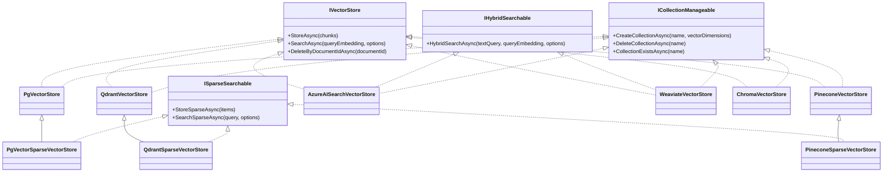

# Vector Stores

The vector store is the persistence layer for embedded chunks. Rag.NET ships six implementations, each registered via a fluent extension method on `RagBuilder`. The interface is designed to be swapped without changing any pipeline code.

## Feature matrix

| Feature | `PgVectorStore` | `QdrantVectorStore` | `AzureAISearchVectorStore` | `WeaviateVectorStore` | `ChromaVectorStore` | `PineconeVectorStore` | `RedisVectorStore` |
|---------|:-:|:-:|:-:|:-:|:-:|:-:|:-:|
| Package | `Rag.NET.VectorStores.PgVector` | `Rag.NET.VectorStores.Qdrant` | `Rag.NET.VectorStores.AzureAISearch` | `Rag.NET.VectorStores.Weaviate` | `Rag.NET.VectorStores.Chroma` | `Rag.NET.VectorStores.Pinecone` | `Rag.NET.VectorStores.Redis` |
| Dense (semantic) search | Yes | Yes | Yes | Yes | Yes | Yes | Yes |
| Hybrid search (native) | No — BM25 fallback | No — BM25 fallback | Yes (`IHybridSearchable`) | Yes (`IHybridSearchable`) | No — BM25 fallback | No — BM25 fallback | No — BM25 fallback ([why](#hybrid-search-is-declined-not-approximated)) |
| Sparse search (SPLADE, `ISparseSearchable`) | Yes (`enableSparseVectors: true`) | Yes (`enableSparseVectors: true`) | No | No | No | Yes (`EnableSparseVectors = true`) | No |
| Metadata filtering | Yes (JSONB `@>`) | Yes (payload match / numeric range) | Yes (typed `metadata_entries/any(...)`) | Yes (typed `where` on `meta_*` props) | Yes (`where` `$eq`/`$and`) | Yes (filter `$eq`/`$and`) | Not yet |
| Typed metadata round-trip | Yes (native JSONB types) | Yes (native payload types) | Yes (typed complex-collection slots) | Yes (typed auto-schema props) | Yes (native values; dates as sentinel) | Yes (native values; dates as sentinel) | Not yet |
| `ICollectionManageable` | Yes | Yes | Yes | Yes | Yes | Yes | Yes |
| Similarity function | Cosine (via `<=>`); dot product when sparse (`<#>`) | Cosine | Cosine | Cosine | Cosine | Cosine (dotproduct when sparse) | Cosine (distance converted to similarity) |
| Index algorithm | HNSW at ≤ 2000 dims, **exact scan above** (see [below](#dense-index-and-search-behaviour)) | HNSW | HNSW | HNSW | HNSW | Serverless (managed) | HNSW |
| Persistence | PostgreSQL | Qdrant server | Azure managed | Weaviate server | Chroma server | Pinecone managed | Redis Stack / Redis 8+ |

## Interface hierarchy



The sparse subtypes are opt-in registrations, not separate packages — the dense base type
deliberately does **not** implement `ISparseSearchable`, so a `store is ISparseSearchable`
capability probe is honest.

## Shared interface

All six implement `IVectorStore`:

```csharp
public interface IVectorStore
{
    Task StoreAsync(IReadOnlyList<EmbeddedChunk> chunks, CancellationToken cancellationToken = default);

    Task<IReadOnlyList<SearchResult>> SearchAsync(
        ReadOnlyMemory<float> queryEmbedding,
        SearchOptions options,
        CancellationToken cancellationToken = default);

    Task DeleteByDocumentIdAsync(string documentId, CancellationToken cancellationToken = default);
}
```

`SearchOptions` carries `TopK`, `MinScore`, and `MetadataFilter`. Hybrid routing is not part of it: the pipeline decides between `SearchAsync` and `IHybridSearchable.HybridSearchAsync` *before* calling the store (see [Retrieval — How the hybrid path is selected](retrieval.md#how-the-hybrid-path-is-selected)), so a store implementation never sees a hybrid flag.

### Typed metadata

Chunk metadata values are typed (`MetadataValue`: string, number, boolean, or date — see the [ingestion guide](./ingestion.md#typed-metadata-values)), and every store persists the type: a `page` written as the number `3` is stored as a number, read back as a number, and filtered as a number. `MetadataFilter` takes the same typed values, so a numeric filter is a numeric comparison in the store, not a string match:

```csharp
var results = await pipeline.RetrieveAsync("query", new RetrievalOptions
{
    MetadataFilter = new Dictionary<string, MetadataValue>
    {
        ["department"] = "finance", // string match
        ["page"]       = 3,         // numeric match — NOT the string "3"
    },
});
```

Filter values are kind-sensitive: filtering on the string `"3"` does not match a stored number `3`. Metadata stored **before** values carried types reads back losslessly as string-kind values; see each store's section (and the Azure AI Search migration note) for what that means for filtering old documents.

## Collection management

All six also implement `ICollectionManageable`, registered alongside `IVectorStore` in the DI container:

```csharp
public interface ICollectionManageable
{
    Task CreateCollectionAsync(string name, int vectorDimensions, CancellationToken cancellationToken = default);
    Task DeleteCollectionAsync(string name, CancellationToken cancellationToken = default);
    Task<bool> CollectionExistsAsync(string name, CancellationToken cancellationToken = default);
}
```

Resolve it directly from DI when you need to manage the index lifecycle:

```csharp
var manageable = provider.GetRequiredService<ICollectionManageable>();
if (!await manageable.CollectionExistsAsync("rag-index"))
    await manageable.CreateCollectionAsync("rag-index", vectorDimensions: 1536);
```

`DeleteCollectionAsync` is uniform across all six stores: deleting a collection that does not
exist is a no-op, so teardown code needs no exists-probe. The backends disagree underneath —
Weaviate and PgVector are idempotent themselves, while Chroma answers 404, Pinecone raises
`NotFoundError`, Qdrant reports `result: false`, and Azure AI Search answers 404 — and each
store absorbs its own flavour.

---

## PostgreSQL + pgvector

**Package:** `Rag.NET.VectorStores.PgVector`

Stores chunks in a `rag_chunks` table. Uses the `pgvector` extension for dense search via the `<=>` cosine distance operator and, when sparse vectors are enabled, for SPLADE search via the `<#>` inner-product operator over a `sparsevec` column. Metadata is stored as `JSONB` with native JSON types — a number-kind `MetadataValue` is a JSON number, a boolean a JSON boolean, a date a `{"$date": ...}` wrapper — and filtered using PostgreSQL's containment operator, so a numeric filter is numeric containment.

### Setup

```csharp
services.AddRagNet(rag => rag
    .UsePgVector(
        connectionString: "Host=localhost;Database=ragdb;Username=postgres;Password=secret",
        vectorDimensions: 1536));
```

The `vectorDimensions` must match the output dimension of your embedding model (`text-embedding-3-small` → 1536, `mxbai-embed-large` → 1024, etc.).

Add `enableSparseVectors: true` to register the sparse-capable subtype instead — see [Sparse vectors (SPLADE)](#sparse-vectors-splade) below.

### Schema

`InitializeAsync` creates the following objects if they do not already exist:

```sql
CREATE EXTENSION IF NOT EXISTS vector;

CREATE TABLE IF NOT EXISTS rag_chunks (
    id          BIGINT GENERATED ALWAYS AS IDENTITY PRIMARY KEY,
    document_id TEXT    NOT NULL,
    chunk_index INTEGER NOT NULL,
    text        TEXT    NOT NULL,
    metadata    JSONB   NOT NULL DEFAULT '{}',
    embedding   vector(<dimensions>) NOT NULL
);

CREATE INDEX IF NOT EXISTS idx_rag_chunks_document_id ON rag_chunks (document_id);

-- The chunk key. StoreAsync upserts on it.
CREATE UNIQUE INDEX IF NOT EXISTS idx_rag_chunks_doc_chunk ON rag_chunks (document_id, chunk_index);

-- Dense ANN index — created only when <dimensions> <= 2000. See below.
CREATE INDEX IF NOT EXISTS idx_rag_chunks_embedding ON rag_chunks USING hnsw (embedding vector_cosine_ops);
```

Call `InitializeAsync` once at application startup (e.g., in a hosted service or `Program.cs`) before any ingestion:

```csharp
var store = provider.GetRequiredService<ICollectionManageable>() as PgVectorStore;
await store!.InitializeAsync();
```

Or resolve `PgVectorStore` directly:

```csharp
var store = provider.GetRequiredService<IVectorStore>() as PgVectorStore;
await store!.InitializeAsync();
```

> **`InitializeAsync` is not always a quick startup step.** Building the HNSW index over a large
> existing table is slow and memory-hungry, and it happens inline. `CREATE INDEX` takes a
> `ShareLock` on `rag_chunks`: concurrent **writes block** until it finishes, reads are
> unaffected. (`CREATE INDEX CONCURRENTLY` is deliberately not used — it cannot run inside a
> transaction, and a failed run leaves an `INVALID` index that `IF NOT EXISTS` would then skip
> forever.) Budget for it on the first run after upgrading.

> **`vectorDimensions` is baked into the table at first initialize.** `CREATE TABLE IF NOT EXISTS`
> matches on the table *name* only, so pointing a store configured for 1536 at a `rag_chunks` whose
> `embedding` is `vector(768)` would skip the statement, report success, and keep the old typmod —
> after which every write and search fails on the mismatch, far from the setting that caused it.
> `InitializeAsync` therefore **fails fast**, naming both dimensions: either construct the store
> with `vectorDimensions:` matching the table, or drop the table and re-ingest with the embedding
> model you are actually using. (Dropping discards every chunk stored; re-ingestion is what
> recomputes them.) The same check guards `CreateCollectionAsync` against its `vectorDimensions`
> argument.

### Chunk key and upsert semantics

A chunk is keyed by `(document_id, chunk_index)`, enforced by a unique index. `StoreAsync` **upserts** on that key, so re-storing a chunk replaces it rather than appending a duplicate row — the behaviour re-ingestion and `ReindexStaleAsync` have always assumed. Earlier versions had no such key and appended a second row instead.

Two consequences when pointing the store at a table created by one of those versions:

- **`InitializeAsync` fails fast** if `rag_chunks` already contains duplicate `(document_id, chunk_index)` pairs, because the unique key cannot be created over them. It **deletes nothing** — the exception carries the duplicate count and the query to inspect them. Decide which row of each pair to keep, remove the rest, then initialize again.
- **`StoreAsync` throws** an `InvalidOperationException` if the table has no unique index on exactly those two columns (the `ON CONFLICT` clause has nothing to infer). Almost always this means `InitializeAsync` was never called against the table.

### Collection names

`CreateCollectionAsync` caps collection names at **47 characters**, shorter than PostgreSQL's own 63-byte identifier limit. Three index names are derived from a collection name — `idx_{name}_document_id`, `idx_{name}_doc_chunk`, `idx_{name}_embedding` — and PostgreSQL *silently truncates* over-long identifiers rather than failing. 47 is the longest name that leaves all three intact.

The damage does not arrive all at once. Just past the cap only the longest decoration is truncated, so that index merely exists under a name you never asked for. From about 58 characters all three collapse onto the *same* 63 bytes, and creation then fails partway through: the btree is created first and takes the truncated name, and the unique key is attempted next under what is now the same identifier. That failure is **loud** — the key's existence check resolves by *shape* against `pg_index`, not by name, so it correctly reports no key, then finds the btree squatting on the name and throws `a relation named 'X' already exists but is not a unique index`. Creation aborts there, before the ANN index is attempted. Rejecting up front is still worth it: that runtime exception names a truncated identifier you never typed and tells you to drop it, when the real fix is a shorter name.

> The cap covers only the names the store *derives*. The plain `CREATE INDEX IF NOT EXISTS` statements — `idx_rag_chunks_document_id`, `idx_rag_chunks_embedding`, `idx_rag_chunks_sparse` — still match on name alone. A hand-made relation already holding one of those names makes the corresponding statement do nothing and the store quietly runs without that index. Unlike the unique key, that costs performance, not correctness, which is why it is documented rather than probed.

### Dense index and search behaviour

`InitializeAsync` builds an HNSW index on `embedding` with `vector_cosine_ops`, matching the `<=>` operator `SearchAsync` orders by. Two things follow that are worth knowing before tuning anything:

- **The index is skipped above 2000 dimensions.** pgvector refuses to build HNSW on a wider column (measured against pgvector 0.8.2: 2000 builds, 2001 fails), and `text-embedding-3-large` at 3072 is over the line. Rather than failing initialization for those models, the store leaves the index out and dense search stays an **exact sequential scan** — slower on large tables, but exact, and the behaviour such deployments already had. To get an index at those widths, store `halfvec` or reduce the embedding dimension at the provider.
- **Where the index exists, dense search is approximate,** and results may differ from the exact scan.

**A filtered search may return fewer results than `TopK`, including none.** `MinScore` and `MetadataFilter` are applied *after* the HNSW index has picked its candidates, so a selective filter can discard all of them (measured: 2,000 rows, 5 matching the filter, 0 returned). The store mitigates this by setting `hnsw.iterative_scan = relaxed_order` per query, which makes pgvector keep scanning until it has enough surviving rows (all 5 in that same measurement).

- **`relaxed_order` relaxes the ordering, not just the scan** — that is what it trades for the recall, so pgvector may hand back the surviving rows slightly out of distance order. You never see it: both `SearchAsync` and `SearchSparseAsync` read through one method that sorts by score descending before returning, so **results are in descending score order under every iterative-scan mode**. That matters beyond tidiness — the RRF merge behind ensemble retrieval ranks hits by their position in the list.
- Raising `hnsw.ef_search` does **not** compensate — at `ef_search = 1000` the same query still returned 0. Do not reach for it.
- Even with iterative scanning, pgvector stops at `hnsw.max_scan_tuples` (20,000 by default) rather than degrading into a full scan, so a very selective filter over a very large table can still come back short. Raise that setting if you need it to dig deeper.
- `hnsw.iterative_scan` arrived in **pgvector 0.8**. The store reads `pg_extension.extversion` once, caches the answer, and simply does not issue the setting against an older extension — so on 0.7 and below a filtered search over an HNSW index keeps the truncating behaviour above. Upgrading pgvector is the only fix.

### Similarity score

Dense search returns `1 - (embedding <=> query)`, which is cosine similarity in `[0, 1]`. `MinScore` is applied as a `WHERE` clause filter before `ORDER BY` and `LIMIT` — but where the HNSW index exists that filtering happens *after* the index picked its candidates, with the consequences described [above](#dense-index-and-search-behaviour).

**`MinScore` means something different on the sparse path.** `SearchSparseAsync` scores by raw dot product of matching term weights — unbounded above and not comparable to a cosine similarity. The same option name carries two scales; tune it per path rather than reusing one threshold.

### Hybrid search

`PgVectorStore` does not implement `IHybridSearchable`. When `UseHybridSearch = true`, the pipeline falls back to the in-memory BM25 index + RRF merge. See [Retrieval — Hybrid search](retrieval.md#hybrid-search-bm25--vector).

### Sparse vectors (SPLADE)

Pass `enableSparseVectors: true` to `UsePgVector` to register `PgVectorSparseVectorStore` — a subtype that adds a nullable `sparse_embedding sparsevec(N)` column to the same `rag_chunks` rows that hold the dense vectors and serves `ISparseSearchable`. The dense-only `PgVectorStore` deliberately does **not** implement `ISparseSearchable`, so the pipelines' capability probe is honest and no SPLADE encoding work happens against a store that cannot persist it (the same type-split as [Qdrant](#sparse-vectors-splade-1) and [Pinecone](#sparse-vectors-splade-2)). Pair it with `UseSpladeEncoder` — see [Sparse retrieval (SPLADE)](retrieval.md#sparse-retrieval-splade) for the full setup.

```csharp
services.AddRagNet(rag => rag
    .UsePgVector(
        connectionString:     "Host=localhost;Database=ragdb;Username=postgres;Password=secret",
        vectorDimensions:     1536,
        enableSparseVectors:  true,
        sparseVocabularySize: PgVectorSparseVectorStore.DefaultSparseVocabularySize));  // 30522
```

`InitializeAsync` then does everything the dense one does, plus:

```sql
ALTER TABLE rag_chunks ADD COLUMN IF NOT EXISTS sparse_embedding sparsevec(<vocabularySize>);
CREATE INDEX IF NOT EXISTS idx_rag_chunks_sparse ON rag_chunks USING hnsw (sparse_embedding sparsevec_ip_ops);
```

Search is server-side: `SearchSparseAsync` orders by the `<#>` inner-product operator over that index and returns the negated result as the score. Chunks sharing no term with the query are **absent** from the results rather than present with score 0.

**Requires pgvector 0.7.0 or later** — the release that introduced the `sparsevec` type. `InitializeAsync` verifies the installed version and throws naming both versions and the upgrade path (`ALTER EXTENSION vector UPDATE`) rather than letting PostgreSQL's context-free "type sparsevec does not exist" surface later. Note that the [iterative-scan mitigation](#dense-index-and-search-behaviour) applies to sparse search too and needs **0.8**; the sparse HNSW index otherwise truncates filtered queries exactly as the dense one does.

#### `CreateCollectionAsync` is sparse-blind

The sparse store inherits `CreateCollectionAsync` unchanged, and the table it creates has **no `sparse_embedding` column** and no sparse index — nothing sparse can be written to or read from a collection. This is a documented sharp edge, not an oversight: collections on this store are already disconnected from the read/write path, because `StoreSparseAsync` and `SearchSparseAsync` hardcode `rag_chunks` exactly as the inherited dense `StoreAsync` and `SearchAsync` do. `ICollectionManageable` here manages tables the store itself never queries. If you need a second sparse-capable table, point a second store at a separate database or schema rather than at a collection.

#### No ordering contract

Dense and sparse writes for the same chunk can happen in **either order**. `sparse_embedding` lives in its own column and is deliberately excluded from the dense upsert's `DO UPDATE SET` list, so calling `StoreAsync` after `StoreSparseAsync` does *not* drop the chunk's sparse vector. This is the opposite of [Pinecone](#sparse-vectors-splade-2), where an upsert replaces the whole record and the write order is a documented hazard — do not assume that hazard generalises across stores.

#### Term budget: `TopTerms` must be ≤ 1000

pgvector's HNSW index rejects a `sparsevec` with more than **1000** non-zero elements (an unindexed `sparsevec` column allows up to 16,000). `OnnxSpladeOptions.TopTerms` defaults to 256, comfortably inside the cap, but raising it past 1000 makes every write fail. `StoreSparseAsync` validates the whole batch before opening a connection and throws an `ArgumentException` naming the chunk, the term count and `OnnxSpladeOptions.TopTerms` — **nothing is written**. Either lower the term budget, or drop the `idx_rag_chunks_sparse` index and accept a sequential scan up to 16,000 terms.

#### `sparseVocabularySize` is baked in at first initialize

The `sparsevec` column's dimension is the sparse encoder's vocabulary size, which must be strictly greater than every term id the encoder emits. It defaults to `PgVectorSparseVectorStore.DefaultSparseVocabularySize` (30522 — BERT's WordPiece vocabulary, which every SPLADE checkpoint in common use inherits).

**It cannot be changed in place.** `ALTER TABLE ... ADD COLUMN IF NOT EXISTS` matches on the column *name* only, so against an existing `sparsevec(100)` it would leave the dimension alone and report success — after which every sparse write and read fails on the mismatch, and the pipeline swallows both (ingestion survives a sparse-side fault; the ensemble degrades to dense results). The visible outcome would be successful ingestion, successful retrieval, and permanently dense-only quality behind one log line. `InitializeAsync` therefore **fails fast** on a dimension mismatch, naming both dimensions and the two ways out:

- construct the store with `sparseVocabularySize:` matching the existing column, or
- `ALTER TABLE rag_chunks DROP COLUMN sparse_embedding` and initialize again — which discards every sparse vector already stored. Re-ingest the affected documents to rebuild them; `SparseEmbeddingBehavior` recomputes a sparse vector per chunk on every ingest. (`ReindexStaleAsync` also regenerates sparse vectors from the stored chunk text, but only for documents whose *embedding version stamp* is stale — dropping the column does not make anything stale, so it will not pick them up on its own.)

So switching to an encoder with a different vocabulary is a drop-and-re-ingest operation, not a config change.

> **One failure mode has no gate:** a term id at or above the declared dimension is rejected by PostgreSQL with a raw `ERROR: sparsevec index out of bounds`, naming neither the column nor the option. Nothing guards it because a SPLADE encoder emits ids below its own vocabulary size by construction — if you see this error, `sparseVocabularySize` is smaller than your encoder's vocabulary.

---

## Qdrant

**Package:** `Rag.NET.VectorStores.Qdrant`

Stores chunks as Qdrant points with a payload. Metadata is stored both as a serialised JSON string in `metadata` (the round-trip authority) and as individual typed `meta_{key}` payload fields — numbers as payload doubles, booleans as payload booleans — to enable Qdrant's native payload filtering.

### Setup

```csharp
services.AddRagNet(rag => rag
    .UseQdrant(
        host:            "localhost",
        port:            6334,
        collectionName:  "my-collection",
        vectorDimensions: 1536));
```

### Collection initialisation

Call `InitializeAsync` before first use. It creates the collection with cosine distance if it does not already exist:

```csharp
var store = provider.GetRequiredService<IVectorStore>() as QdrantVectorStore;
await store!.InitializeAsync();
```

### Metadata filtering

Qdrant filters on `meta_{key}` payload fields using must conditions matched to the value's kind: strings and dates use keyword match, booleans a boolean match, and numbers a closed `gte = lte` range (Qdrant's match condition has no double form):

```csharp
var results = await pipeline.RetrieveAsync("query", new RetrievalOptions
{
    MetadataFilter = new Dictionary<string, MetadataValue>
    {
        ["department"] = "finance",   // keyword match on meta_department
        ["page"]       = 3,           // numeric range 3 <= meta_page <= 3
    },
});
```

### Hybrid search

`QdrantVectorStore` does not implement `IHybridSearchable`. When `UseHybridSearch = true`, the pipeline falls back to the in-memory BM25 index + RRF merge.

### Sparse vectors (SPLADE)

Pass `enableSparseVectors: true` to `UseQdrant` to register `QdrantSparseVectorStore` — a subtype that creates the collection with a named sparse vector (`"splade"`) next to the dense vector and serves `ISparseSearchable`. The dense-only `QdrantVectorStore` deliberately does **not** implement `ISparseSearchable`, so the pipelines' capability probe is honest and no SPLADE encoding work happens against a store that cannot persist it. Sparse vectors live on the same points as the dense embeddings: point ids become deterministic per `(DocumentId, ChunkIndex)` (making chunk upserts idempotent), and `StoreSparseAsync` attaches sparse vectors to points previously upserted by `StoreAsync` — ingestion always calls them in that order. `InitializeAsync` fails fast when an existing collection was created without sparse support — delete the collection and re-ingest to enable it. See [Sparse retrieval (SPLADE)](retrieval.md#sparse-retrieval-splade) for the full setup including `UseSpladeEncoder`.

---

## Azure AI Search

**Package:** `Rag.NET.VectorStores.AzureAISearch`

Stores chunks as Azure AI Search documents. Implements both `IVectorStore` and `IHybridSearchable` — **native** hybrid search combining BM25 full-text search with HNSW vector search at the service level (as does [Weaviate](#weaviate)).

### Setup

```csharp
using Azure;
using Rag.NET.AzureAISearch;

services.AddRagNet(rag => rag
    .UseAzureAISearch(
        endpoint:         new Uri("https://my-search.search.windows.net"),
        indexName:        "my-rag-index",
        credential:       new AzureKeyCredential("your-api-key"),
        vectorDimensions: 1536));
```

### Index schema

`InitializeAsync` creates or updates the index with these fields:

| Field | Type | Role |
|-------|------|------|
| `id` | `String` (key) | UUID per chunk |
| `document_id` | `String` (filterable) | For delete-by-document |
| `chunk_index` | `Int32` | Chunk ordinal |
| `text` | `SearchableString` | Full-text search |
| `metadata` | `String` | Legacy serialised JSON (still written; read fallback) |
| `metadata_entries` | `Collection(Edm.ComplexType)` | Typed metadata: `{key, stringValue, numberValue, boolValue, dateValue}` rows, all sub-fields filterable |
| `embedding` | `Collection(Single)` | HNSW vector field |

The vector field is configured with an HNSW algorithm profile named `"default-algorithm"`. `metadata_entries` carries one row per metadata key with the sub-field matching the value's kind populated — which is what makes *every* metadata key filterable with its type and **no per-key schema change**: a new key needs no index update, the writer writes it and the filter finds it. Sub-fields of a complex collection cannot be marked `sortable` (they are multi-valued per document), so sorting by a metadata key is not available.

```csharp
var store = provider.GetRequiredService<ICollectionManageable>() as AzureAISearchVectorStore;
await store!.InitializeAsync();
```

### Native hybrid search

When `UseHybridSearch = true`, `AzureAISearchVectorStore` is registered, and the call configures nothing the backend cannot express — no sparse (SPLADE) arm would run, no `EnsembleOptions`, `MinScore` left at `0.0` — the pipeline calls `HybridSearchAsync`. This issues a single Azure AI Search request with both a full-text query and a vectorised query, letting the service perform BM25+vector fusion (the [dispatch rule](retrieval.md#how-the-hybrid-path-is-selected) in full):

```csharp
var results = await pipeline.RetrieveAsync("ISO 27001 audit requirements", new RetrievalOptions
{
    TopK            = 10,
    UseHybridSearch = true,
});
```

The returned scores are Azure AI Search's own hybrid fusion values — [Reciprocal Rank Fusion](https://learn.microsoft.com/azure/search/hybrid-search-ranking): each fused query contributes at most about `1/60`, so a two-arm hybrid score tops out around `0.033`. Not cosine similarities, and exactly why a configured `MinScore` keeps the client-side path: a similarity-tuned threshold applied store-side to RRF values would silently return nothing. Callers invoking `HybridSearchAsync` directly should tune `SearchOptions.MinScore` against the RRF scale or leave it at `0.0`. This is the hybrid path only — plain `SearchAsync` issues a pure vector query whose score is a bounded function of the similarity metric, which is why the store is treated as similarity-scaled (see [Score scale](#score-scale-iscorescaleaware)).

### Metadata filtering

Filters run against the typed `metadata_entries` complex collection, one `any()` clause per filter pair, AND-composed, with the comparison against the sub-field matching the value's kind:

```csharp
// Generates: metadata_entries/any(m: m/key eq 'department' and m/stringValue eq 'finance')
//        and metadata_entries/any(m: m/key eq 'page' and m/numberValue eq 3)
var results = await pipeline.RetrieveAsync("query", new RetrievalOptions
{
    MetadataFilter = new Dictionary<string, MetadataValue>
    {
        ["department"] = "finance",
        ["page"]       = 3,
    },
});
```

This replaces the previous `search.ismatch` substring probe over the JSON blob with real typed comparisons.

### Migrating an existing index

`InitializeAsync` uses `CreateOrUpdateIndexAsync`, and adding `metadata_entries` is an **additive** field change, so an existing index picks the new field up on the next run without a rebuild. The legacy `metadata` string field stays declared and written — Azure AI Search forbids removing or re-typing an existing field, and keeping it is what lets the update succeed against a pre-existing index.

Two honest caveats for documents ingested **before** the change:

- **Reading them keeps working.** They have no `metadata_entries` rows, so the store falls back to the legacy JSON blob; every value comes back as a string-kind `MetadataValue`. Nothing throws, nothing is lost.
- **Filtering them stops working until re-ingest.** `MetadataFilter` now runs against `metadata_entries`, and old documents have no rows there to match — under the previous `search.ismatch` filtering they *did* match. Re-ingest the affected documents to make them filterable again.

### Indexing latency

Azure AI Search indexing is near real-time. `StoreAsync` includes a 1-second delay after batch upload to allow the index to become consistent before a subsequent `SearchAsync` call. This delay is intentional and sourced from the implementation; plan for it in integration tests.

---

## Weaviate

**Package:** `Rag.NET.VectorStores.Weaviate`

Stores chunks as objects of a single Weaviate class (`vectorizer: none` — Rag.NET brings its own vectors; cosine distance). Implements `IVectorStore`, `IHybridSearchable` (native BM25+vector fusion), and `ICollectionManageable`, all served by one singleton. Object ids are deterministic per `(DocumentId, ChunkIndex)`, so re-ingesting a chunk replaces it.

### Local quickstart

```bash
docker run -p 8080:8080 \
  -e AUTHENTICATION_ANONYMOUS_ACCESS_ENABLED=true \
  -e PERSISTENCE_DATA_PATH=/var/lib/weaviate \
  -e DEFAULT_VECTORIZER_MODULE=none \
  cr.weaviate.io/semitechnologies/weaviate:latest
```

### Setup

```csharp
services.AddRagNet(rag => rag
    .UseWeaviate(
        endpoint:         new Uri("http://localhost:8080"),
        className:        "RagChunks",   // capital letter + letters/digits/underscores
        vectorDimensions: 1536));
```

The class name doubles as a GraphQL field, so Weaviate requires a capitalized GraphQL-valid name (validated eagerly at registration). Optional settings via the `configure` callback:

```csharp
services.AddRagNet(rag => rag
    .UseWeaviate(new Uri("https://my-cluster.weaviate.cloud"), "RagChunks", 1536, options =>
    {
        options.ApiKey = "wcs-api-key";   // sent as Authorization: Bearer
        options.Tenant = "customer_a";    // opt into multi-tenancy
    }));
```

### Class schema and initialisation

`InitializeAsync` creates the class if missing: fixed properties `document_id` (text, `field` tokenization so `Equal` filters match whole ids), `chunk_index` (int), `text` (text — feeds BM25), and `metadata_json` (serialised metadata for lossless round-tripping). `StoreAsync` also initialises lazily on first write, so a forgotten `InitializeAsync` can never let Weaviate's auto-schema create the class with the wrong tokenization.

```csharp
var store = provider.GetRequiredService<IVectorStore>() as WeaviateVectorStore;
await store!.InitializeAsync();
```

### Scores

Dense search maps Weaviate's cosine `distance` (0 = identical … 2 = opposite) to `Score = 1 - distance / 2`, so an identical vector scores 1.0. Hybrid search returns Weaviate's relative-score-fusion value, already in `[0, 1]`. `MinScore` is applied to the mapped score in both modes.

### Native hybrid search

When `UseHybridSearch = true` and the call configures nothing the backend cannot express — no sparse (SPLADE) arm would run, no `EnsembleOptions`, `MinScore` left at `0.0` — the pipeline calls `HybridSearchAsync`: a single GraphQL `hybrid: {query, vector}` request lets Weaviate fuse BM25 and vector rankings server-side, so a chunk that matches only by keyword is still found. The returned scores are Weaviate's relative-score-fusion values in `[0, 1]`, not cosine similarities. See [Retrieval — How the hybrid path is selected](retrieval.md#how-the-hybrid-path-is-selected) for the dispatch rule in full.

### Metadata filtering and auto-schema

Each chunk metadata key is written as an extra typed `meta_{key}` property — text for strings, `number` for numbers, `boolean` for booleans; Weaviate's auto-schema (enabled by default in the official image) adds these properties with the matching type on first write, making them server-side filterable with typed `where` operands (`valueText`, `valueNumber`, `valueBoolean`). The `metadata_json` property remains the lossless round-trip authority:

```csharp
// Generates: where: {path: ["meta_department"], operator: Equal, valueText: "finance"}
var results = await pipeline.RetrieveAsync("query", new RetrievalOptions
{
    MetadataFilter = new Dictionary<string, MetadataValue>
    {
        ["department"] = "finance",
    },
});
```

Multiple filter entries are wrapped in a single `And` operand. Note that auto-schema created `meta_*` properties use Weaviate's default `word` tokenization, so `Equal` on a multi-word value matches per token — keep filterable metadata values single-token.

### Multi-tenancy

Set `WeaviateOptions.Tenant` to isolate data per tenant: the class is created with `multiTenancyConfig: {enabled: true}`, the tenant itself is created during initialisation (idempotent), and every store/search/delete carries it. Two stores configured with different tenants on the same class never see each other's chunks.

---

## Chroma

**Package:** `Rag.NET.VectorStores.Chroma`

Stores chunks as records of a single Chroma collection via the REST v2 API — deliberately the lightweight, **dense-only** adapter. Implements `IVectorStore` and `ICollectionManageable`, served by one singleton. Record ids are `{documentId}:{chunkIndex}`, so re-ingesting a chunk upserts (replaces) it; the chunk text rides as the record's document and metadata carries the chunk metadata plus `document_id` and `chunk_index`.

### Local quickstart

```bash
docker run -p 8000:8000 chromadb/chroma
```

### Setup

```csharp
services.AddRagNet(rag => rag
    .UseChroma(
        endpoint:       new Uri("http://localhost:8000"),
        collectionName: "rag-chunks"));   // 3-512 chars: letters/digits/._-, alphanumeric ends
```

The collection is created automatically (with the cosine space) on first use; Chroma infers vector dimensions from the first upsert, so no dimension parameter is needed. Optional settings via the `configure` callback:

```csharp
services.AddRagNet(rag => rag
    .UseChroma(new Uri("http://localhost:8000"), "rag-chunks", options =>
    {
        options.Tenant   = "my_tenant";     // default: default_tenant
        options.Database = "my_database";   // default: default_database
        options.ApiKey   = "static-token";  // sent as Authorization: Bearer
    }));
```

Chroma addresses collections by UUID internally; the store resolves the configured name to its UUID once and caches it. If the collection is deleted or recreated behind the store's back, the next operation transparently re-resolves and retries once.

### Scores

Chroma returns cosine `distance = 1 - cosine similarity` (0 = identical … 2 = opposite), mapped to `Score = 1 - distance`, so an identical vector scores 1.0 and an orthogonal one 0.0 (opposite vectors go negative). `MinScore` is applied to the converted score.

The store **requires the cosine space**. If the configured collection already exists with a different space (Chroma's default is squared L2), the first operation fails fast with an `InvalidOperationException` naming the actual space — the score conversion would otherwise be silently on the wrong scale and `MinScore` would misfilter. Delete and recreate the collection (re-ingesting its documents) or point the store at a cosine collection.

### Hybrid search

`ChromaVectorStore` does not implement `IHybridSearchable` (or `ISparseSearchable`) — Chroma has no native BM25+vector fusion for externally supplied embeddings. When `UseHybridSearch = true`, the pipeline falls back to the in-memory BM25 index + RRF merge; if you want *native* hybrid or sparse search, use [Qdrant](#qdrant), [Pinecone](#pinecone), or [PgVector](#postgresql--pgvector) (sparse/SPLADE), [Weaviate](#weaviate), or [Azure AI Search](#azure-ai-search) instead. See [Retrieval — Hybrid search](retrieval.md#hybrid-search-bm25--vector).

### Metadata filtering

Chunk metadata keys are stored as-is on each record with native value types (numbers as numbers, booleans as booleans; dates as a `$date:`-prefixed sentinel string, since record values cannot be objects) and filtered server-side with Chroma's typed `$eq` operator; multiple filter entries are composed with `$and`:

```csharp
// Generates: where: {"$and": [{"department": {"$eq": "finance"}}, {"team": {"$eq": "core"}}]}
var results = await pipeline.RetrieveAsync("query", new RetrievalOptions
{
    MetadataFilter = new Dictionary<string, MetadataValue>
    {
        ["department"] = "finance",
        ["team"]       = "core",
    },
});
```

Note that `document_id` and `chunk_index` are reserved record-metadata keys (a same-named chunk metadata key would be overwritten by them).

---

## Pinecone

**Package:** `Rag.NET.VectorStores.Pinecone`

Stores chunks as records of a Pinecone **serverless** index via the official `Pinecone.Client` SDK. Implements `IVectorStore` and `ICollectionManageable`, served by one singleton; the opt-in sparse variant adds `ISparseSearchable` (see below). Record ids are `{documentId}:{chunkIndex}`, so re-ingesting a chunk upserts (replaces) it.

Pinecone stores no document body: the chunk text lives in record metadata (key `text`) next to `document_id` and `chunk_index`, and is read back into `SearchResult.Chunk.Text`. Keep chunks comfortably under Pinecone's **~40 KB metadata limit per record** — text plus all metadata must fit.

> **SDK version note:** the package pins `Pinecone.Client` **3.1.0**, not 4.x. The 4.x control-plane models require a `vector_type` response field that Pinecone Local does not send, so index create/describe/list fail against the emulator ([pinecone-dotnet-client#54](https://github.com/pinecone-io/pinecone-dotnet-client/issues/54); the SDK repository was archived in July 2026, so no fix is expected).
>
> This pin was verified empirically **against Pinecone Local only** — the store's behaviour on the live Pinecone service has not been exercised in this repository's test suite. Be aware that 3.1.0 sends `X-Pinecone-API-Version: 2025-01`, which is past Pinecone's 12-month guaranteed support window for an API version. Upgrading to 4.x (a source-breaking change: renamed metric enums and reshaped describe/list responses) becomes necessary if Pinecone retires 2025-01 or if you need 2025-04+ features — native sparse indexes in particular — and would cost Pinecone Local coverage for index management until #54 is resolved.

### Setup

```csharp
services.AddRagNet(rag => rag
    .UsePinecone(
        apiKey:           "your-api-key",
        indexName:        "rag-chunks",   // 1-45 chars: lowercase letters/digits/-, alphanumeric ends
        vectorDimensions: 1536));
```

Optional settings via the `configure` callback:

```csharp
services.AddRagNet(rag => rag
    .UsePinecone("your-api-key", "rag-chunks", 1536, options =>
    {
        options.Namespace = "customer-a";              // namespace isolation (see below)
        options.EnableSparseVectors = true;            // sparse variant — dotproduct index required
        options.Cloud  = ServerlessSpecCloud.Aws;      // serverless placement, default aws
        options.Region = "us-east-1";                  //   ... default us-east-1
        options.Endpoint = new Uri("http://localhost:5080");  // Pinecone Local
    }));
```

### Index lifecycle

`CreateCollectionAsync(name, dimensions)` creates a serverless index (cloud/region from the options; cosine metric — dotproduct when sparse vectors are enabled) and polls `describe` until the index reports ready, bounded by `PineconeOptions.IndexReadyTimeout` (default 2 minutes; serverless creation typically takes under a minute, Pinecone Local is ready instantly). Deleting a missing index is a no-op; storing or searching against a missing index fails fast with an exception naming `CreateCollectionAsync` as the fix.

### Local development (Pinecone Local)

Pinecone Local is an in-memory emulator of the control and data planes — no account or API key needed (keys are accepted and ignored):

```bash
docker run -p 5080-5090:5080-5090 \
  -e PORT=5080 -e PINECONE_HOST=localhost \
  ghcr.io/pinecone-io/pinecone-local:latest
```

Point the store at it with `options.Endpoint = new Uri("http://localhost:5080")` — the `http` scheme also switches the SDK's data-plane gRPC channels to plaintext. The emulator serves the control plane on port 5080 and gives every index its own data-plane port from 5081–5090, advertised as `localhost:{port}` — hence the port-range publish (and a cap of ten live indexes). Emulator limitations to plan around: data is not persisted across restarts, at most 100,000 records per index, and **no sparse values on dense indexes** (see the sparse section below); delete-by-metadata-filter is rejected exactly like the real serverless service.

### Scores

Pinecone returns native similarity scores, so `MinScore` applies directly: cosine similarity in `[-1, 1]` on the default metric (identical vector ⇒ 1.0, orthogonal ⇒ 0.0). On a dotproduct index (sparse variant) dense scores are raw dot products and sparse scores are sums of matching term-weight products — both unbounded above, so tune `MinScore` for that scale.

### Namespace isolation

Set `PineconeOptions.Namespace` to scope every upsert, query, and delete to one Pinecone namespace — the features.md "namespace-based collection isolation". Two stores configured with different namespaces on the same index never see each other's chunks, and `DeleteByDocumentIdAsync` only deletes within its own namespace. Leave it null for the default namespace.

### Metadata filtering

Chunk metadata keys are stored as-is on each record with native value types (numbers as numbers, booleans as booleans; dates as a `$date:`-prefixed sentinel string, since record values cannot be objects) and filtered server-side with Pinecone's typed `$eq` operator; multiple filter entries are composed with `$and`:

```csharp
// Generates: filter: {"$and": [{"department": {"$eq": "finance"}}, {"team": {"$eq": "core"}}]}
var results = await pipeline.RetrieveAsync("query", new RetrievalOptions
{
    MetadataFilter = new Dictionary<string, MetadataValue>
    {
        ["department"] = "finance",
        ["team"]       = "core",
    },
});
```

`document_id`, `chunk_index`, and `text` are reserved record-metadata keys (a same-named chunk metadata key would be overwritten by them).

### Delete by document

Serverless indexes do not support delete-by-metadata-filter (the service answers "Serverless and Starter indexes do not support deleting with metadata filtering" — Pinecone Local included), so `DeleteByDocumentIdAsync` lists vector ids by the `{documentId}:` prefix and deletes by id, in batches. Ids whose remainder after the prefix is not purely digits are skipped — they belong to a longer document id that merely starts the same way (e.g. deleting `doc` never touches `doc:7`'s chunks).

### Sparse vectors (SPLADE)

Set `EnableSparseVectors = true` in the `configure` callback to register `PineconeSparseVectorStore` — a subtype that serves `ISparseSearchable` next to the dense interfaces. The dense-only `PineconeVectorStore` deliberately does **not** implement `ISparseSearchable`, so the pipelines' capability probe is honest and no SPLADE encoding work happens against a store that cannot persist it (the same type-split as [Qdrant](#sparse-vectors-splade-1) and [PgVector](#sparse-vectors-splade)). Pair it with `UseSpladeEncoder` — see [Sparse retrieval (SPLADE)](retrieval.md#sparse-retrieval-splade) for the full setup.

Sparse values ride on the same records as the dense embeddings: `StoreSparseAsync` upserts the full record (dense + sparse + metadata), so it needs no prior `StoreAsync` call for that chunk. **Order matters in the other direction, though:** a Pinecone upsert replaces the *entire* record and `StoreAsync` writes records without sparse values, so calling `StoreAsync` after `StoreSparseAsync` for the same chunk silently drops its sparse vector. Always store dense first, sparse second — Rag.NET's own ingestion (`StorageBehavior`) and `RegenerateSparseAsync` both do, so this only bites hand-rolled write paths; re-ingesting a chunk means re-running both steps. `SearchSparseAsync` issues a sparse query with an all-zero dense vector sized from the live index (Pinecone requires a dense vector on every query; zeroing it nulls the dense contribution — the documented `alpha = 0` weighting).

Pinecone only accepts sparse values on **dotproduct** indexes. The sparse variant's `CreateCollectionAsync` therefore creates dotproduct indexes, and its first data-plane use fails fast with an `InvalidOperationException` naming the fix when the configured index has a different metric — the real service would accept sparse upserts into a cosine index and only reject at *query* time.

**Pinecone Local gap:** the emulator rejects sparse values on *writes* to dense indexes (its gRPC upsert answers `INVALID_ARGUMENT`; its REST path silently drops them), though it does serve sparse *queries*. Concretely, the container suite covers: dotproduct index creation by the sparse variant, dense store/search through it, the non-dotproduct fail-fast, and sparse querying (including that the zero dense vector is sized from the live index rather than the configured `VectorDimensions`). It does **not** cover storing sparse values or the sparse store-then-search round-trip — that test is skipped with this reason, so the same-record sparse write path has only been verified by construction, never executed against a live Pinecone serverless index. Treat it as unproven until you run it against the real service.

---

## Redis (RediSearch)

**Package:** `Rag.NET.VectorStores.Redis`

Stores chunks as Redis hashes under `{index}:{documentId}:{chunkIndex}` and queries them with an HNSW vector index. The point is reuse: a large share of .NET applications already run Redis for caching, and for those teams pointing it at retrieval is a much lower bar than standing up a second datastore — the same argument that justifies pgvector.

Needs the **RediSearch module**: Redis Stack, or Redis 8 and later where it is built in. Plain Redis answers `FT.CREATE` with an unknown-command error.

### Setup

```csharp
services.AddRagNet(rag => rag
    .UseRedis(
        configuration:    "localhost:6379",
        indexName:        "ragnet-idx",
        vectorDimensions: 1536));
```

If Redis is already in the application — the case this store exists for — hand it the connection you have. The store does not dispose a multiplexer it did not create:

```csharp
var redis = ConnectionMultiplexer.Connect("localhost:6379");
services.AddRagNet(rag => rag.UseRedis(redis, "ragnet-idx", 1536));
```

Call `InitializeAsync` before first use. It creates the index only if absent, because re-creating it would discard every stored vector.

### Similarity score

RediSearch returns `vector_score` as a **cosine distance** in `[0, 2]` — 0 is identical, larger is worse. That is the opposite direction from every score in this library, so the store converts it to `1 - distance` and reports ordinary cosine similarity in `[-1, 1]`.

This is why `RedisVectorStore` does **not** implement `IScoreScaleAware`: its scores are already on the scale every threshold assumes, exactly as pgvector's `1 - (embedding <=> $1)` is. Publishing the distance unconverted would invert every ranking and silently break `MinScore` — an integration test asserts an exact match scores ~1.0 rather than ~0.0 for precisely that reason.

### Hybrid search is declined, not approximated

RediSearch can run a text query alongside the vector one, but its text scoring is TF-IDF-shaped rather than the BM25 the hybrid arm fuses. A store advertising `IHybridSearchable` here would be fusing a score it cannot describe, so this one does not — and the pipeline falls back to its own BM25 arm, which is honest about what it is.

### Not yet

Metadata filtering and typed metadata round-trip are not implemented. `document_id` is indexed as a TAG (which is how `DeleteByDocumentIdAsync` finds a document's chunks without scanning keys the store did not write) and `chunk_index` as NUMERIC, but arbitrary `MetadataFilter` predicates are not translated to RediSearch query syntax. Filtering happens in the pipeline instead.

## Multi-index federation

**Package:** `Rag.NET` (core)

`FederatedVectorStore` wraps two or more `IVectorStore` instances behind a single store, so you can search across collections living in different backends (e.g. a private PgVector index plus a shared Qdrant index) without migrating data. It is registered as *the* `IVectorStore`, so the entire pipeline (MMR, reranking, caching, …) composes unchanged.

### Setup

```csharp
services.AddRagNet(rag => rag
    .UseFederatedSearch(f => f
        .AddStore(_ => new PgVectorStore("Host=...;Database=private", 1536), "private-pg")
        .AddStore(_ => new QdrantVectorStore("localhost", 6334, "shared", 1536), "shared-qdrant")
        .WithPrimary(0)      // optional: writes/deletes target this store (default: first)
        .WithRrfK(60)));     // optional: RRF constant (default: 60)
```

At least two stores are required (validated at registration). Store factories receive the `IServiceProvider` and run once, when the federated store is first resolved.

### Behaviour

- **Search** fans out to all stores concurrently, then merges the per-store rankings with N-way Reciprocal Rank Fusion: each hit contributes `1 / (k + rank)` (1-based rank, `k` = `RrfK`) and the merged `Score` is the summed RRF score, not a cosine similarity. `TopK` is applied after the merge. Ties on the merged score are broken deterministically: the chunk that first appeared in the lower store index wins, then the lower per-store rank.
- **`MinScore`** is applied by each store against its own similarity scale *before* fusion; the merged `Score` is RRF. Beware cross-backend coherence: the same `MinScore` value means different things to different backends (e.g. raw cosine similarity in `[0, 1]` for PgVector/Qdrant vs. Azure AI Search's rescaled relevance score, which for cosine bottoms out around `0.333`), so a threshold tuned for one store may over- or under-filter another. This is the store-side `SearchOptions.MinScore` applied during fan-out, which is unaffected by the score scale the *federated* store declares for its own merged results.
- **Provenance:** every merged result's chunk metadata gains a `source.store` entry with the store's name (from `AddStore(..., name)`) or its zero-based index. The source store's own chunk is never mutated — the tag is written into a copied metadata dictionary.
- **Writes and deletes** go to the primary store only. `DeleteByDocumentIdAsync` does **not** touch secondary stores — documents ingested directly into secondaries must be deleted there.
- **Degraded, never broken:** a store that throws during search is skipped with a logged warning; the federated search itself only throws (`InvalidOperationException` naming the stores) when *every* store failed.

### Interaction with other registrations

`UseFederatedSearch` supersedes any earlier `IVectorStore` registration (standard last-wins container semantics). Do not combine it with `UsePgVector`/`UseQdrant`-style calls — add those stores through the builder instead.

**Persistent conversation memory:** `UsePersistentMemory` resolves the DI `IVectorStore` and normally filters recalled exchanges by `PersistentMemoryOptions.MinScore` (default 0.7), a threshold calibrated to the similarity scale. Federated results carry RRF scores (about 0.033 at best for two stores), so that threshold would discard every match. `FederatedVectorStore` therefore declares `IScoreScaleAware` with `ScoreScale.OpaqueRanking`, and persistent memory reacts by **skipping `MinScore` entirely**: it injects the store's top `TopK` matches in rank order and logs one warning per memory instance naming the store type and the ignored threshold. Recall works against a federated store; what you give up is the ability to require a minimum relevance — every recall injects the best `TopK` the federation returns, however weak. Lower `TopK` (default 3) if that is too much context, or point persistent memory at a dedicated similarity-scaled store when you need a real threshold.

### Score scale (`IScoreScaleAware`)

`IScoreScaleAware` is an opt-in capability interface declaring what a store's `SearchResult.Score` means:

| Scale | Meaning | Declared by |
|-------|---------|-------------|
| `ScoreScale.Similarity` | Comparable, roughly `[0, 1]`, safe to threshold against a fixed cut-off | The assumed default — stores that do **not** implement the interface |
| `ScoreScale.OpaqueRanking` | Ordinal only; magnitude is not comparable and must not be thresholded | `FederatedVectorStore` (RRF sums) |

The declaration describes `IVectorStore.SearchAsync` — the interface `IScoreScaleAware` sits on — not any capability method the store also happens to offer. Consumers probe with `store is IScoreScaleAware { ScoreScale: ScoreScale.OpaqueRanking }`. Every other store in the library is unchanged and continues to be treated as similarity-scaled, so `SearchOptions.MinScore` on the retrieval path behaves exactly as before; the probe currently affects persistent conversation memory only.

Azure AI Search was evaluated and deliberately left undeclared (i.e. similarity): its `SearchAsync` issues a pure vector query, whose `@search.score` is a bounded monotone function of the similarity metric and is thresholdable. Its **hybrid** scores (`HybridSearchAsync`) are a different matter — RRF values around `1/60` per fused query — but `IScoreScaleAware` describes the dense path only, and the pipeline's hybrid dispatch never applies a non-zero `MinScore` to them (a configured `MinScore` keeps the client-side path).

### Limitations

Federation is **dense-only** in this release: `IHybridSearchable` (native hybrid), sparse search, and `ICollectionManageable` capabilities of the underlying stores are not federated. When `UseHybridSearch = true`, the pipeline's BM25 fallback still applies over the shared in-memory/SQLite BM25 index, not per federated store.

---

## Implementing a custom vector store

See [Extending](extending.md#implementing-ivectorstore) for the full guide.
