# Rag.NET Documentation

Rag.NET is a modular Retrieval-Augmented Generation (RAG) pipeline library for .NET, built on [Microsoft.Extensions.AI](https://devblogs.microsoft.com/dotnet/introducing-microsoft-extensions-ai-preview/) abstractions. These docs cover every layer from first setup to production-grade extensions.

## Pages

| Page | What it covers |
|------|---------------|
| [Why RAG?](why-rag.md) | What RAG is, the problem it solves, and when Rag.NET is the right tool |
| [Getting Started](getting-started.md) | Dependency injection setup, ingesting a document, and running a Q&A loop |
| [Positioning](positioning.md) | Where Rag.NET sits against Semantic Kernel, LangChain, LlamaIndex and Haystack — and where it loses |
| [Architecture](guide/architecture.md) | Pipeline internals, data-flow diagram, all interfaces and core models |
| [Ingestion](guide/ingestion.md) | Parsers, `DocumentMetadata`, `IngestionOptions`, progress reporting |
| [Data Providers](guide/data-providers.md) | Cloud storage and web connectors; OAuth token management; delta ingestion |
| [Chunking](guide/chunking.md) | `FixedSize`, `Recursive`, and `TokenAware` strategies with trade-off table |
| [Retrieval](guide/retrieval.md) | `RetrievalOptions`, semantic search, hybrid BM25+RRF search, metadata filtering |
| [Post-Retrieval](guide/post-retrieval.md) | Lost-in-the-Middle reordering and redundancy filtering |
| [Conversational Memory](guide/memory.md) | In-session history trimming, token-budget management, and persistent cross-session recall |
| [Vector Stores](guide/vector-stores.md) | pgvector, Qdrant, Azure AI Search; hybrid search support matrix |
| [Evaluation](guide/evaluation.md) | `EmbeddingDistanceEvaluator`, `EvaluationSample`, score interpretation |
| [Observability](guide/observability.md) | `ILogger` structured logging, OpenTelemetry `ActivitySource`, Polly resilience |
| [Extending](guide/extending.md) | Implementing `IDocumentParser`, `IVectorStore`, `IChunkingStrategy` |
| [Mediator](guide/mediator.md) | Dispatching ingest/retrieve/delete commands via `Rag.NET.Mediator` and ZeroAlloc.Mediator |
| [OSS Libraries](reference/oss-libraries.md) | Every open-source dependency used, where it is used, and why |
| [Answer Engines](answer-engines.md) | MapReduce, Refine, and Dispatching answer engine strategies |
| [Query Techniques](query-techniques.md) | HyDE and Multi-Query retrieval expansion |

## Quick links

- Sample applications: `samples/Rag.NET.Sample` — interactive console app (PgVector, Ollama/OpenAI)
  — and `samples/Rag.NET.QuickStart` — a config-driven walkthrough built on `Rag.NET.Hosting`
- Benchmark results: [benchmarks.md](reference/benchmarks.md)
- How Rag.NET compares: [quality and cost](reference/library-comparison.md) (measured) and
  [scope](reference/library-comparison-scope.md) (read, cited per claim)
- Feature roadmap and design notes: `docs/plans/`
- GitHub README: covers the quick-start and package list

## Package layout

```mermaid
flowchart TD
    ABSTRACTIONS["Rag.NET.Abstractions<br>Interfaces · Models · Options · IRagBuilder"] --> CORE
    ABSTRACTIONS --> CHUNKING["Rag.NET.Chunking<br>HierarchicalMerger · CodeChunking"]
    ABSTRACTIONS --> CHUNKING_SEM["Rag.NET.Chunking.Semantic<br>Semantic chunking"]
    ABSTRACTIONS --> CHUNKING_TOK["Rag.NET.Chunking.TokenAware<br>Token-count chunking"]
    ABSTRACTIONS --> AE["Rag.NET.AnswerEngines<br>MapReduce · Refine · Dispatching"]
    ABSTRACTIONS --> QT["Rag.NET.QueryTechniques<br>HyDE · MultiQuery"]
    ABSTRACTIONS --> MEM["Rag.NET.Memory<br>Persistent cross-session memory"]
    ABSTRACTIONS --> CHUNKING_CS["Rag.NET.Chunking.CSharp<br>Roslyn-based C# chunking"]
    ABSTRACTIONS --> SBUS["Rag.NET.Ingestion.AzureServiceBus<br>Service Bus ingestion trigger"]

    CORE["Rag.NET<br>Core pipeline · Text/Markdown/CSV/JSON parsers · Recursive chunking"]

    CORE --> PG["Rag.NET.VectorStores.PgVector<br>PostgreSQL + pgvector"]
    CORE --> QD["Rag.NET.VectorStores.Qdrant<br>Qdrant"]
    CORE --> AZ["Rag.NET.VectorStores.AzureAISearch<br>Azure AI Search (native hybrid)"]

    CORE --> PDF["Rag.NET.Parsers.Pdf"]
    CORE --> HTML["Rag.NET.Parsers.Html"]
    CORE --> WORD["Rag.NET.Parsers.Word"]
    CORE --> XL["Rag.NET.Parsers.Excel"]
    CORE --> PPT["Rag.NET.Parsers.PowerPoint"]

    CORE --> EVAL["Rag.NET.Evaluation<br>Embedding-based answer quality"]
    CORE --> MED["Rag.NET.Mediator<br>ZeroAlloc.Mediator integration"]

    CORE --> CONFLUENCE["Rag.NET.DataProviders.Confluence<br>Confluence pages"]
    CORE --> JIRA["Rag.NET.DataProviders.Jira<br>Jira issues"]
    CORE --> NOTION["Rag.NET.DataProviders.Notion<br>Notion pages"]
    CORE --> ASANA["Rag.NET.DataProviders.Asana<br>Asana tasks"]
    CORE --> SLACK["Rag.NET.DataProviders.Slack<br>Slack messages"]
    CORE --> TEAMS["Rag.NET.DataProviders.MicrosoftTeams<br>Teams messages"]
    CORE --> GMAIL["Rag.NET.DataProviders.Gmail<br>Gmail messages"]
    CORE --> GITLAB["Rag.NET.DataProviders.GitLab<br>GitLab repository files"]
    CORE --> BITBUCKET["Rag.NET.DataProviders.Bitbucket<br>Bitbucket repository files"]
    CORE --> ZENDESK["Rag.NET.DataProviders.Zendesk<br>Zendesk tickets &amp; articles"]
    CORE --> AIRTABLE["Rag.NET.DataProviders.Airtable<br>Airtable rows"]
    CORE --> GRAPHRAG["Rag.NET.GraphRag<br>GraphRAG · Mind-Map Extractor"]
    CORE --> RERANK_CO["Rag.NET.Reranking.Cohere<br>Cohere reranking API"]
    CORE --> RERANK_ON["Rag.NET.Reranking.Onnx<br>Local ONNX cross-encoder"]
    CORE --> AUDIO["Rag.NET.Parsers.Audio<br>Whisper.net transcription"]
    CORE --> AZBLOB["Rag.NET.DataProviders.AzureBlob<br>Azure Blob Storage"]
    CORE --> BOX["Rag.NET.DataProviders.Box<br>Box"]
    CORE --> DROPBOX["Rag.NET.DataProviders.Dropbox<br>Dropbox"]
    CORE --> GDRIVE["Rag.NET.DataProviders.GoogleDrive<br>Google Drive"]
    CORE --> ONEDRIVE["Rag.NET.DataProviders.OneDrive<br>OneDrive"]
    CORE --> SHAREPOINT["Rag.NET.DataProviders.SharePoint<br>SharePoint"]
    CORE --> WEB["Rag.NET.DataProviders.Web<br>Web crawler · Sitemap · RSS"]

    style PG fill:#e8f4fd,stroke:#4a90d9
    style QD fill:#e8f4fd,stroke:#4a90d9
    style AZ fill:#e8f4fd,stroke:#4a90d9
    style EVAL fill:#e8f4fd,stroke:#4a90d9
    style MED fill:#e8f4fd,stroke:#4a90d9
    style ABSTRACTIONS fill:#fff3cd,stroke:#f0ad4e
    style CHUNKING fill:#e8f4fd,stroke:#4a90d9
    style CHUNKING_SEM fill:#e8f4fd,stroke:#4a90d9
    style CHUNKING_TOK fill:#e8f4fd,stroke:#4a90d9
    style AE fill:#e8f4fd,stroke:#4a90d9
    style QT fill:#e8f4fd,stroke:#4a90d9
    style MEM fill:#e8f4fd,stroke:#4a90d9
    style CHUNKING_CS fill:#e8f4fd,stroke:#4a90d9
    style SBUS fill:#e8f4fd,stroke:#4a90d9
    style GRAPHRAG fill:#e8f4fd,stroke:#4a90d9
    style RERANK_CO fill:#e8f4fd,stroke:#4a90d9
    style RERANK_ON fill:#e8f4fd,stroke:#4a90d9
    style AUDIO fill:#e8f4fd,stroke:#4a90d9
    style AZBLOB fill:#e8f4fd,stroke:#4a90d9
    style BOX fill:#e8f4fd,stroke:#4a90d9
    style DROPBOX fill:#e8f4fd,stroke:#4a90d9
    style GDRIVE fill:#e8f4fd,stroke:#4a90d9
    style ONEDRIVE fill:#e8f4fd,stroke:#4a90d9
    style SHAREPOINT fill:#e8f4fd,stroke:#4a90d9
    style WEB fill:#e8f4fd,stroke:#4a90d9
```

| NuGet package | Contents |
|--------------|----------|
| `Rag.NET` | Core pipeline, abstractions, Text/Markdown/CSV/JSON parsers, Recursive chunking |
| `Rag.NET.Abstractions` | All 20+ interfaces, models, and options — no implementations, no heavy dependencies |
| `Rag.NET.Chunking` | `HierarchicalMergerChunkingStrategy`, `CodeChunkingStrategy` |
| `Rag.NET.Chunking.Semantic` | `SemanticChunkingStrategy` — splits at semantic boundaries using embeddings |
| `Rag.NET.Chunking.TokenAware` | `TokenAwareChunkingStrategy` — splits by token count rather than characters |
| `Rag.NET.Chunking.CSharp` | `CSharpChunkingStrategy` — Roslyn-based semantic chunking for C# source files |
| `Rag.NET.AnswerEngines` | `MapReduceAnswerEngine`, `RefineAnswerEngine`, `DispatchingAnswerEngine` |
| `Rag.NET.QueryTechniques` | `LlmHypotheticalDocumentGenerator` (HyDE), `LlmQueryExpander` (MultiQuery) |
| `Rag.NET.Memory` | `PersistentConversationMemory` — SQLite-backed cross-session memory |
| `Rag.NET.VectorStores.PgVector` | PostgreSQL + pgvector vector store |
| `Rag.NET.VectorStores.Qdrant` | Qdrant vector store |
| `Rag.NET.VectorStores.AzureAISearch` | Azure AI Search vector store with native hybrid search |
| `Rag.NET.Parsers.Pdf` | PDF parser |
| `Rag.NET.Parsers.Pdf.AzureDocumentIntelligence` | Whole-document OCR for the PDF parser via Azure Document Intelligence (paid, per page) |
| `Rag.NET.Parsers.Html` | HTML parser (AngleSharp) |
| `Rag.NET.Parsers.Word` | Word `.docx` parser (OpenXml) |
| `Rag.NET.Parsers.Excel` | Excel `.xlsx` parser (OpenXml) |
| `Rag.NET.Parsers.PowerPoint` | PowerPoint `.pptx` parser (OpenXml) |
| `Rag.NET.Parsers.Audio` | WAV/MP3/FLAC transcription via Whisper.net (local, no API key required) |
| `Rag.NET.Evaluation` | Answer-quality evaluation via embedding cosine similarity |
| `Rag.NET.Mediator` | ZeroAlloc.Mediator integration — dispatch ingest/retrieve/delete via `IMediator` |
| `Rag.NET.GraphRag` | GraphRAG entity extraction, community detection, local/global search, Mind-Map Extractor |
| `Rag.NET.Reranking.Cohere` | `CohereReranker` — hosted cross-encoder reranking via Cohere API |
| `Rag.NET.Reranking.Onnx` | `OnnxReranker` — local ONNX cross-encoder reranking (no API key) |
| `Rag.NET.Ingestion.AzureServiceBus` | `AzureServiceBusIngestionTrigger` — ingests each queue/subscription message end to end and settles it (complete / abandon / dead-letter); opt-in sessions for per-document FIFO |
| `Rag.NET.DataProviders.Confluence` | Confluence pages via REST API |
| `Rag.NET.DataProviders.Jira` | Jira issues via REST API |
| `Rag.NET.DataProviders.Notion` | Notion pages and blocks via REST API |
| `Rag.NET.DataProviders.Asana` | Asana tasks and subtasks via REST API |
| `Rag.NET.DataProviders.Slack` | Slack channel messages via REST API |
| `Rag.NET.DataProviders.MicrosoftTeams` | Teams channel messages via Microsoft Graph |
| `Rag.NET.DataProviders.Gmail` | Gmail messages via IMAP (MailKit) |
| `Rag.NET.DataProviders.GitLab` | GitLab repository files via NGitLab |
| `Rag.NET.DataProviders.Bitbucket` | Bitbucket repository files via REST API |
| `Rag.NET.DataProviders.Zendesk` | Zendesk tickets and help center articles |
| `Rag.NET.DataProviders.Airtable` | Airtable rows and attachments |
| `Rag.NET.DataProviders.AzureBlob` | Azure Blob Storage — ETag/LastModified delta sync |
| `Rag.NET.DataProviders.Box` | Box — events cursor delta sync |
| `Rag.NET.DataProviders.Dropbox` | Dropbox — cursor-based delta sync |
| `Rag.NET.DataProviders.GoogleDrive` | Google Drive — pageToken change stream |
| `Rag.NET.DataProviders.OneDrive` | OneDrive via Microsoft Graph — deltaLink token |
| `Rag.NET.DataProviders.SharePoint` | SharePoint via Microsoft Graph — deltaLink token |
| `Rag.NET.DataProviders.Web` | Web crawler, Sitemap loader, RSS/Atom feed loader |

## Requirements

- .NET 10 or later
- A compatible embedding provider (OpenAI, Azure OpenAI, Ollama, etc.)
- A supported vector store (PostgreSQL+pgvector, Qdrant, or Azure AI Search)
